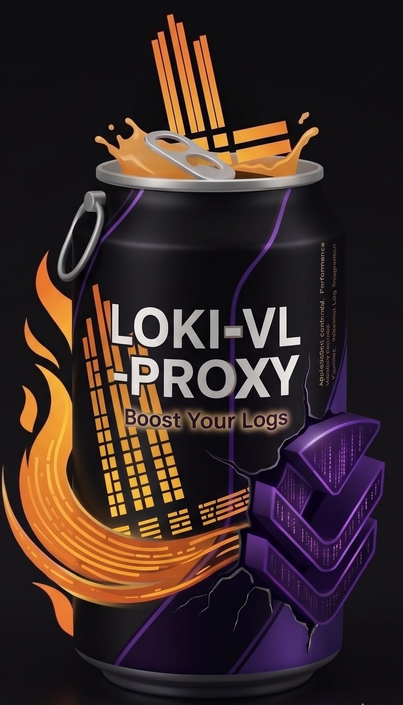
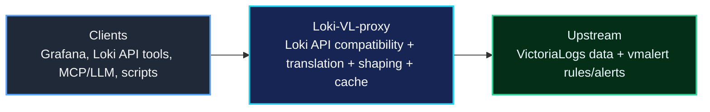
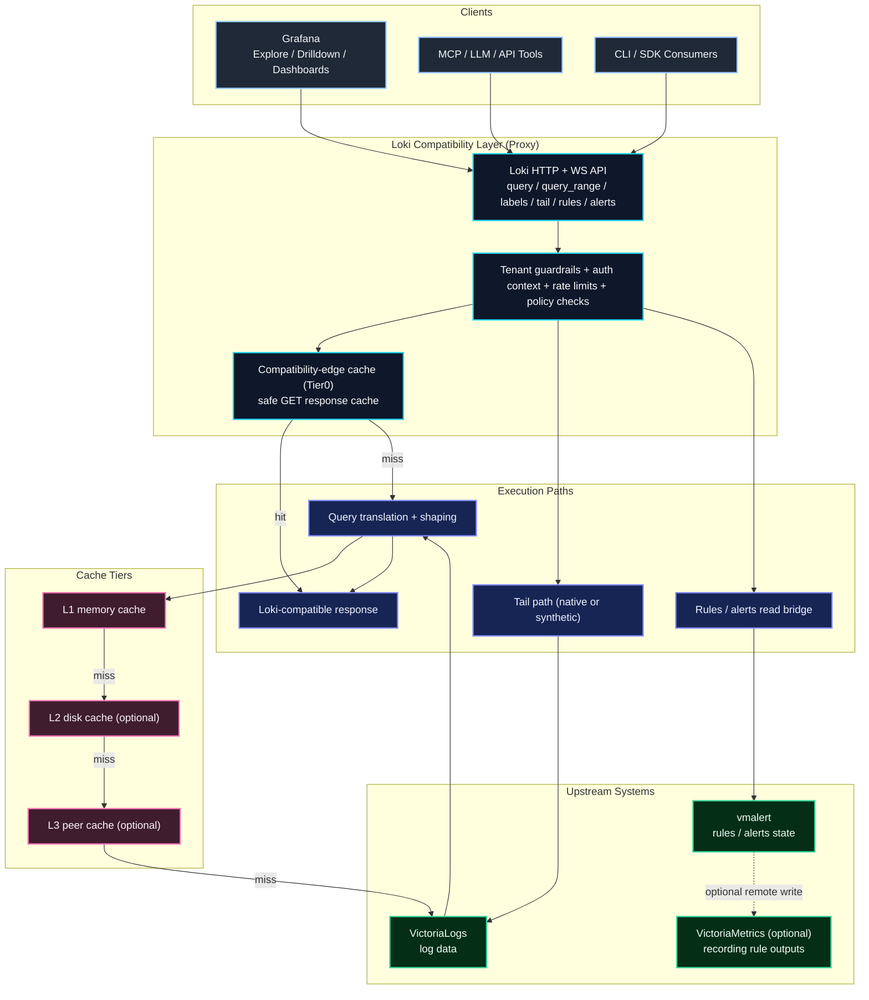
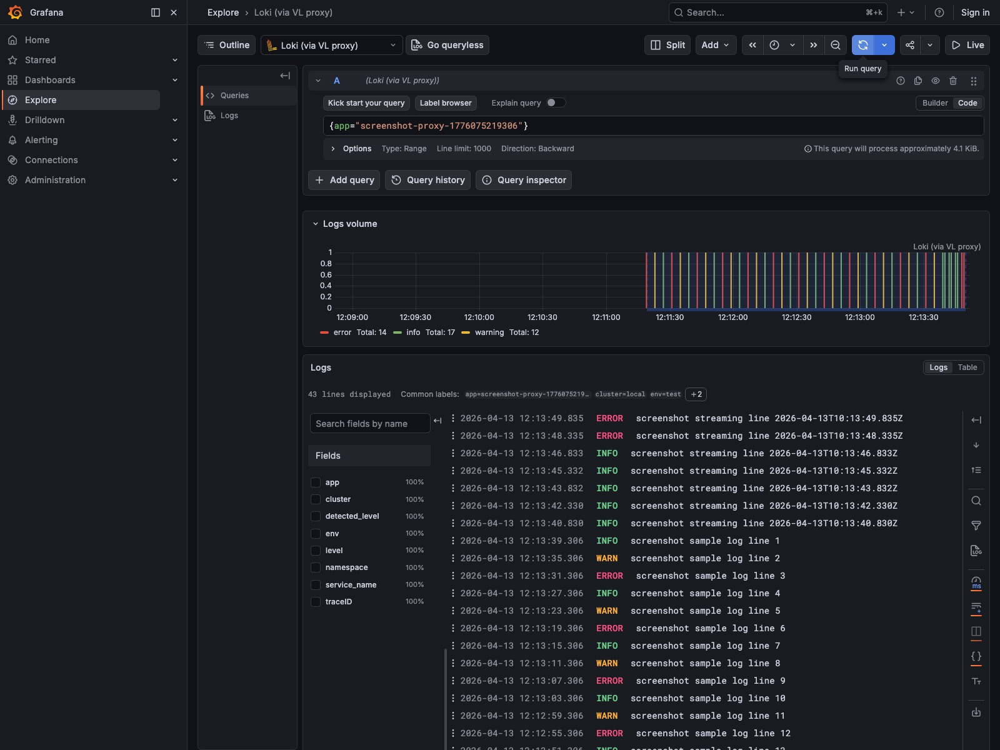
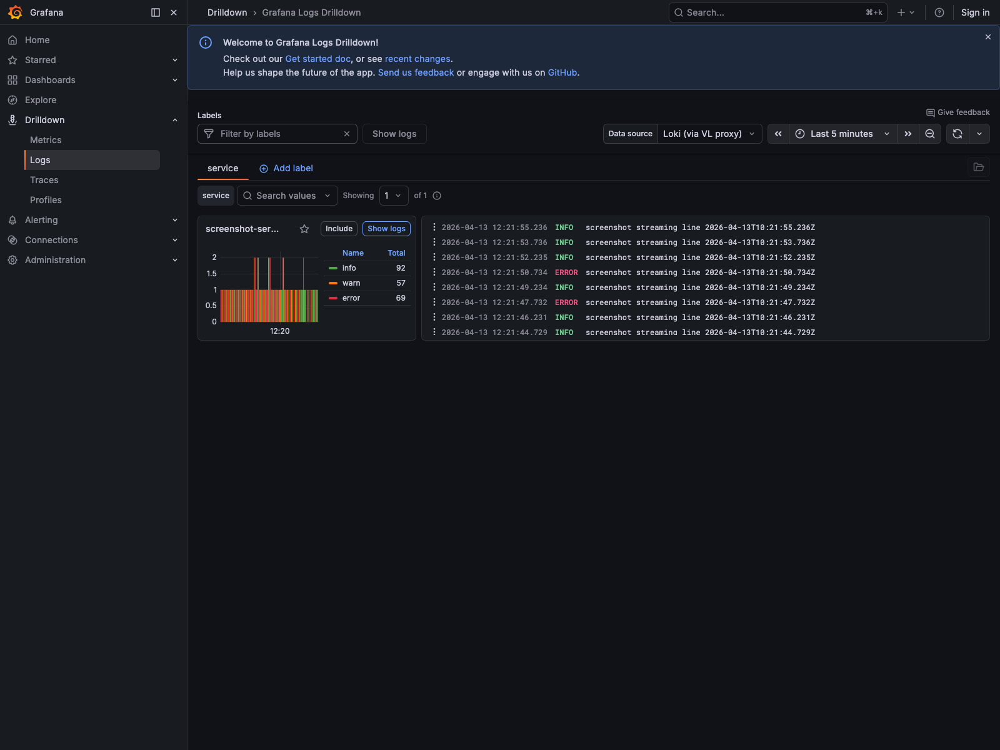
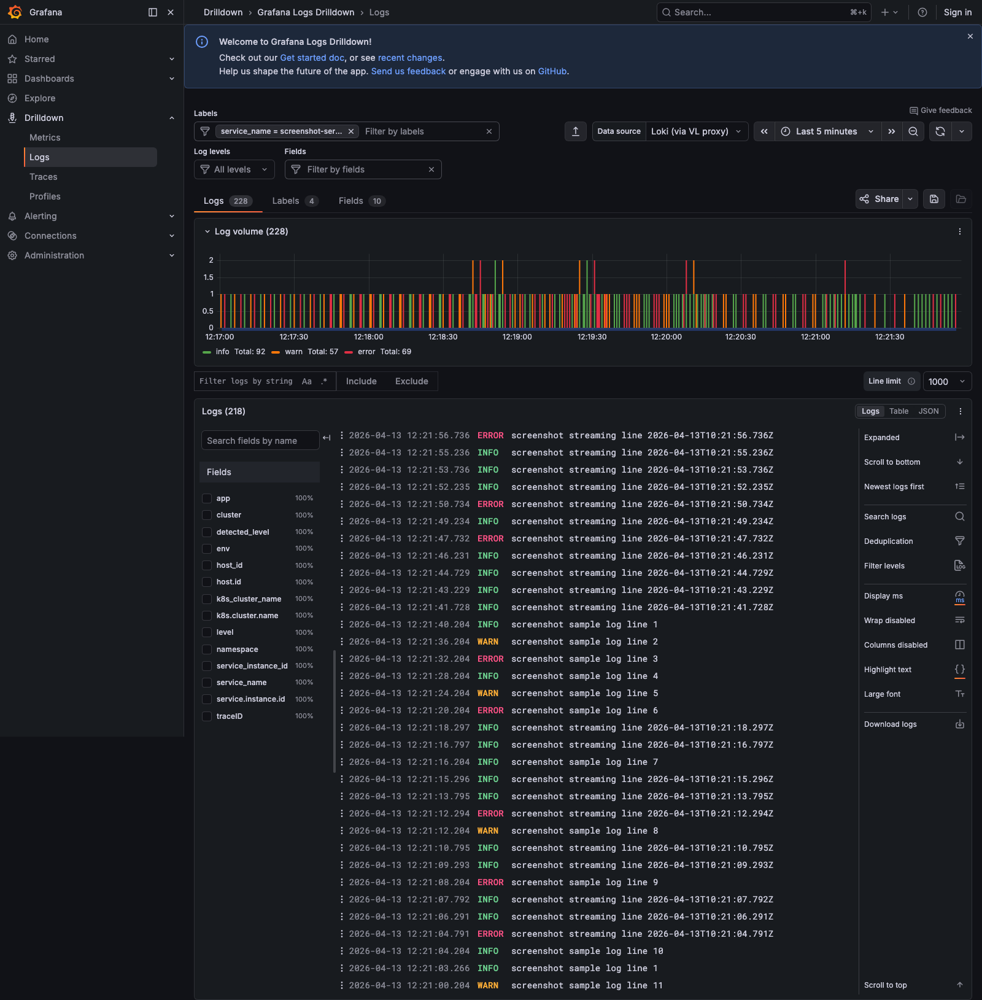
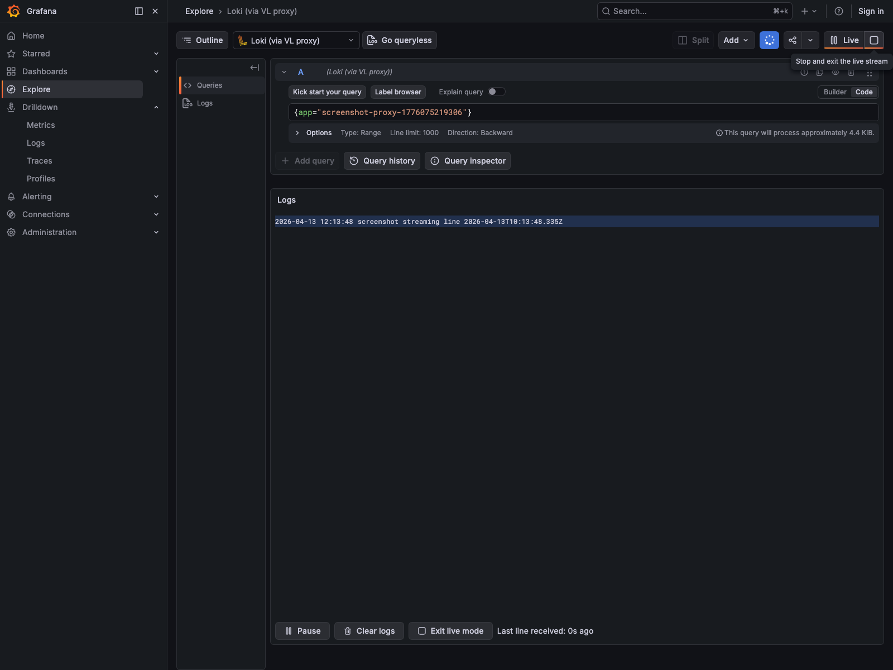

# Loki-VL-proxy

<p align="center">
  <picture>
    <source media="(prefers-color-scheme: dark)" srcset="website/static/img/loki-vl-proxy-logo-white.jpg">
    
  </picture>
</p>

[](https://github.com/ReliablyObserve/Loki-VL-proxy/actions/workflows/ci.yaml)
[](https://github.com/ReliablyObserve/Loki-VL-proxy/actions/workflows/compat-loki.yaml)
[](https://github.com/ReliablyObserve/Loki-VL-proxy/actions/workflows/compat-drilldown.yaml)
[](https://github.com/ReliablyObserve/Loki-VL-proxy/actions/workflows/compat-vl.yaml)
[](https://go.dev/)
[](https://github.com/ReliablyObserve/Loki-VL-proxy/releases)
[](https://github.com/ReliablyObserve/Loki-VL-proxy)
[](#tests)
[](#tests)
[](#logql-compatibility)
[](LICENSE)
[](https://github.com/ReliablyObserve/Loki-VL-proxy/actions/workflows/codeql.yaml)

**Keep your entire Loki stack — Grafana Explore, Drilldown, dashboards, API tooling — and run it on VictoriaLogs at a fraction of the cost.**

- **Drop-in Loki API.** Point your existing Grafana Loki datasource at the proxy. Zero plugin changes, zero query rewrites.
- **VictoriaLogs economics.** Up to 30x less RAM, up to 15x less disk vs Loki. TrueFoundry real-world: ~40% less storage, lower CPU and RAM at the same ingestion rate.
- **Proxy intelligence built in.** 4-tier cache, 1h window reuse, adaptive parallelism, circuit breaker, rate limits, tenant isolation. One ~14 MB static binary.

Project site: `https://reliablyobserve.github.io/Loki-VL-proxy/`

---

## Real-World Improvements Over Loki

Benchmarked against tuned Loki on the same hardware with ~8M log entries across six representative workloads at 100 concurrent clients:

- **Throughput**: 68–4,500× faster with warm cache; 6–1,700× faster with cache disabled (coalescer + circuit breaker only, measuring VL's raw query speed)
- **Latency (P50)**: metadata 196 ms → 2 ms, heavy aggregations 2,399 ms → 2 ms, content search 13,415 ms → 2 ms
- **Content search**: VL maintains a word-level inverted token index — `|= "word"` completes in milliseconds; Loki scans every chunk (same 13–90 s regardless of hardware)
- **High-cardinality**: VL's stream-independent index does not grow with pod/container label cardinality; Loki ingesters hold one chunk per active stream

Full six-workload comparison, latency tables, and resource data: [Benchmarks](docs/benchmarks.md) · [Performance](docs/performance.md)

---

## The Cost Case

Real-life tested VictoriaLogs deployment: **800 M total entries**, **310 GiB/day** raw ingest, **54.9× compression**, **40.5 GiB disk** for 7.1 days of retention. Measured VL process envelope at that ingest load:

| Component | Cores | Memory |
|---|---:|---:|
| `vlstorage` | 1.0 | 5.0 GiB |
| `vlinsert` | 0.1 | 0.6 GiB |
| `vlselect` (ingest-only baseline) | 0.1 | 0.25 GiB |
| **VL + proxy combined** | **~1.4** | **~6.1 GiB** |
| Loki published floor (`<3 TB/day`) | 38 | 59 GiB |

Note: `vlselect` was measured at the ingest floor (0 read rps) — it grows under active query load. `loki-bench` gives 1:1 numbers from your own environment. See [Cost Model](docs/cost-model.md) for the full analysis with scaling factors, AWS EC2 cost tables, and caveats.

- **Storage**: 40.5 GiB on disk for 800 M entries / 7.1 days (54.9× compression); TrueFoundry independently reported ~40% less storage vs Loki
- **Replication**: Loki RF=3 means 3× write amplification and cross-AZ egress; VL runs AZ-local with no mandatory replication
- **Grafana UX**: identical — no dashboard, alert, or API client changes required
- **Proxy overhead**: ~14 MB binary; near-zero on cache hit, ~15–30 ms on cache miss

Full cost worksheet, scaling projections, and sizing guide: [Cost Model](docs/cost-model.md) · [Scaling](docs/scaling.md)

---

## Quick Start

### Docker

```bash
docker run -p 3100:3100 \
  ghcr.io/reliablyobserve/loki-vl-proxy:latest \
  -backend=http://victorialogs:9428
```

### Helm

```bash
helm install loki-vl-proxy oci://ghcr.io/reliablyobserve/charts/loki-vl-proxy \
  --version <release> \
  --set extraArgs.backend=http://victorialogs:9428 \
  --set extraArgs.patterns-enabled=true
```

### Grafana Datasource

Point your existing Loki datasource at the proxy — no other changes needed.

```yaml
datasources:
  - name: Loki (via VL proxy)
    type: loki
    access: proxy
    url: http://loki-vl-proxy:3100
    jsonData:
      httpHeaderName1: X-Scope-OrgID
    secureJsonData:
      httpHeaderValue1: team-alpha
```

That's it. Grafana Explore, Drilldown, and all dashboards work immediately.

For StatefulSet persistence, peer-cache fleet setup, OTLP push wiring, and image source options, see [Getting Started](docs/getting-started.md) and [Operations](docs/operations.md).

---

## Why It's Fast

**4-tier cache:**
- **Tier0** — compatibility-edge cache for safe GET responses (no backend hit at all)
- **L1** — in-memory hot path
- **L2** — disk (bbolt), survives restarts, warms historical windows across large working sets
- **L3** — peer cache, lets warm fleet replicas share results instead of all hitting the backend

**Window reuse.** Long `query_range` requests are split into 1h windows. Historical windows are served from cache; only the live edge fetches from VictoriaLogs. A 7-day query with warm cache may hit the backend for a single window.

**Adaptive parallelism.** Parallel window fetches use EWMA-based backpressure — ramps up when VictoriaLogs is fast, backs off automatically before it becomes a problem.

**Request coalescing.** Concurrent identical queries collapse into one upstream request.

---

## What Works Out of the Box

- Grafana Explore — log browsing, filtering, live tail
- Grafana Logs Drilldown — patterns, service view, field breakdown
- Dashboards — all LogQL panel types
- Multi-tenant — `X-Scope-OrgID` isolation with per-tenant rate limits
- Live tail — native WebSocket tail or synthetic polling fallback
- Rules and alerts — read bridge to vmalert (no write lifecycle)
- LogQL — 100% coverage: stream selectors, filters, parsers, metric queries, range functions, vector operators
- OTel labels — dotted structured metadata exposed correctly in detected fields, underscore-safe in stream labels

---

## Production Features

- **Circuit breaker** — opens on backend failure, closes automatically on recovery
- **Per-client rate limits** — token bucket, configurable per tenant
- **Tenant isolation** — strict `X-Scope-OrgID` fanout guardrails; no cross-tenant data bleed
- **TLS / mTLS** — configurable on both northbound (client) and southbound (backend) boundaries
- **OTLP push** — proxy emits its own traces to any OTLP endpoint
- **Operator dashboard** — packaged Grafana dashboard covering Client → Proxy → VictoriaLogs, cache behavior, fanout, and resource utilization
- **Runbook-backed alerts** — 13 alert rules, each with a linked runbook
- **100+ Prometheus metrics** — all under `loki_vl_proxy_*` prefix
- **Read-only by default** — `/push` blocked, delete gated, debug/admin disabled unless explicitly enabled

---

## High-Level Flow



## Detailed Architecture



---

## Compatibility

Loki-VL-proxy is validated continuously in CI against three separate tracks: Loki API, Grafana Logs Drilldown, and VictoriaLogs integration.

### Label and Field Compatibility

| Profile | Stream labels (`/labels`) | Detected fields / metadata | Best for |
|---|---|---|---|
| Loki-conservative | underscore-only | translated underscore aliases | strict Loki UX |
| Mixed (default) | underscore-only | dotted + translated aliases | Grafana + OTel correlation |
| Native-field | underscore-only (`label-style=underscores`) | dotted-native only | VL/OTel-native field workflows |

Grafana query builder works best with underscore aliases. Code mode (`label-style=underscores`, `metadata-field-mode=translated`) handles dotted keys without UI tokenization issues.

**Tuple safety:** Default responses return strict `[timestamp, line]` 2-tuples. 3-tuple metadata mode activates only when the client sends `X-Loki-Response-Encoding-Flags: categorize-labels`. Cache keys are segregated by tuple mode.

### LogQL Compatibility

Stream selectors, filters, parser pipelines, metric queries, range functions, scalar bool comparisons, vector set operators, and invalid LogQL error forms are all covered and machine-validated in CI against a real Loki oracle.

For full detail: [Loki Compatibility](docs/compatibility-loki.md), [Translation Reference](docs/translation-reference.md), [Known Issues](docs/KNOWN_ISSUES.md)

---

## Observability

- **100+ Prometheus metrics** under `loki_vl_proxy_*` — cache hit ratios, window fetch latency, fanout behavior, per-tenant and per-client pressure, circuit breaker state
- **Packaged operator dashboard** — rows for Client-Side Loki API Visibility, Proxy Internal, and Backend-Side VictoriaLogs fanout; fast incident attribution
- **13 runbook-backed alert rules** — backend latency, backend unreachable, circuit breaker open, high error rate, rate limiting, tenant isolation, and more
- **Structured JSON logs** — route-aware, semconv-aligned, with user-pattern attribution from trusted Grafana headers
- **OTLP tracing** — proxy emits traces to any OTLP endpoint

See [Observability](docs/observability.md) and [Alert Runbooks Index](docs/runbooks/alerts.md).

---

## Security

- Read-only API surface by default: `/push` blocked, delete gated, debug/admin disabled
- Non-root runtime image, read-only root filesystem, restricted Helm security contexts
- Hardening headers on all HTTP responses including 404s and disabled routes
- CI security gates: `gitleaks`, `gosec`, Trivy, `actionlint`, `hadolint`, OpenSSF Scorecard, OWASP ZAP, curated Nuclei
- Proxy-specific coverage: tenant isolation, cache boundary enforcement, browser-origin checks on `/tail`, forwarded auth handling

See [Security](docs/security.md) and [Security Policy](SECURITY.md).

---

## UI Gallery

VictoriaLogs backend with Loki-VL-proxy as the Loki-compatible query layer.

<a href="docs/images/ui/explore-main.png">
  
</a>
<a href="docs/images/ui/explore-details.png">
  
</a>
<a href="docs/images/ui/drilldown-main.png">
  
</a>
<a href="docs/images/ui/drilldown-service.png">
  
</a>
<a href="docs/images/ui/explore-tail-multitenant.png">
  
</a>

---

## Documentation Map

### Core
- [Getting Started](docs/getting-started.md)
- [Configuration](docs/configuration.md)
- [Operations](docs/operations.md)
- [Architecture](docs/architecture.md)
- [API Reference](docs/api-reference.md)
- [Security](docs/security.md)
- [Observability](docs/observability.md)
- [Performance](docs/performance.md)
- [Scaling](docs/scaling.md)

### Compatibility
- [Compatibility Matrix](docs/compatibility-matrix.md)
- [Loki Compatibility](docs/compatibility-loki.md)
- [Logs Drilldown Compatibility](docs/compatibility-drilldown.md)
- [Grafana Loki Datasource Compatibility](docs/compatibility-grafana-datasource.md)
- [VictoriaLogs Compatibility](docs/compatibility-victorialogs.md)
- [Translation Modes Guide](docs/translation-modes.md)
- [Translation Reference](docs/translation-reference.md)

### Cache and Runtime Design
- [Fleet Cache](docs/fleet-cache.md)
- [Peer Cache Design](docs/peer-cache-design.md)
- [Benchmarks](docs/benchmarks.md)

### Runbooks
- [Alert Runbooks Index](docs/runbooks/alerts.md)
- [Deployment Best Practices](docs/runbooks/deployment-best-practices.md)
- [Backend High Latency](docs/runbooks/loki-vl-proxy-backend-high-latency.md)
- [Backend Unreachable](docs/runbooks/loki-vl-proxy-backend-unreachable.md)
- [Circuit Breaker Open](docs/runbooks/loki-vl-proxy-circuit-breaker-open.md)
- [Client Bad Request Burst](docs/runbooks/loki-vl-proxy-client-bad-request-burst.md)
- [Proxy Down](docs/runbooks/loki-vl-proxy-down.md)
- [Grafana Tuple Contract](docs/runbooks/loki-vl-proxy-grafana-tuple-contract.md)
- [High Error Rate](docs/runbooks/loki-vl-proxy-high-error-rate.md)
- [High Latency](docs/runbooks/loki-vl-proxy-high-latency.md)
- [Rate Limiting](docs/runbooks/loki-vl-proxy-rate-limiting.md)
- [Operational Resources](docs/runbooks/loki-vl-proxy-system-resources.md)
- [Tenant High Error Rate](docs/runbooks/loki-vl-proxy-tenant-high-error-rate.md)

### Testing and Release
- [Testing](docs/testing.md)
- [Release Info](docs/release-info.md)

### Migration and Project Status
- [Rules And Alerts Migration](docs/rules-alerts-migration.md)
- [Known Issues](docs/KNOWN_ISSUES.md)
- [Roadmap](docs/roadmap.md)
- [Changelog](CHANGELOG.md)

---

## License

Apache License 2.0. See [LICENSE](LICENSE).
