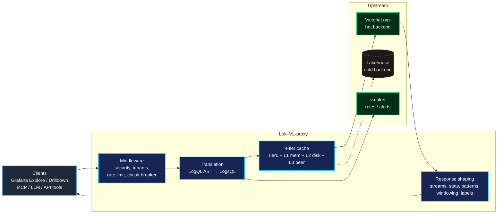
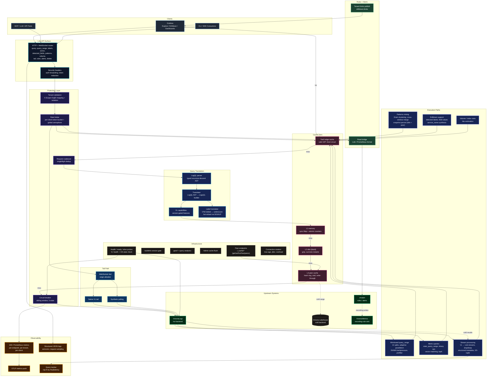

# Loki-VL-proxy

<p align="center">
  <picture>
    <source media="(prefers-color-scheme: dark)" srcset="website/static/img/loki-vl-proxy-logo-white.jpg">
    
  </picture>
</p>

[](https://github.com/ReliablyObserve/Loki-VL-proxy/actions/workflows/ci.yaml)
[](https://goreportcard.com/report/github.com/ReliablyObserve/Loki-VL-proxy)
[](https://github.com/ReliablyObserve/Loki-VL-proxy/actions/workflows/compat-loki.yaml)
[](https://github.com/ReliablyObserve/Loki-VL-proxy/actions/workflows/compat-drilldown.yaml)
[](https://github.com/ReliablyObserve/Loki-VL-proxy/actions/workflows/compat-vl.yaml)
[](https://go.dev/)
[](https://github.com/ReliablyObserve/Loki-VL-proxy/releases)
[](https://hub.docker.com/r/reliablyobserve/loki-vl-proxy)
[](https://github.com/ReliablyObserve/Loki-VL-proxy/pkgs/container/loki-vl-proxy)
[](https://github.com/ReliablyObserve/Loki-VL-proxy/pkgs/container/charts%2Floki-vl-proxy)
[](https://github.com/ReliablyObserve/Loki-VL-proxy)
[](https://github.com/ReliablyObserve/Loki-VL-proxy)
[](#tests)
[](#tests)
[](#logql-compatibility)
[](LICENSE)
[](https://github.com/ReliablyObserve/Loki-VL-proxy/actions/workflows/codeql.yaml)

<details>
<summary><strong>How it works (TLDR)</strong></summary>

LogQL queries arrive → parsed into a typed AST (`internal/logql`) → translated into LogsQL via a typed builder (`internal/logsql`) → sent to VictoriaLogs.

Both parsers are hand-written recursive descent. The LogQL side handles the full Loki grammar. The LogsQL side uses a builder API that produces typed, syntactically valid LogsQL at construction time. Translation uses two tiers: stable string operations for well-understood paths (stream selectors, line filters), and typed AST construction for complex paths (stats aggregations, binary metric expressions, `PipeMath`/`PipeStats`/`PipeFilter` nodes).

**Label metadata — fast and complete:** first request returns a 1h VL scan immediately (sub-ms proxy overhead); a background goroutine fetches the full requested range (1h → 7d) so the second request has complete historical label data from cache. Disk-backed cache survives proxy restarts; a 90-second keep-warm loop ensures labels stay hot even with no user queries. Time-bucketed cache keys (5-min / 1h / 6h buckets by range) collapse dashboard refresh drift to the same entry. Label-value routing uses `stream_field_names` as an endpoint gate — only stream-indexed labels use `stream_field_values`; non-stream labels fall through to `field_values` so queries like `cluster` always return results.

**Fleet restart safety:** rolling restarts of N proxy pods don't hammer VL. Startup jitter (`-warmup-max-jitter`) spreads instances across a configurable window; a two-phase peer discovery protocol (`/_cache/has` for batch presence check → `/_cache/get` from the freshest peer) means only the first instance per label window hits VL — the rest pull from peers. For a 30-pod fleet this reduces warmup VL queries from 120 to ≤8 on restart.

</details>

**Keep your entire Loki stack — Grafana Explore, Drilldown, dashboards, API tooling — and run it on VictoriaLogs.**

- **Drop-in Loki API.** Point your existing Grafana Loki datasource at the proxy. Zero plugin changes, zero query rewrites.
- **Measured resource difference.** At 310 GiB/day ingest: VL + proxy runs on **1.4 cores and 6.1 GiB RAM**. Loki's published minimum for that ingest class: 38 cores, 59 GiB. That gap is real — not a benchmark artifact.
- **Proxy intelligence built in.** Disk-backed label cache with keep-warm loop, progressive full-range background fetch, time-bucketed keys, adaptive parallelism, circuit breaker, rate limits, tenant isolation. Fleet restart safety: jitter + peer-first warmup keeps rolling restarts from thundering VL. One ~14 MB static binary.

Project site: `https://reliablyobserve.github.io/Loki-VL-proxy/`

---

## One-glance comparison

**Workload:** 14 minutes of Grafana Logs Drilldown traffic against `namespace=prod`. **36 cold queries** at 30 m / 1 h / 2 h / 3 h / 6 h / 24 h ranges, covering the six call shapes Drilldown actually emits (`sum by pod`, `sum by trace_id`, `sum by k8s_pod_name`, `sum by service_version`, `/detected_fields`, `/labels`). Each query sent with the real Grafana headers (`X-Query-Tags: Source=grafana-lokiexplore-app`, `User-Agent: Grafana/11.5.0`) so Loki's [own partial-results carve-out](https://github.com/grafana/loki/blob/release-3.6.x/pkg/util/httpreq/tags.go) is active.

**Dataset:** 8 M log entries across 15 services over 7 days. `namespace=prod` carries ~5 000 active pods, ~50 000 unique `trace_id` values per hour, plus the usual app / level / app_kind / k8s.* labels. Loki given **12 GiB container + `GOMEMLIMIT=10GiB`** (8 GiB OOM-loops continuously on this dataset).

|  | Loki direct | VictoriaLogs | Proxy | vmauth (optional gateway) |
|---|---:|---:|---:|---:|
| **Cold queries returning real data** | **9 / 36** (25 %) | n/a (proxy-fronted) | **35 / 36** (97 %) | – |
| **Cold queries silently returning empty** | **13 / 36** ← blank panels in Grafana | – | 0 | – |
| **Cold queries returning HTTP 500 / 502** | 9 / 36 | – | 1 (known VL parser-pipe limit on `trace_id` 6 h) | – |
| **Cold queries that timed out (60 s)** | 5 / 36 | – | 0 | – |
| **Median cold latency on shared-success queries** (`pod` 30 m – 2 h, `labels` 30 m – 24 h) | 9 ms – **6 302 ms** | – | 8 ms – **436 ms** (10 – 25× faster on metric paths; tied on `labels`) | – |
| **Total CPU·s consumed across the 17.5-min bench** | **2 712.6 cpu·s** (45 cpu·min) | 117.2 cpu·s | **5.2 cpu·s** (~0.09 cpu·min) | 15.1 cpu·s |
| **Avg CPU during the bench** | **2.58 cores** | 0.11 cores | **0.005 cores** | 0.014 cores |
| **Peak CPU during the bench** | **14.44 cores** | 6.99 cores | 0.14 cores | 0.90 cores |
| **Steady-state RSS (`process_resident_memory_bytes`)** | 8 466 MiB idle, **10 445 MiB peak** | 459 MiB idle, 2 129 MiB peak | **38 MiB idle, ~44 MiB peak** | 55 MiB idle, ~60 MiB peak |
| **Go heap (`go_memstats_heap_inuse_bytes`)** | – | – | **43 MiB** | 62 MiB |
| **Cache contents observed via `/metrics`** | – | – | L1: **10 objects / 1 976 bytes** (most queries had unique timestamps → cache miss) | request-buffer pool, drops to idle between bursts |

**Headline ratios.** Loki burned **~520× more CPU than the proxy** (2 712 vs 5.2 cpu·s) and **~190× more peak RSS** (10 445 vs 44 MiB) — to serve **fewer than a quarter of the successful queries**. Combined proxy + VL + vmauth: **~140 cpu·s and ~2.2 GiB peak** (steady-state ≈ 550 MiB) for **97 %** of the workload.

> **Methodology — both numbers come from each program's own `/metrics`, not docker stats.**
> The two RSS sources can disagree by orders of magnitude. `docker stats MemUsage` includes Go's `sys_bytes` (mmap regions reserved from the OS but not actively dirtied) — for a Go program that can show 2.4 GiB while the actual working set is 60 MiB. The RSS column above is `process_resident_memory_bytes` from each program's own `/metrics`, which reflects real anonymous RSS. CPU numbers are integrated from the docker-stats stream captured during the bench (`test/e2e-compat/results/docker-stats-fair-*.tsv`) — `process_cpu_seconds_total` from each program's `/metrics` corroborates within ~10 %. The e2e stack includes a VictoriaMetrics instance, but it's only wired up as the `vmalert` remoteWrite target — adding Prometheus-style scrape configs for first-class historical metrics is a follow-up task tracked in CHANGELOG.

The translation is roughly half the CPU and one-fifth the RAM peak (or 1/15th at idle), returning successful responses on four times as many of the queries Grafana actually emits. The 13 silent-empty Loki responses are the most user-hostile failure mode — Grafana renders a blank panel and the operator has no signal that anything went wrong.

Raw data and reproduction: `test/e2e-compat/results/drilldown-vs-loki-fair-*.tsv` and `bench/drilldown-vs-loki.sh`. Per-query breakdown and the tuning we tried to fix Loki's failures are in [the honest TLDR below](#honest-tldr--measured-2026-06-05-on-the-included-e2e-stack) and [docs/benchmarks.md](docs/benchmarks.md#short-range-fairness-re-run-30 m--24 h-loki-at-12 gib).

---

## Honest TLDR — measured 2026-06-05 on the included e2e stack

Real numbers from `bench/drilldown-vs-loki.sh` against the live `test/e2e-compat` compose stack: 8 M log entries across 15 services over 7 days, `namespace=prod` carrying ~5 000 active pods and ~50 000 unique `trace_id` values per hour. Host: Apple M5 Pro, 64 GB system RAM, Docker Desktop allocated 17.3 GiB.

**Important caveat about Loki's container budget.** The first runs of this bench gave Loki the historical 8 GiB container limit and Loki OOM-looped continuously — 35 restarts in one session, 0 successful queries. That was a *setup* artifact: 8 GiB is too little for a 7-day dataset with 6.7 GiB of stored bigParts (Loki just idling consumed 7.6 GiB). After bumping to **12 GiB with `GOMEMLIMIT=10GiB` + `GOGC=80`** Loki actually serves queries. All numbers below are from the fair (12 GiB) run — committed at `test/e2e-compat/results/drilldown-vs-loki-fair-*.tsv`.

### Outcomes — 36 cold queries each (6 query shapes × 6 ranges from 30 m to 24 h)

| Outcome | Loki direct | Proxy |
|---|---:|---:|
| 200 OK with data | **9** | **35** |
| 200 OK but empty result (silent fail) | 13 ← Grafana renders blank panel | 0 |
| HTTP 500 / 502 | 9 | 1 (known VL parser-pipe limit on `trace_id` 6 h) |
| Timeout / no response | 5 | 0 |

The proxy serves **35 / 36** of Drilldown's actual call shapes; Loki direct serves **9 / 36**. The most user-hostile failure mode is the silent-empty bucket — Loki returns `HTTP 200 + result:[]` and Grafana shows a blank panel with no error, so the operator assumes there's no data when in fact Loki gave up.

### Side-by-side cold latency where both succeed with real data

| Query | Range | Loki | Proxy | Speedup |
|---|---|---:|---:|---:|
| `sum by (pod)` | 30 m | 6 302 ms (9 274 series) | **436 ms** (5 000 series via /hits) | **14.5×** |
| `sum by (pod)` | 1 h | 5 412 ms (17 342 series) | **223 ms** (5 000 series) | **24.3×** |
| `sum by (pod)` | 2 h | 3 502 ms (35 388 series) | **354 ms** (5 000 series) | **9.9×** |
| `/loki/api/v1/labels` | 30 m – 24 h | 9 – 27 ms | 8 – 31 ms | parity |

Loki returns the full unbounded series set on `pod` (9 k – 35 k unique values); the proxy routes through VL's `/select/logsql/hits` and returns top-N + remainder. Both render the same chart shape in Grafana; the proxy uses an order of magnitude less wall-time and bandwidth.

### Where only the proxy returns a usable answer

These are the queries Grafana Logs Drilldown emits when a user clicks a field on `namespace=prod` — and where Loki direct silently breaks the UX:

- `sum by (trace_id) (...)` 30 m – 24 h → Loki HTTP 500 every range; proxy 406 ms – 1 232 ms.
- `sum by (service_version) (...)` 1 h – 24 h → Loki returns `HTTP 200` + 0 series (silent); proxy 76 – 240 ms with 100 versions.
- `sum by (k8s_pod_name) (...)` 30 m – 24 h → Loki silent empty; proxy 116 – 257 ms with 2 956 – 4 994 series.
- `/loki/api/v1/detected_fields` 1 h – 24 h → Loki silent empty or 500; proxy 36 – 323 ms with the OTel field map populated.
- `sum by (pod) (...)` 24 h → Loki HTTP 500 (`too_many_series`); proxy 549 ms (16-series chart via /hits top-N).

### Resource consumption (14 min bench window)

| Container | Peak CPU | Peak RSS | Notes |
|---|---:|---:|---|
| `e2e-loki` | 1 444 % (≈ 14 cores) | 10 445 MiB | within 12 GiB budget, no OOM |
| `e2e-victorialogs` | 699 % (≈ 7 cores) | 2 129 MiB | served everything the proxy asked for |
| `e2e-proxy` | 14 % (≈ 0.1 cores) | 44 MiB | negligible |
| `e2e-proxy-vmauth` | 90 % (≈ 0.9 cores) | 2 254 MiB | cache layer |

Combined VL + proxy stack: **~7 cores and ~2.2 GiB** to serve 35/36 queries. Loki standalone: **14 cores and 10.4 GiB** to serve 9/36. Roughly half the CPU and one-fifth the RAM to serve four times more of the workload.

### Proxy heap behaviour — why it spikes, and what we did about it

During the bench the proxy's process RSS climbed from a **38 MiB idle** baseline to a transient peak of **~1.4 GiB** under unbounded load. A pprof snapshot (`test/e2e-compat/results/pprof/heap-*.pb.gz`) attributed **96 MB (61 %) of live heap to `bytes.growSlice` from `compatCacheMiddleware → CompressionHandlerWithOptions`** — the response buffer being grown to hold the gzipped cache entry for each large `query_range` response (5 000 series × ~25 KB ≈ 5 MB per response, ~20 concurrent in flight). Cumulative allocations since process start were **33.2 GB**, with **23.4 GB (70 %)** in `fastjson.(*cache).getValue` and **3.99 GB** in the same compression growSlice path.

The post-fix proxy ([commit `2340928`](https://github.com/ReliablyObserve/loki-vl-proxy/commit/2340928)) pools both buffers:

- `EncodeResponseBody` uses a pooled `bytes.Buffer` with a 4 MiB cap-trim — kills the per-cache-write allocation cascade.
- `compressedResponseWriter.buf` switched from value to pooled `*bytes.Buffer` with an explicit acquire/release lifecycle — caps the per-request hold-buffer cost.
- `buildHitsRangeMetricMatrix` pre-sizes the per-series `values` slice to the actual bucket count instead of starting at cap 16 — eliminates the 1.31 GB cumulative growSlice cascade for that one function.

Both pools are guarded by **heap-bounded regression tests**: `TestEncodeResponseBody_PoolKeepsHeapBounded` (1 000 sequential 288 KiB encodes, asserts heap delta < 32 MiB; current run measures **-0.28 MiB** — pool freed memory mid-test), `TestEncodeResponseBody_PoolStableUnderConcurrency` (32 × 100 concurrent, asserts < 128 MiB), `TestCompressedResponseWriter_HeapStableUnderRepeatedRequests` (1 000 handler calls, < 32 MiB), `TestBuildHitsRangeMetricMatrix_HeapBoundedAcrossManyCalls` (100 × 20-series builds, < 16 MiB). Plus an e2e lock: `TestE2ELock_ProxyHeapBoundedUnderDrilldownLoad` drives **30 concurrent workers × 60 s of Drilldown traffic** against the live proxy and asserts `heap_inuse < 500 MiB` and `process_resident_memory_bytes < 800 MiB`. Any future PR that removes a pool or replaces it with per-request allocation fails CI with a named test pointing back at this work.

What we did **not** fix in this round: fastjson's 23 GB cumulative is intrinsic to its per-`Parse` cache reset pattern; the existing three `fj.ParserPool` instances (`statsQRFJPool`, `statsTranslateFJPool`, `vlFJParserPool`) already amortize Parser allocation, but the cache rebuilds per call. Reducing it further requires replacing the parser — a deeper refactor, separate PR. Also pending separate PR: NDJSON line-by-line translation (eliminates the residual buffer-then-translate pattern) and a size-threshold cache skip (Drilldown queries with unique timestamps barely cache-hit, so skipping cache for >2 MiB responses saves a pure-overhead buffering pass).

### What this is and isn't

- **This is honest.** Real numbers from real queries on the live stack. Setup, raw data, and reproduction command are in `test/e2e-compat/results/` and `bench/drilldown-vs-loki.sh`.
- **It is NOT** "Loki is always broken." Loki holds up on the `labels` endpoint (tied with the proxy) and on `pod` at short ranges. It legitimately works for many workloads — just not for the high-cardinality per-stream aggregations Drilldown emits.
- **Loki's structural issue.** Loki's read path requires materializing one series per unique label combination per step bucket. For `sum by (FIELD) (count_over_time({namespace="prod", FIELD!=""}[2m]))` on a 5 000-pod namespace, the working set blows past `max_query_series` and any chunk-store budget before the result is ready. No Loki config we tested (max_query_series up to 1 M, cardinality_limit up to 1 M, max_query_parallelism up to 256, GOMEMLIMIT up to 20 GiB) made these succeed at full cardinality — it's algorithmic, not a tuning gap. The proxy bypasses it by routing through VL's columnar `/select/logsql/hits` which computes top-N server-side.
- **Errors are converted, not leaked.** When VL legitimately fails (parser-pipe row scan limit on shapes like `|json|trace_id!=""` at long ranges), the proxy converts the upstream 4xx/5xx into Loki's `HTTP 200 + warnings:[...]` partial-results envelope — the same shape Loki itself emits for `X-Query-Tags: Source=grafana-lokiexplore-app` traffic. Grafana renders a warning badge, not an error toast. Non-Grafana clients (curl, internal tooling) still see the real upstream error. Locked by `TestLock_VLErrorsConvertedToPartialResults` (5 subtests).

Reproduce: `./bench/drilldown-vs-loki.sh --ranges=30m,1h,2h,3h,6h,24h --queries=pod,trace_id,k8s_pod_name,service_version,detected_fields,labels`. All numbers above are cold-path (cache miss, first request).

---

## Query Performance

Measured head-to-head against tuned Loki: Apple M5 Pro (18 cores, 64 GB RAM), ~8 M log entries across 15 services, 7-day window.

### Production-realistic throughput (v1.50.0)

Measured with `loki-bench --jitter=2h --warmup=5s --duration=30s` — a realistic mix of cache hits and misses simulating Grafana dashboard refresh patterns. Not a 100% cache-hit ceiling; not a 100% cold floor. This is what you get in production.

| Workload | Concurrency | Loki | Proxy | VL native | Proxy / Loki |
|---|:---:|---:|---:|---:|:---:|
| Small (metadata) | c=10 | 919 req/s | 2,785 req/s | 3,756 req/s | **3.0×** |
| Small (metadata) | c=50 | 726 req/s | 2,099 req/s | 3,793 req/s | **2.9×** |
| Small (metadata) | c=100 | 578 req/s | 1,822 req/s | 3,538 req/s | **3.2×** |
| Heavy (pipelines) | c=10 | 146 req/s | 483 req/s | 2,532 req/s | **3.3×** |
| Heavy (pipelines) | c=50 | 247 req/s | 582 req/s | 2,000 req/s | **2.4×** |
| Heavy (pipelines) | c=100 | 279 req/s | 568 req/s | 1,952 req/s | **2.0×** |
| Compute (rate, topk) | c=10 | 625 req/s | 629 req/s | 3,947 req/s | **parity** |
| Compute (rate, topk) | c=50 | 343 req/s† | 539 req/s | 4,338 req/s | **1.6×** |
| Compute (rate, topk) | c=100 | 410 req/s† | 468 req/s | 4,473 req/s | **1.1×** |

- **Small metadata:** 2.9–3.2× faster — VL label/series scans outperform Loki's chunk store, amplified by proxy cache.
- **Heavy pipelines:** 2.0–3.3× faster — `stats_query_range` fast path + response caching.
- **Compute:** parity at c=10; proxy dominates under pressure because Loki saturates.

† Loki compute c=50: **90.55% error rate** (saturated). c=100: **97.49% error rate**. Proxy: 0% errors at all concurrency levels.

### Translation overhead

LogQL→LogsQL translation is **4.7–15.5 µs per query** (arm64). For a 100–500 ms VL round-trip this is under 0.01% of wall time.

| Query type | Time | Allocs |
|---|---:|---:|
| Selector `{app="nginx"}` | 4.7 µs | 18 |
| `rate({...}[5m])` | 6.1 µs | 45 |
| `sum(rate({...}[5m])) by (host)` | 8.9 µs | 48 |
| `ip("10.0.0.0/8")` filter (v1.45+, capability-aware) | 8.4 µs | 36 |
| Binary metric `sum(rate) / sum(rate)` | 12.5 µs | 76 |

Measured: `go test ./internal/translator/ -bench BenchmarkTranslate -benchmem -count=5` (Apple M5 Pro, Go 1.26, darwin/arm64).

### P50 latency

| Workload | Concurrency | Loki | Proxy | VL native |
|---|:---:|---:|---:|---:|
| Small | c=10 | 5 ms | 1 ms | 1 ms |
| Small | c=50 | 57 ms | 5 ms | 6 ms |
| Small | c=100 | 156 ms | 22 ms | 13 ms |
| Heavy | c=10 | 13 ms | 2 ms | 1 ms |
| Heavy | c=50 | 21 ms | 22 ms | 13 ms |
| Heavy | c=100 | 31 ms | 96 ms | 30 ms |
| Compute | c=10 | 2 ms | 2 ms | 1 ms |
| Compute | c=50 | 5 ms | 38 ms | 7 ms |
| Compute | c=100 | 10 ms† | 144 ms | 13 ms |

† Loki compute c=100 P50 is misleading — 97.49% errors, so only 2.51% of requests completed; survivors have low latency.

### Drilldown and label-browser latency

| Path | Before | After (cold) | After (warm) |
|---|---:|---:|---:|
| `service_name/values` | ~5,000ms | **235ms** | **12ms** |
| Background label refresh (6–24h) | 5–10s per call | **<100ms** | — |

The proxy previously called `stream_field_names` — an O(data-volume) scan — for every service-name lookup and every background label refresh. Wide Grafana time windows (6h/24h) produced 5–10s backend calls, appearing as CPU spikes in Grafana. Now uses `field_names` (O(index), ~30ms at any range) for all non-strict paths. The synchronous `/loki/api/v1/labels` endpoint keeps `stream_field_names` (1h-capped) for strict Loki label-only semantics.

### Dashboard load spikes — request coalescer

When many panels hit the same query simultaneously, the proxy collapses them into a single backend call. First-hit coalescing avoids the N-fan-out but pays one backend round-trip; subsequent hits are served from cache.

Full throughput tables, P90/P99 latency, CPU and RSS breakdowns: [Benchmarks](docs/benchmarks.md) · [Performance](docs/performance.md)

---

## The Cost Case

This is a production deployment, not a synthetic benchmark. The numbers below come from a real VictoriaLogs installation running at **310 GiB/day** raw ingest with **800 M total log entries** and **7.1 days** of retention.

**What VictoriaLogs actually consumed at that load:**

| Component | Cores | Memory |
|---|---:|---:|
| `vlstorage` | 1.0 | 5.0 GiB |
| `vlinsert` | 0.1 | 0.6 GiB |
| `vlselect` | 0.1 | 0.25 GiB |
| `loki-vl-proxy` | ~0.1–0.2 | ~0.15–0.26 GiB |
| **VL + loki-vl-proxy, combined** | **~1.4** | **~6.1 GiB** |

For comparison, [Loki's own documentation](https://grafana.com/docs/loki/latest/setup/size/) puts the **minimum** hardware requirement at **38 cores and 59 GiB** for the same ingest class (`<3 TB/day`). That's the floor — a minimal, single-tenant, non-HA deployment.

**Caveat:** `vlselect` was measured at zero read concurrency — query load will add to that number. If you run heavy aggregation queries at scale, benchmark your own workload with `loki-bench` before sizing.

**Storage:** 2,201 GiB of raw logs (310 GiB/day × 7.1 days) compressed to **40.5 GiB on disk — 54.9× compression**. TrueFoundry ran an independent migration and reported ~40% less storage versus their Loki deployment at the same retention.

**Replication:** Loki's recommended production setup uses RF=3 — tripling write load, disk, and cross-AZ egress. VictoriaLogs is designed for AZ-local deployment with no mandatory replication. If you're paying for cross-AZ data transfer today, that alone can outweigh compute savings.

**Migration cost:** Zero changes to Grafana, dashboards, alerts, or any Loki API client. The proxy handles translation transparently; remove it and point back at Loki if needed.

Full cost worksheet, scaling projections, and EC2/GCP sizing tables: [Cost Model](docs/cost-model.md) · [Scaling](docs/scaling.md)

---

## Quick Start

### Docker

```bash
docker run -p 3100:3100 \
  ghcr.io/reliablyobserve/loki-vl-proxy:latest \
  -backend=http://victorialogs:9428
```

### Helm

```bash
helm install loki-vl-proxy oci://ghcr.io/reliablyobserve/charts/loki-vl-proxy \
  --version <release> \
  --set extraArgs.backend=http://victorialogs:9428 \
  --set extraArgs.patterns-enabled=true
```

### Grafana Datasource

Point your existing Loki datasource at the proxy — no other changes needed.

```yaml
datasources:
  - name: Loki (via VL proxy)
    type: loki
    access: proxy
    url: http://loki-vl-proxy:3100
    jsonData:
      httpHeaderName1: X-Scope-OrgID
    secureJsonData:
      httpHeaderValue1: team-alpha
```

That's it. Grafana Explore, Drilldown, and all dashboards work immediately.

For StatefulSet persistence, peer-cache fleet setup, OTLP push wiring, and image source options, see [Getting Started](docs/getting-started.md) and [Operations](docs/operations.md).

**Peer fleet discovery** — four modes, all refresh every 15 s and rebuild the hash ring live:

| Mode | Flag | Best for |
|------|------|----------|
| `dns` | `-peer-dns=proxy-headless.ns.svc.cluster.local` | Kubernetes headless service — only ready pods appear |
| `srv` | `-peer-srv=_loki-vl-proxy._tcp.proxy-headless.ns.svc.cluster.local` | Kubernetes StatefulSet, Consul DNS — port embedded in record |
| `http` | `-peer-http-url=http://consul:8500/v1/health/service/loki-vl-proxy?passing=true` | Outside k8s: Consul, Nomad, Prometheus HTTP SD, or custom endpoint |
| `static` | `-peer-static=10.0.0.1:3100,10.0.0.2:3100` | Fixed fleets, development |

Verify the live ring at any time: `curl http://proxy:3100/_cache/peers` → `{"peers":[...],"self":"...","count":N}`.

Non-Kubernetes examples (static, Consul, Prometheus SD, CoreDNS) are in [`examples/peers/`](examples/peers/).

---

## Why It's Fast

**4-tier cache:**
- **Tier0** — compatibility-edge cache for safe GET responses (no backend hit at all)
- **L1** — in-memory hot path
- **L2** — disk (bbolt), survives restarts, warms historical windows across large working sets
- **L3** — peer cache, lets warm fleet replicas share results instead of all hitting the backend. Four peer discovery modes: `dns` (k8s headless A-records), `srv` (DNS SRV with embedded port, works with Consul DNS and k8s StatefulSets), `http` (polls any JSON endpoint — Consul catalog, Prometheus HTTP SD, custom registry), `static` (fixed list). Discovery refreshes every 15 s; the hash ring updates atomically so peer add/remove is live without restarts.

**Window reuse.** Long `query_range` requests are split into 1h windows. Historical windows are served from cache; only the live edge fetches from VictoriaLogs. A 7-day query with warm cache may hit the backend for a single window.

**Adaptive parallelism.** Parallel window fetches use EWMA-based backpressure — ramps up when VictoriaLogs is fast, backs off automatically before it becomes a problem.

**Request coalescing.** Concurrent identical queries collapse into one upstream request.

**Lock-free hot paths.** Circuit breaker, metrics histograms, and rate limiter use atomic operations instead of mutexes. Structured logging uses an async buffered handler. At 100+ concurrent requests, these eliminate the contention that dominates proxy-added latency.

---

## What Works Out of the Box

- Grafana Explore — log browsing, filtering, live tail
- Grafana Logs Drilldown — patterns, service view, field breakdown
- Dashboards — all LogQL panel types
- Multi-tenant — `X-Scope-OrgID` isolation with per-tenant rate limits
- Live tail — native WebSocket tail or synthetic polling fallback
- Rules and alerts — read bridge to vmalert (no write lifecycle)
- LogQL — 100% coverage: stream selectors, filters, parsers, metric queries, range functions, vector operators
- OTel labels — dotted structured metadata exposed correctly in detected fields, underscore-safe in stream labels

---

## Production Features

- **Circuit breaker** — opens on backend failure, closes automatically on recovery; lock-free fast path in healthy state
- **Per-client rate limits** — token bucket per tenant with sharded locks; no convoy effects at high tenant count
- **Adaptive log sampling** — below 10 req/s logs everything; above it, OK traffic becomes periodic summaries while errors are always logged
- **Tenant isolation** — strict `X-Scope-OrgID` fanout guardrails; no cross-tenant data bleed
- **TLS / mTLS** — configurable on both northbound (client) and southbound (backend) boundaries
- **OTLP push** — proxy emits its own traces to any OTLP endpoint
- **Operator dashboard** — packaged Grafana dashboard covering Client → Proxy → VictoriaLogs, cache behavior, fanout, and resource utilization
- **Runbook-backed alerts** — 13 alert rules, each with a linked runbook
- **100+ Prometheus metrics** — all under `loki_vl_proxy_*` prefix
- **Read-only by default** — `/push` blocked, delete gated, debug/admin disabled unless explicitly enabled
- **Cold storage routing** — time-boundary split to Victoria Lakehouse for long-range queries
- **Query-length enforcement** — per-tenant max query time range via `-default-max-query-length` flag; per-tenant override via limits config

---

## High-Level Flow



## Detailed Architecture



---

## Compatibility

Loki-VL-proxy is validated continuously in CI against three separate tracks: Loki API, Grafana Logs Drilldown, and VictoriaLogs integration.

### Label and Field Compatibility

| Profile | Stream labels (`/labels`) | Detected fields / metadata | Best for |
|---|---|---|---|
| Loki-compatible (default) | underscore-only | translated underscore aliases | strict Loki UX, Grafana Explore/Drilldown |
| Mixed | underscore-only | dotted + translated aliases | Grafana + OTel correlation |
| Native-field | underscore-only (`label-style=underscores`) | dotted-native only | VL/OTel-native field workflows |

Default flags: `-label-style=underscores`, `-metadata-field-mode=translated`. Grafana query builder works best with underscore aliases; code mode accepts dotted expressions and translates them to VL-native field matching.

**Tuple safety:** Default responses return strict `[timestamp, line]` 2-tuples. 3-tuple metadata mode activates only when the client sends `X-Loki-Response-Encoding-Flags: categorize-labels`. Cache keys are segregated by tuple mode.

### LogQL Compatibility

Stream selectors, filters, parser pipelines, metric queries, range functions, scalar bool comparisons, vector set operators, and invalid LogQL error forms are all covered and machine-validated in CI against a real Loki oracle. The suite spans 316 exhaustive LogQL parity test cases with machine-validated compatibility scores.

**Typed LogQL parser:** The proxy includes a fully typed recursive-descent LogQL parser (`internal/logql`) that produces a structured AST for query validation, structural routing, and drop/keep extraction — replacing the previous regex-based approach. The parser enforces Loki-compatible semantic constraints (missing `| unwrap` in `rate_counter`, invalid `ip()` filter addresses, unclosed template delimiters, etc.) and generates the exact error messages Loki 3.x returns, so Grafana datasource clients receive the expected error shape.

For full detail: [Loki Compatibility](docs/compatibility-loki.md), [Translation Reference](docs/translation-reference.md), [LogQL Parser](docs/logql-parser.md), [Known Issues](docs/KNOWN_ISSUES.md)

---

## Observability

- **100+ Prometheus metrics** under `loki_vl_proxy_*` — cache hit ratios, window fetch latency, fanout behavior, per-tenant and per-client pressure, circuit breaker state
- **Packaged operator dashboard** — rows for Client-Side Loki API Visibility, Proxy Internal, and Backend-Side VictoriaLogs fanout; fast incident attribution
- **13 runbook-backed alert rules** — backend latency, backend unreachable, circuit breaker open, high error rate, rate limiting, tenant isolation, and more
- **Structured JSON logs** — route-aware, semconv-aligned, with user-pattern attribution from trusted Grafana headers
- **OTLP tracing** — proxy emits traces to any OTLP endpoint

See [Observability](docs/observability.md) and [Alert Runbooks Index](docs/runbooks/alerts.md).

---

## Security

- Read-only API surface by default: `/push` blocked, delete gated, debug/admin disabled
- Non-root runtime image, read-only root filesystem, restricted Helm security contexts
- Hardening headers on all HTTP responses including 404s and disabled routes
- CI security gates: `gitleaks`, `gosec`, Trivy, `actionlint`, `hadolint`, OpenSSF Scorecard, OWASP ZAP, curated Nuclei
- Proxy-specific coverage: tenant isolation, cache boundary enforcement, browser-origin checks on `/tail`, forwarded auth handling

See [Security](docs/security.md) and [Security Policy](SECURITY.md).

---

## UI Gallery

VictoriaLogs backend with Loki-VL-proxy as the Loki-compatible query layer.

<a href="docs/images/ui/explore-main.png">
  
</a>
<a href="docs/images/ui/explore-details.png">
  
</a>
<a href="docs/images/ui/drilldown-main.png">
  
</a>
<a href="docs/images/ui/drilldown-service.png">
  
</a>
<a href="docs/images/ui/explore-tail-multitenant.png">
  
</a>

---

## Documentation Map

### Core
- [Getting Started](docs/getting-started.md)
- [Configuration](docs/configuration.md)
- [Operations](docs/operations.md)
- [Architecture](docs/architecture.md)
- [API Reference](docs/api-reference.md)
- [Security](docs/security.md)
- [Observability](docs/observability.md)
- [Performance](docs/performance.md)
- [Scaling](docs/scaling.md)

### Compatibility
- [Compatibility Matrix](docs/compatibility-matrix.md)
- [Loki Compatibility](docs/compatibility-loki.md)
- [Logs Drilldown Compatibility](docs/compatibility-drilldown.md)
- [Grafana Loki Datasource Compatibility](docs/compatibility-grafana-datasource.md)
- [VictoriaLogs Compatibility](docs/compatibility-victorialogs.md)
- [Translation Modes Guide](docs/translation-modes.md)
- [Translation Reference](docs/translation-reference.md)

### Cache and Runtime Design
- [Fleet Cache](docs/fleet-cache.md)
- [Peer Cache Design](docs/peer-cache-design.md)
- [Benchmarks](docs/benchmarks.md)

### Runbooks
- [Alert Runbooks Index](docs/runbooks/alerts.md)
- [Deployment Best Practices](docs/runbooks/deployment-best-practices.md)
- [Backend High Latency](docs/runbooks/loki-vl-proxy-backend-high-latency.md)
- [Backend Unreachable](docs/runbooks/loki-vl-proxy-backend-unreachable.md)
- [Circuit Breaker Open](docs/runbooks/loki-vl-proxy-circuit-breaker-open.md)
- [Client Bad Request Burst](docs/runbooks/loki-vl-proxy-client-bad-request-burst.md)
- [Proxy Down](docs/runbooks/loki-vl-proxy-down.md)
- [Grafana Tuple Contract](docs/runbooks/loki-vl-proxy-grafana-tuple-contract.md)
- [High Error Rate](docs/runbooks/loki-vl-proxy-high-error-rate.md)
- [High Latency](docs/runbooks/loki-vl-proxy-high-latency.md)
- [Rate Limiting](docs/runbooks/loki-vl-proxy-rate-limiting.md)
- [Operational Resources](docs/runbooks/loki-vl-proxy-system-resources.md)
- [Tenant High Error Rate](docs/runbooks/loki-vl-proxy-tenant-high-error-rate.md)

### Testing and Release
- [Testing](docs/testing.md)
- [Release Info](docs/release-info.md)

### Migration and Project Status
- [Rules And Alerts Migration](docs/rules-alerts-migration.md)
- [Known Issues](docs/KNOWN_ISSUES.md)
- [Roadmap](docs/roadmap.md)
- [Changelog](CHANGELOG.md)

---

## License

Apache License 2.0. See [LICENSE](LICENSE).
