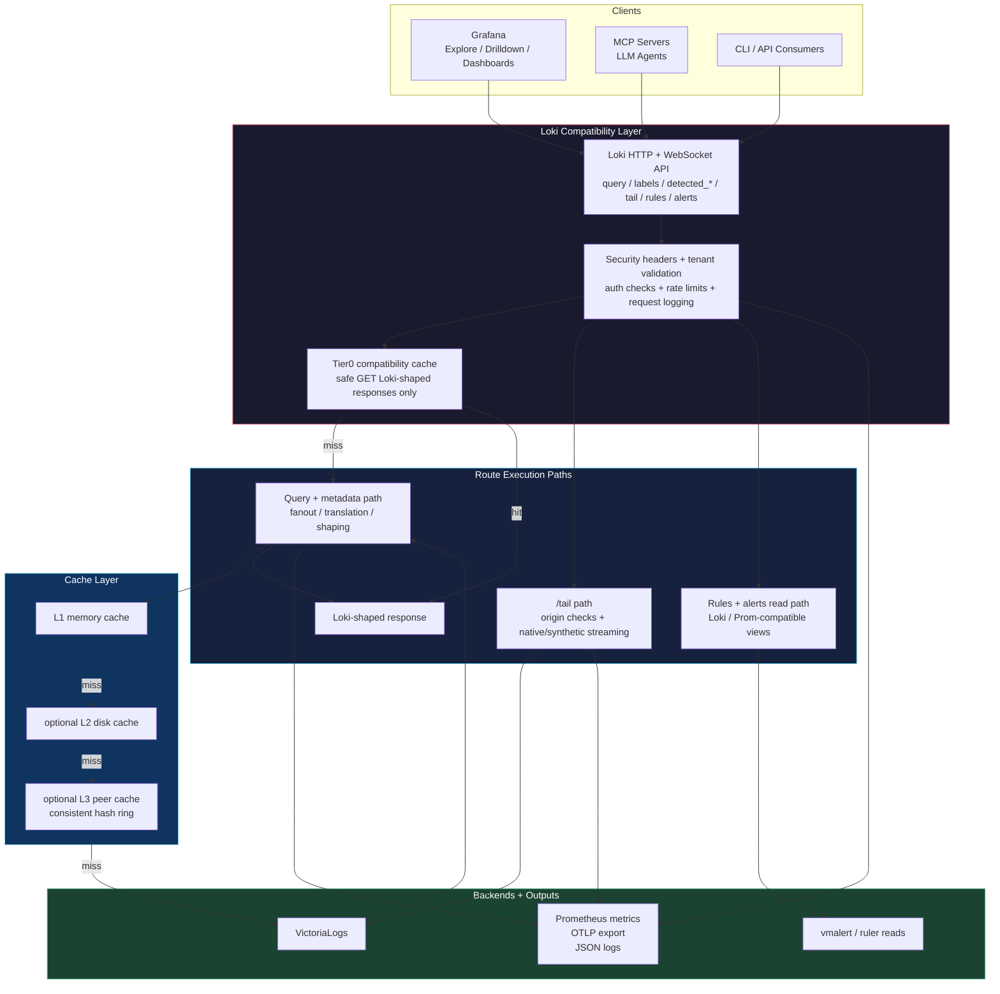

# Loki-VL-proxy

[](https://github.com/ReliablyObserve/Loki-VL-proxy/actions/workflows/ci.yaml)
[](https://github.com/ReliablyObserve/Loki-VL-proxy/actions/workflows/compat-loki.yaml)
[](https://github.com/ReliablyObserve/Loki-VL-proxy/actions/workflows/compat-drilldown.yaml)
[](https://github.com/ReliablyObserve/Loki-VL-proxy/actions/workflows/compat-vl.yaml)
[](https://go.dev/)
[](https://github.com/ReliablyObserve/Loki-VL-proxy/releases)
[](https://github.com/ReliablyObserve/Loki-VL-proxy)
[](#tests)
[](#tests)
[](#logql-compatibility)
[](LICENSE)
[](https://github.com/ReliablyObserve/Loki-VL-proxy/actions/workflows/codeql.yaml)

HTTP proxy that exposes a **Loki-compatible read API** on the frontend and translates requests to **VictoriaLogs** on the backend. Use Grafana's native Loki datasource (Explore, Drilldown, dashboards) with VictoriaLogs -- no custom datasource plugin needed.

**Single static binary**, ~10MB Docker image, zero external runtime dependencies.

## Architecture



See [Architecture](docs/architecture.md) for component design, [Observability](docs/observability.md) for metrics/logging/integration guidance, and [Fleet Cache](docs/fleet-cache.md) for distributed caching.

## Key Features

### Loki Compatibility Layer
See [Getting Started](docs/getting-started.md), [Architecture](docs/architecture.md), [API Reference](docs/api-reference.md), [Loki Compatibility](docs/compatibility-loki.md), and [Logs Drilldown Compatibility](docs/compatibility-drilldown.md).

- **Loki-compatible frontend** -- use the standard Loki datasource, API shape, and WebSocket tail entrypoints against VictoriaLogs without a custom plugin
- **Full LogQL execution surface** -- stream selectors, filters, parsers, metric queries, binary expressions, and subqueries are supported, with proxy-side evaluation for the parts VictoriaLogs does not natively provide
- **Grafana-native workflows** -- Explore, Logs Drilldown, dashboards, live tail, and datasource-side multi-tenant reads work through the same datasource model operators already know
- **OTel-aware label and metadata translation** -- bidirectional dot/underscore conversion plus hybrid field exposure keeps Loki labels usable while preserving dotted OTel-style metadata for field-oriented flows
- **Read-path rules and alerts compatibility** -- surface `vmalert` rules and alerts on Loki-compatible read endpoints and migrate Loki-style rule files with the built-in converter
- **Indexed fast path where possible** -- known VictoriaLogs `_stream_fields` can stay on native stream selectors instead of dropping to slower field scans
- **Tier0 safe response cache** -- a dedicated compatibility-edge microcache can short-circuit repeated safe GET reads after tenant validation without bypassing translation, auth, or route policy on misses

### Security & Hardening
See [Security](docs/security.md), [Configuration](docs/configuration.md), [Observability](docs/observability.md), and [Known Issues](docs/KNOWN_ISSUES.md).

- **Closed-by-default admin surface** -- `/debug/queries`, `pprof`, and peer-cache internals require explicit enablement and can be additionally protected with admin auth
- **Tenant isolation controls** -- explicit tenant mapping, default-tenant aliases for VL `0:0`, and bounded read fanout on `X-Scope-OrgID: tenant-a|tenant-b`
- **Layered request protection** -- rate limiting, concurrency caps, request coalescing, normalization, cache boundaries, and circuit breaking all apply before backend pressure cascades
- **Origin, delete, and secret safeguards** -- browser-origin checks for `/tail`, confirmation-gated deletes, tenant-scoped destructive paths, and log redaction for sensitive values
- **TLS and identity passthrough support** -- server-side HTTPS, backend TLS, OTLP TLS, optional client cert auth, and controlled header/cookie forwarding to the backend

### Performance & Scale
See [Performance Guide](docs/performance.md), [Scaling](docs/scaling.md), [Fleet Cache](docs/fleet-cache.md), and [Observability](docs/observability.md).

- **Fast where Grafana feels it** -- the proxy keeps repeated dashboard refreshes, Explore reads, and Drilldown metadata calls on warm cache paths measured in nanoseconds to sub-microseconds instead of milliseconds
- **Tier0 plus tiered caches** -- a small compatibility-edge response cache fronts the existing in-memory LRU + TTL, optional disk-backed bbolt, and fleet peer-cache layers
- **Fleet-aware scaling** -- consistent hashing, shadow copies with TTL preservation, headless-service peer discovery, and per-peer circuit breakers keep multi-replica fleets efficient under HPA churn
- **Hot-path backend reduction** -- request coalescing, Tier0 cache hits, query normalization, and cached Loki-shaped responses reduce duplicate backend work for repeated dashboards and shared reads
- **Bounded expensive paths** -- multi-tenant fanout, merge size, synthetic-tail dedup state, and metadata/discovery fallbacks all have explicit safety caps
- **Graceful fallback behavior** -- native-first metadata discovery and synthetic tail fallback keep user-facing flows working when backend-native paths are absent or incomplete
- **Measured regression control** -- compatibility, performance, and quality gates track cache-hit versus bypass behavior, throughput, allocations, and memory growth across hot paths

### Operations
See [Getting Started](docs/getting-started.md), [Configuration](docs/configuration.md), [Scaling](docs/scaling.md), [Observability](docs/observability.md), [Testing](docs/testing.md), [Compatibility Matrix](docs/compatibility-matrix.md), and [Rules And Alerts Migration](docs/rules-alerts-migration.md).

- **Multitenant deployment model** -- Loki tenant headers map to VictoriaLogs `AccountID` and `ProjectID`, with hot-reloadable tenant configuration
- **Operational observability** -- Prometheus `/metrics`, OTLP export, structured JSON logs, per-tenant and per-client breakdowns, and peer-cache metrics are available out of the box
- **Rules migration support** -- convert Loki-style rule files into `vmalert` `type: vlogs` definitions for read-compatible Grafana alert visibility
- **Production Helm support** -- OCI chart publishing, `Deployment` or `StatefulSet` modes, persistent disk cache, headless peer discovery, HPA support, and GOMEMLIMIT auto-tuning
- **Versioned compatibility tracks** -- Loki, VictoriaLogs, and Logs Drilldown are validated as separate compatibility tracks with dedicated CI signals

## Quick Start

```bash
# Build and run
go build -o loki-vl-proxy ./cmd/proxy
./loki-vl-proxy -backend=http://your-victorialogs:9428

# Docker
docker build -t loki-vl-proxy .
docker run -p 3100:3100 loki-vl-proxy -backend=http://victorialogs:9428

# Pull published release images
docker pull ghcr.io/reliablyobserve/loki-vl-proxy:<release>
docker pull docker.io/slaskoss/loki-vl-proxy:<release>

# Docker Compose (dev/test with Grafana)
docker-compose up -d
# Grafana at http://localhost:3000
```

Image publication model:

- `ghcr.io/reliablyobserve/loki-vl-proxy:<release>` is always published by release workflows.
- `docker.io/slaskoss/loki-vl-proxy:<release>` is published when Docker Hub credentials are configured in repo secrets.
- Helm charts are published to `oci://ghcr.io/reliablyobserve/charts/loki-vl-proxy:<release>`.

### Helm (Kubernetes)

```bash
helm install loki-vl-proxy oci://ghcr.io/reliablyobserve/charts/loki-vl-proxy \
  --version <release> \
  --set extraArgs.backend=http://victorialogs:9428

# Local chart (development)
helm install loki-vl-proxy ./charts/loki-vl-proxy \
  --set extraArgs.backend=http://victorialogs:9428
```

For persistent cache, switch the workload to `StatefulSet` and enable `persistence`. The chart will mount the PVC and inject `-disk-cache-path` automatically unless you override it explicitly:

```bash
helm install loki-vl-proxy ./charts/loki-vl-proxy \
  --set workload.kind=StatefulSet \
  --set persistence.enabled=true \
  --set persistence.size=10Gi \
  --set extraArgs.backend=http://victorialogs:9428
```

### Fleet Cache (Multi-Replica)

```bash
# Kubernetes (DNS discovery via headless service)
helm install loki-vl-proxy ./charts/loki-vl-proxy \
  --set replicaCount=3 \
  --set peerCache.enabled=true
```

When `peerCache.enabled=true`, the chart provisions a headless service and injects `-peer-self`, `-peer-discovery=dns`, and `-peer-dns` automatically. The proxy refreshes peers from DNS on a timer, so HPA-driven pod churn does not require a static replica list. The same headless service is also used automatically when `workload.kind=StatefulSet`.

### Grafana Datasource

```yaml
datasources:
  - name: Loki (via VL proxy)
    type: loki
    access: proxy
    url: http://loki-vl-proxy:3100
    jsonData:
      maxLines: 5000
      timeout: 600
      httpHeaderName1: X-Scope-OrgID
    secureJsonData:
      httpHeaderValue1: team-alpha
```

### Grafana Datasource with OTel Label Translation

```yaml
datasources:
  - name: Loki (VL + OTel)
    type: loki
    access: proxy
    url: http://loki-vl-proxy:3100
    # Use with: loki-vl-proxy -label-style=underscores
    # Queries like {service_name="api"} auto-translate to VL's service.name
```

Proxy-side datasource helpers:

- `-cache-max-bytes` to set the primary L1 in-memory cache budget explicitly
- `-compat-cache-enabled` to keep the Tier0 compatibility-edge cache on or off
- `-compat-cache-max-percent` to reserve a bounded share of the L1 memory budget for Tier0, defaulting to 10% and capped at 50%
- `-backend-timeout` for long Grafana queries against VL
- `-forward-headers` and `-forward-cookies` for backend auth/context passthrough
- `-metrics.trust-proxy-headers` to trust `X-Grafana-User` and surface per-user client metrics/log context
- `-metadata-field-mode=hybrid` by default, so field APIs expose both dotted OTel names and Loki-style aliases without changing the label surface
- built-in default-tenant aliases `0`, `fake`, and `default` for VL's `0:0` tenant during single-tenant migrations
- explicit Loki-style multi-tenant fanout on read/query endpoints with `X-Scope-OrgID: tenant-a|tenant-b`
- synthetic `__tenant_id__` labels in merged query results so Explore and Drilldown filters can narrow multi-tenant reads back down
- multi-tenant Drilldown and Explore level filters such as `detected_level="error" or detected_level="info"` are translated and regression-tested against the live Grafana stack
- `-tenant.allow-global` to let `X-Scope-OrgID: *` use VL's default `0:0` tenant as a proxy-specific wildcard bypass
- native-first Drilldown field and label discovery that keeps slower-changing metadata hot in cache while leaving live query and tail paths conservative
- safe Tier0 response caching only on cacheable GET reads such as `query`, `query_range`, `series`, labels, volume, and Drilldown metadata endpoints; `/tail`, writes, and websocket paths stay outside it
- `-tls-client-ca-file` and `-tls-require-client-cert` for HTTPS client auth
- `-tail.mode=auto|native|synthetic` to choose native tail, forced synthetic tail, or the default native-with-fallback behavior
- `-tail.allowed-origins` when Grafana or another browser client must use `/tail`

### Why The Cache Stack Matters

You do not need to understand the implementation details to understand the operational value:

| Layer | Plain-English role | Operator benefit |
|---|---|---|
| `Tier0` | Instant answer cache at the Loki-compatible frontend | Repeated Grafana reads can return before most proxy work even starts |
| `L1` memory | Hot local RAM cache on one proxy pod | The fastest path for repeated dashboard and Explore traffic |
| `L2` disk | Local persistent cache on the same pod or node | Keeps useful cached results available beyond memory pressure and across larger working sets |
| `L3` fleet peer cache | Cache sharing between proxy replicas | One warm pod can help the rest of the fleet instead of every pod hitting VictoriaLogs separately |

In measured benchmarks on this branch:

| Example path | Cold or uncached path | Warm cached path | Why it matters |
|---|---|---|---|
| `query_range` | `4.58 ms` | `0.64-0.67 us` | Repeated dashboard refreshes stop behaving like backend work |
| `detected_field_values` | `2.76 ms` | `0.71 us` | Drilldown metadata becomes effectively instant after warm-up |
| fleet peer-cache reuse | network/backend path | `52 ns` local shadow-copy hit | A 3-node fleet can reuse hot results instead of refetching them |

How to read benchmark labels:

| Benchmark label | Plain-English meaning |
|---|---|
| `query_range` primary-cache hit | The normal internal cache path already satisfied the handler |
| `query_range` Tier0 compat hit | Final Loki-shaped response was served from Tier0 at the compatibility edge |
| `detected_fields` primary-cache hit | Normal in-handler cache path |
| `detected_fields` Tier0 compat hit | Final response returned before most handler work |
| `detected_field_values` no compat cache | Full metadata path executed |
| `detected_field_values` Tier0 compat hit | Tier0 short-circuited the compatibility path |

Short interpretation:

- Primary cache is the regular internal cache pipeline.
- Tier0 is the compatibility-edge final-response cache.
- Biggest Tier0 wins show up on metadata and Drilldown-style endpoints, where there is more compatibility work to skip.
- On hot `query_range` paths, the normal cache is already highly optimized, so Tier0 mostly preserves that win instead of multiplying it.

The practical outcome is simple: the proxy does not just make VictoriaLogs look like Loki, it keeps common Grafana read paths fast enough to feel native even when the backend path is more complex.

Current scope boundaries and follow-up hardening are tracked in [Known Issues](docs/KNOWN_ISSUES.md):

- rules and alerts are exposed on read endpoints only; writes stay on the VictoriaLogs / `vmalert` side by design
- browser `/tail` access requires explicit `-tail.allowed-origins`
- `/tail` remains single-tenant
- `X-Scope-OrgID: *` remains a proxy-specific default/global convenience
- coverage and test hardening is still open

Tier0 and fleet-cache performance validation is covered by targeted benchmarks and load-style tests now, and the next CI step is to promote the compose-backed e2e cache/performance smoke flows into GitHub Actions on pull requests and post-merge `main` runs.

### Grafana Datasource for Multi-Tenant Read Fanout

```yaml
datasources:
  - name: Loki (VL multi-tenant)
    type: loki
    access: proxy
    url: http://loki-vl-proxy:3100
    jsonData:
      httpHeaderName1: X-Scope-OrgID
    secureJsonData:
      httpHeaderValue1: team-a|team-b
```

Use `__tenant_id__` in Explore or Drilldown-compatible queries when you want to narrow a multi-tenant datasource back to a single tenant:

```logql
{app="api-gateway", __tenant_id__="team-b"}
{service_name="api-gateway", __tenant_id__=~"team-.*"}
```

## Docs

- [Observability](docs/observability.md)
- [Configuration](docs/configuration.md)
- [Rules And Alerts Migration](docs/rules-alerts-migration.md)
- [API Reference](docs/api-reference.md)
- [Architecture](docs/architecture.md)
- [Fleet Cache](docs/fleet-cache.md)
- [Performance](docs/performance.md)
- [Compatibility Matrix](docs/compatibility-matrix.md)
- [Testing](docs/testing.md)

## API Coverage

20 Loki endpoints implemented. See [API Reference](docs/api-reference.md) for the full table.

| Category | Endpoints |
|---|---|
| Data queries | `query_range`, `query`, `series`, `labels`, `label/{name}/values` |
| Analytics | `index/stats`, `index/volume`, `index/volume_range`, `patterns` |
| Metadata | `detected_fields`, `detected_labels`, `detected_field/{name}/values` |
| Streaming | `tail` (WebSocket), `format_query` |
| Write | `push` (blocked 405), `delete` (safeguarded) |
| Admin | `rules`, `alerts`, `config`, `buildinfo`, `ready` |

**887 tests** (unit + fuzz + perf regression + race-safe)

## Compatibility Tracks

The repo now reports compatibility as three separate tracks instead of one blended percentage:

| Track | Scope | Versions tracked |
|---|---|---|
| Loki | Loki API and LogQL behavior for Loki clients | `3.6.x`, `3.7.x` |
| Logs Drilldown | Grafana Logs Drilldown app contracts and service-detail flows | `1.0.x`, `2.0.x` |
| VictoriaLogs | Backend integration and translation behavior | `v1.3x.x`, `v1.4x.x` |

The support window is deliberate. We do not try to carry unlimited historical compatibility. Loki tracks the current minor family plus one minor behind, Logs Drilldown tracks the current family plus one family behind, and VictoriaLogs currently tracks the `v1.3x.x` and `v1.4x.x` backend bands.
Those compatibility workflows read their version matrices from the shared manifest in `test/e2e-compat/compatibility-matrix.json`, so one update moves CI and docs together.

See [Compatibility Matrix](docs/compatibility-matrix.md), [Loki Compatibility](docs/compatibility-loki.md), [Logs Drilldown Compatibility](docs/compatibility-drilldown.md), and [VictoriaLogs Compatibility](docs/compatibility-victorialogs.md).

## LogQL Compatibility

**100% of LogQL features handled** -- no errors, no silent failures. Every feature either translates natively to VL or is evaluated at the proxy layer.

| Feature | Status | Implementation |
|---------|--------|----------------|
| Stream selectors `{app="x"}` | Native | Field filters (or VL stream selectors with `-stream-fields`) |
| Line filters `\|= "text"` | Native | Substring match via `~"text"` |
| Parsers `\| json`, `\| logfmt`, `\| pattern`, `\| regexp` | Native | VL `unpack_json`, `unpack_logfmt`, `extract`, `extract_regexp` |
| Label filters `\| level="error"` | Native | VL field filters |
| Metric queries `rate()`, `count_over_time()`, etc. | Native | VL `stats` pipeline |
| Binary expressions `A / B`, `A * 100` | Proxy | Parallel VL queries + arithmetic |
| `quantile_over_time()` | Native | VL `quantile(phi, field)` |
| `without()` grouping | Proxy | VL returns all labels, proxy strips excluded labels |
| `on()`/`ignoring()` | Proxy | Label-subset matching with join semantics |
| `group_left()`/`group_right()` | Proxy | One-to-many join with label inclusion |
| `bool` modifier | Proxy | Stripped; comparisons return 1/0 |
| `offset` / `@` modifiers | Proxy | Stripped at translation |
| Subquery `rate(...)[1h:5m]` | Proxy | Concurrent sub-step evaluation + aggregation |
| `unwrap duration()/bytes()` | Proxy | Unit conversion parsers |
| `\| decolorize` | Proxy | ANSI stripping |
| `absent_over_time()` | Native | Mapped to `count()` |
| `\| line_format` / `\| label_format` | Proxy | Template evaluation |

All features produce correct results. Implementation details for advanced features in [Known Issues](docs/KNOWN_ISSUES.md).

## Release Automation

`Auto Release` on `main` now uses a precedence order aligned with common OSS patterns:

1. explicit release labels on merged PR: `release:major`, `release:minor`, `release:patch`, `no-release`
2. semantic PR labels: `breaking-change`, `feature`, `bugfix`, `performance`
3. conventional commit subjects (`feat`, `fix`, `perf`, `refactor`, `revert`, breaking markers)
4. fallback patch bump for non-doc/non-ci changes when no explicit signal is present

Release is skipped only when the change-set since the latest tag is docs/metadata/CI only (`README`, `CHANGELOG`, `docs/`, `.github/`). Helm chart changes are treated as releasable, and metadata sync commits are loop-protected with `[skip ci]`.

## Documentation

| Document | Contents |
|---|---|
| [Architecture](docs/architecture.md) | Component design, data flow, protection layers, data model mapping |
| [Fleet Cache](docs/fleet-cache.md) | Distributed cache: hash ring, shadow copies, TTL preservation, circuit breakers |
| [Configuration](docs/configuration.md) | All flags, environment variables, cache, tenancy, TLS, OTLP |
| [API Reference](docs/api-reference.md) | Endpoint table, delete safeguards, metrics, observability |
| [Translation Reference](docs/translation-reference.md) | LogQL to LogsQL mapping table, supported/unsupported features |
| [Performance](docs/performance.md) | Benchmarks, optimization techniques, scaling profile, CI regression gates |
| [Benchmarks](docs/benchmarks.md) | Raw benchmark numbers, connection pool tuning, hot path analysis |
| [Scaling](docs/scaling.md) | Capacity planning, resource projections, per-tenant/client metrics, Helm sizing |
| [Operations](docs/operations.md) | Deployment, performance tuning, troubleshooting |
| [Testing](docs/testing.md) | Test categories, running tests, fuzz testing |
| [Compatibility Matrix](docs/compatibility-matrix.md) | Separate Loki, Drilldown, and VictoriaLogs compatibility tracks |
| [Loki Compatibility](docs/compatibility-loki.md) | Loki API and LogQL version matrix |
| [Logs Drilldown Compatibility](docs/compatibility-drilldown.md) | Drilldown app version matrix and app contracts |
| [VictoriaLogs Compatibility](docs/compatibility-victorialogs.md) | VictoriaLogs backend version matrix and translation focus |
| [Known Issues](docs/KNOWN_ISSUES.md) | VL compatibility gaps, data model differences |
| [Roadmap](docs/roadmap.md) | Completed features and planned work |
| [Changelog](CHANGELOG.md) | Release history |

## License

Apache License 2.0. See [LICENSE](LICENSE) for details.
