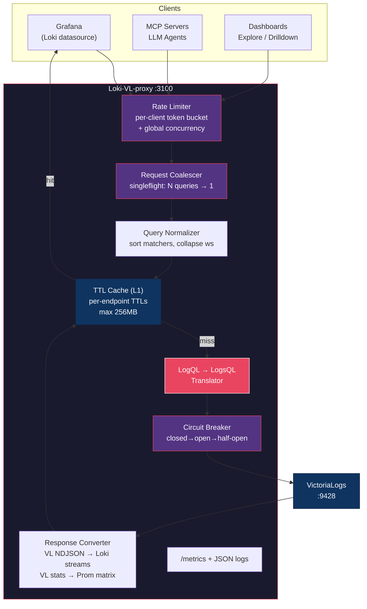
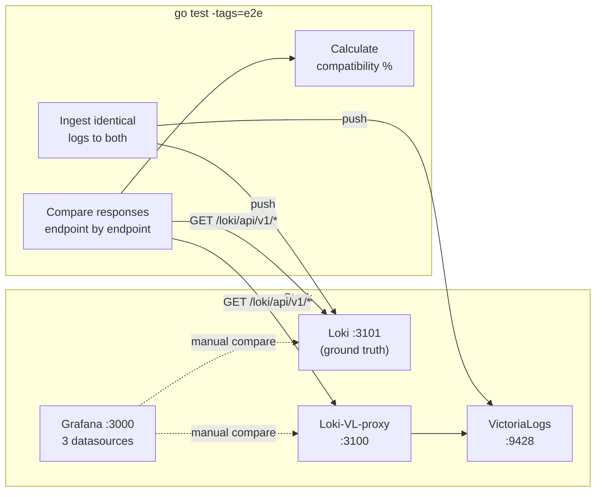

# Loki-VL-proxy

HTTP proxy that exposes a **Loki-compatible API** on the frontend and translates requests to **VictoriaLogs** on the backend. Allows using Grafana's native Loki datasource (Explore, Drilldown, dashboards) with VictoriaLogs — no custom datasource plugin needed.

## Architecture



### E2E Test Architecture



## Features

- **LogQL → LogsQL translation**: stream selectors, line filters, label filters, parsers, metric queries
- **Response format conversion**: VL NDJSON → Loki streams, VL stats → Prometheus matrix/vector
- **Request coalescing**: N identical concurrent queries → 1 backend request (singleflight)
- **Rate limiting**: per-client token bucket + global concurrent query semaphore
- **Circuit breaker**: opens after consecutive failures, auto-recovers via half-open probing
- **Query normalization**: sort label matchers, collapse whitespace for better cache hits
- **Tiered cache**: per-endpoint TTLs (labels=60s, queries=10s), max bytes (256MB), eviction stats
- **Multitenancy**: String→int tenant mapping for Loki `X-Scope-OrgID` → VL `AccountID`/`ProjectID`
- **WebSocket tail**: `/loki/api/v1/tail` bridges Loki WebSocket to VL NDJSON streaming
- **L2 disk cache**: bbolt-backed on-disk cache with gzip compression, AES-256 encryption, write-back buffer (AWS ST1 optimized)
- **OTLP telemetry**: Push proxy metrics to any OTLP HTTP endpoint (gzip/zstd compression, TLS)
- **Observability**: Prometheus `/metrics`, structured JSON logs via `slog`
- **Hardened HTTP**: Request body/header size limits, read/write/idle timeouts, security headers
- **Single static binary**, ~10MB Docker image, zero external dependencies at runtime

## API Coverage

| Loki Endpoint | Status | VL Backend | Cached | Tests |
|---|---|---|---|---|
| `/loki/api/v1/query_range` (logs) | Implemented | `/select/logsql/query` | 10s | 6 |
| `/loki/api/v1/query_range` (metrics) | Implemented | `/select/logsql/stats_query_range` | 10s | 1 |
| `/loki/api/v1/query` | Implemented | `/select/logsql/query` or `stats_query` | 10s | 1 |
| `/loki/api/v1/labels` | Implemented | `/select/logsql/field_names` | 60s | 3 |
| `/loki/api/v1/label/{name}/values` | Implemented | `/select/logsql/field_values` | 60s | 3 |
| `/loki/api/v1/series` | Implemented | `/select/logsql/streams` | 30s | 2 |
| `/loki/api/v1/index/stats` | Stub | — | — | 1 |
| `/loki/api/v1/index/volume` | Stub | — | — | 1 |
| `/loki/api/v1/index/volume_range` | Stub | — | — | 1 |
| `/loki/api/v1/detected_fields` | Implemented | `/select/logsql/field_names` | 30s | 1 |
| `/loki/api/v1/patterns` | Stub | — | — | 1 |
| `/loki/api/v1/tail` | Not yet | `/select/logsql/tail` | — | 1 |
| `/ready` | Implemented | `/health` | — | 2 |
| `/loki/api/v1/status/buildinfo` | Implemented | — | — | 1 |
| `/metrics` | Implemented | — | — | 1 |

**181 tests total** (127 unit + 54 e2e, all at 100% compatibility)

## Protection Layers

| Layer | Purpose | Default Config |
|---|---|---|
| Per-client rate limiter | Prevent individual client abuse | 50 req/s, burst 100 |
| Global concurrent limit | Cap total backend load | 100 concurrent queries |
| Request coalescing | Deduplicate identical queries | Automatic (singleflight) |
| Query normalization | Improve cache hit rate | Sort matchers, collapse whitespace |
| In-memory TTL cache | Reduce backend calls | Per-endpoint TTLs, 256MB max |
| Circuit breaker | Protect VL from cascading failure | Opens after 5 failures, 10s backoff |

### How Coalescing Works

When 50 Grafana dashboards (or MCP/LLM agents) send `{app="nginx"} |= "error"` simultaneously:

```
Client 1 ──┐
Client 2 ──┤
Client 3 ──┤──→ 1 request to VL ──→ response shared to all 50
  ...      │
Client 50 ─┘
```

Only **1** request reaches VictoriaLogs. All clients get the same response.

## LogQL Translation Reference

| LogQL | LogsQL |
|---|---|
| `{app="nginx"}` | `{app="nginx"}` |
| `\|= "error"` | `"error"` |
| `!= "debug"` | `-"debug"` |
| `\|~ "err.*"` | `~"err.*"` |
| `!~ "debug.*"` | `NOT ~"debug.*"` |
| `\| json` | `\| unpack_json` |
| `\| logfmt` | `\| unpack_logfmt` |
| `\| pattern "<ip> ..."` | `\| extract "<ip> ..."` |
| `\| regexp "..."` | `\| extract_regexp "..."` |
| `\| line_format "{{.x}}"` | `\| format "<x>"` |
| `\| label_format x="{{.y}}"` | `\| format "<y>" as x` |
| `\| drop a, b` | `\| delete a, b` |
| `\| keep a, b` | `\| fields a, b` |
| `\| label == "val"` | `label:=val` |
| `\| label != "val"` | `-label:=val` |
| `rate({...}[5m])` | `... \| stats rate()` |
| `count_over_time({...}[5m])` | `... \| stats count()` |
| `sum(rate({...}[5m])) by (x)` | `... \| stats by (x) rate()` |
| `bytes_over_time({...}[5m])` | `... \| stats sum(len(_msg))` |
| `bytes_rate({...}[5m])` | `... \| stats rate_sum(len(_msg))` |
| `avg_over_time({...} \| unwrap d [5m])` | `... \| stats avg(d)` |
| `topk(10, rate({...}[5m]))` | `... \| stats rate()` |
| `\| unwrap field` | *(silently dropped — VL stats take field names directly)* |
| `\| label =~ "5.."` | `\| filter label:~"5.."` |
| `\| label !~ "GET\|HEAD"` | `\| filter -label:~"GET\|HEAD"` |

**Note**: Loki `\|= "text"` is **substring** match. Translated to VL `~"text"` (not `"text"` which is word-only).

Full reference: https://docs.victoriametrics.com/victorialogs/logql-to-logsql/

See also: [docs/KNOWN_ISSUES.md](docs/KNOWN_ISSUES.md) for VL compatibility gaps and limitations.

## Installation

### Binary

```bash
# Build from source
go build -o loki-vl-proxy ./cmd/proxy
./loki-vl-proxy -backend=http://your-victorialogs:9428
```

### Docker

```bash
docker build -t loki-vl-proxy .
docker run -p 3100:3100 loki-vl-proxy -backend=http://victorialogs:9428
```

### Helm (Kubernetes)

```bash
helm install loki-vl-proxy ./charts/loki-vl-proxy \
  --set extraArgs.backend=http://victorialogs:9428

# With ServiceMonitor for Prometheus scraping
helm install loki-vl-proxy ./charts/loki-vl-proxy \
  --set extraArgs.backend=http://victorialogs:9428 \
  --set serviceMonitor.enabled=true

# Custom values
helm install loki-vl-proxy ./charts/loki-vl-proxy -f my-values.yaml
```

VictoriaMetrics-style: all proxy flags are exposed via `extraArgs`:

```yaml
extraArgs:
  listen: ":3100"
  backend: "http://victorialogs:9428"
  cache-ttl: "30s"
  cache-max: "50000"
  log-level: "debug"
```

### Docker Compose (dev/test)

```bash
docker-compose up -d
# Grafana at http://localhost:3000, Loki datasource pre-configured
```

### Grafana Datasource Configuration

Point a Loki datasource at the proxy:

```yaml
apiVersion: 1
datasources:
  - name: Loki (via VL proxy)
    type: loki
    access: proxy
    url: http://loki-vl-proxy:3100
    jsonData:
      maxLines: 1000
```

## Configuration

All flags follow VictoriaMetrics naming conventions (`-flagName=value`):

| Flag | Env | Default | Description |
|---|---|---|---|
| **Server** | | | |
| `-listen` | `LISTEN_ADDR` | `:3100` | Listen address |
| `-backend` | `VL_BACKEND_URL` | `http://localhost:9428` | VictoriaLogs backend URL |
| `-log-level` | — | `info` | Log level: debug, info, warn, error |
| **Cache (L1 in-memory)** | | | |
| `-cache-ttl` | — | `60s` | Default cache TTL |
| `-cache-max` | — | `10000` | Maximum cache entries |
| **Cache (L2 on-disk)** | | | |
| `-disk-cache-path` | — | — | Path to bbolt DB file (empty = disabled) |
| `-disk-cache-compress` | — | `true` | Gzip compression for disk cache |
| `-disk-cache-flush-size` | — | `100` | Flush write buffer after N entries |
| `-disk-cache-flush-interval` | — | `5s` | Write buffer flush interval |
| `-disk-cache-encryption-key` | — | — | AES-256 key (32 bytes) for encryption at rest |
| **Multitenancy** | | | |
| `-tenant-map` | `TENANT_MAP` | — | JSON string→int tenant mapping (see below) |
| **OTLP Telemetry** | | | |
| `-otlp-endpoint` | `OTLP_ENDPOINT` | — | OTLP HTTP endpoint for proxy metrics |
| `-otlp-interval` | — | `30s` | Push interval |
| `-otlp-compression` | `OTLP_COMPRESSION` | `none` | Compression: `none`, `gzip`, `zstd` |
| `-otlp-timeout` | — | `10s` | HTTP request timeout |
| `-otlp-tls-skip-verify` | — | `false` | Skip TLS verification (self-signed certs) |
| **HTTP Hardening** | | | |
| `-http-read-timeout` | — | `30s` | Server read timeout |
| `-http-write-timeout` | — | `120s` | Server write timeout |
| `-http-idle-timeout` | — | `120s` | Server idle timeout |
| `-http-max-header-bytes` | — | `1MB` | Maximum header size |
| `-http-max-body-bytes` | — | `10MB` | Maximum request body size |

## Multitenancy

The proxy maps Loki's `X-Scope-OrgID` header to VictoriaLogs' `AccountID`/`ProjectID` headers.

### Tenant Resolution Order

1. **Tenant map lookup** — if `-tenant-map` is configured and the org ID matches a key, use the mapped `AccountID`/`ProjectID`
2. **Numeric passthrough** — if the org ID is a number (e.g., `"42"`), pass it directly as `AccountID` with `ProjectID: 0`
3. **Default** — unmapped non-numeric org IDs get `AccountID: 0`, `ProjectID: 0`

### Configuration

```bash
# Via flag (JSON)
./loki-vl-proxy -tenant-map='{"team-alpha":{"account_id":"100","project_id":"1"},"team-beta":{"account_id":"200","project_id":"2"}}'

# Via environment variable
export TENANT_MAP='{"ops-prod":{"account_id":"300","project_id":"0"}}'
./loki-vl-proxy
```

### Helm values

```yaml
extraArgs:
  tenant-map: '{"team-alpha":{"account_id":"100","project_id":"1"}}'
```

### Grafana Datasource per Tenant

```yaml
datasources:
  - name: Logs (team-alpha)
    type: loki
    url: http://loki-vl-proxy:3100
    jsonData:
      httpHeaderName1: X-Scope-OrgID
    secureJsonData:
      httpHeaderValue1: team-alpha
```

## Structured Metadata Mapping

Loki 3.x has three categories of labels:
1. **Stream labels** — indexed, low-cardinality (e.g., `app`, `namespace`)
2. **Structured metadata** — per-entry key-value pairs (e.g., `trace_id`, `span_id`)
3. **Parsed labels** — extracted at query time via `| json`, `| logfmt`, etc.

VictoriaLogs treats all fields equally — no distinction between stream fields and metadata.

The proxy maps VL fields to Loki's model:

| VL Field | Loki Mapping |
|---|---|
| `_stream` fields (declared at ingestion) | Stream labels |
| Regular fields (all others) | Structured metadata |
| `_time` | Timestamp |
| `_msg` | Log line body |
| Fields from `| unpack_json` / `| unpack_logfmt` | Parsed labels |

In practice, Grafana Explore treats both stream labels and structured metadata as queryable labels, so the distinction is mostly cosmetic.

## Observability

### Metrics (Prometheus scrape)

`GET /metrics` exposes:

```
# Request tracking
loki_vl_proxy_requests_total{endpoint, status}
loki_vl_proxy_request_duration_seconds{endpoint}  (histogram)

# Cache efficiency
loki_vl_proxy_cache_hits_total
loki_vl_proxy_cache_misses_total

# Translation tracking
loki_vl_proxy_translations_total
loki_vl_proxy_translation_errors_total

# System
loki_vl_proxy_uptime_seconds
```

### Logs

Structured JSON to stdout via Go's `slog`:

```json
{"time":"2024-01-15T10:30:00Z","level":"INFO","msg":"query_range request","logql":"{app=\"nginx\"} |= \"error\""}
{"time":"2024-01-15T10:30:00Z","level":"DEBUG","msg":"translated query","logsql":"{app=\"nginx\"} \"error\""}
```

## Testing

```bash
# Unit + contract + advanced tests (106 tests)
go test ./...

# Verbose with individual test names
go test ./... -v

# E2E compatibility tests (requires docker-compose)
cd test/e2e-compat
docker-compose up -d
go test -v -tags=e2e -timeout=120s ./test/e2e-compat/

# Build binary
go build -o loki-vl-proxy ./cmd/proxy
```

### Test Coverage by Category

| Category | Tests | What they verify |
|---|---|---|
| Loki API contracts | 30 | Exact response JSON structure per Loki spec |
| LogQL translation (basic) | 30 | Stream selectors, line filters, parsers, label filters |
| LogQL translation (advanced) | 22 | Metric queries, unwrap, topk, sum by, complex pipelines |
| Query normalization | 8 | Canonicalization for cache keys |
| Cache behavior | 6 | Hit/miss/TTL/eviction/protection |
| Multitenancy | 4 | String→int mapping, numeric passthrough, unmapped default |
| WebSocket tail | 2 | Query validation, WebSocket frame structure |
| Disk cache (L2) | 12 | Set/get, TTL, compression, AES encryption, persistence |
| OTLP pusher | 4 | Push, custom headers, error handling, payload structure |
| Hardening | 4 | Query length limit, limit sanitization, security headers |
| Middleware | 12 | Coalescing, rate limiting, circuit breaker |
| Benchmarks | 10 | Translation ~5μs, cache hit 42ns |
| E2E basic (Loki vs proxy) | 11 | Side-by-side API response comparison |
| E2E complex (real-world) | 31 | Multi-label, chained filters, parsers, cross-service |
| E2E edge cases (VL issues) | 12 | Large bodies, dotted labels, unicode, multiline |

## Roadmap

- [x] String→int multitenancy mapping (`-tenant-map`)
- [x] `/loki/api/v1/tail` — WebSocket→NDJSON bridge for live tailing
- [x] L2 on-disk cache (bbolt) with compression + encryption + write-back buffer
- [x] OTLP push for proxy telemetry (gzip/zstd, TLS, custom headers)
- [x] HTTP hardening (timeouts, body limits, security headers)
- [ ] `/loki/api/v1/index/stats` — real implementation via VL `/select/logsql/hits`
- [ ] `/loki/api/v1/index/volume` — volume data via VL hits with field grouping
- [ ] `/loki/api/v1/detected_field/{name}/values` endpoint
- [ ] Query fingerprinting + analytics dashboard
- [ ] Auto-warming cache for top-N queries
