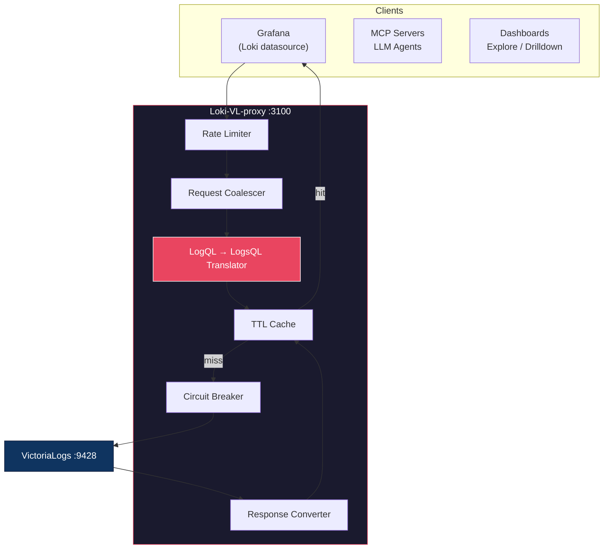

# Loki-VL-proxy

HTTP proxy that exposes a **Loki-compatible API** on the frontend and translates requests to **VictoriaLogs** on the backend. Use Grafana's native Loki datasource (Explore, Drilldown, dashboards) with VictoriaLogs -- no custom datasource plugin needed.

**Single static binary**, ~10MB Docker image, zero external runtime dependencies.

## Architecture



See [docs/architecture.md](docs/architecture.md) for detailed component design, data model mapping, and E2E test architecture.

## Key Features

- **LogQL translation** -- stream selectors, line filters, parsers, metric queries, binary expressions
- **Response conversion** -- VL NDJSON to Loki streams, VL stats to Prometheus matrix/vector
- **Request coalescing** -- N identical queries become 1 backend request (singleflight)
- **6-layer protection** -- rate limiting, concurrency cap, coalescing, normalization, cache, circuit breaker
- **Multitenancy** -- Loki `X-Scope-OrgID` mapped to VL `AccountID`/`ProjectID`
- **OTel label translation** -- bidirectional dot/underscore conversion for 50+ semantic convention fields
- **WebSocket tail** -- live log tailing via Loki's WebSocket protocol
- **Delete with safeguards** -- confirmation header, tenant scoping, time range limits, audit logging
- **Observability** -- Prometheus `/metrics` with Go runtime/GC stats, structured JSON logs, per-tenant breakdowns
- **GOMEMLIMIT auto-tuning** -- Helm chart calculates Go memory limit as % of k8s resource limits (default 70%)

## Quick Start

```bash
# Build and run
go build -o loki-vl-proxy ./cmd/proxy
./loki-vl-proxy -backend=http://your-victorialogs:9428

# Docker
docker build -t loki-vl-proxy .
docker run -p 3100:3100 loki-vl-proxy -backend=http://victorialogs:9428

# Docker Compose (dev/test with Grafana)
docker-compose up -d
# Grafana at http://localhost:3000
```

### Helm (Kubernetes)

```bash
helm install loki-vl-proxy ./charts/loki-vl-proxy \
  --set extraArgs.backend=http://victorialogs:9428
```

### Grafana Datasource

```yaml
datasources:
  - name: Loki (via VL proxy)
    type: loki
    access: proxy
    url: http://loki-vl-proxy:3100
```

## API Coverage

20 Loki endpoints implemented. See [docs/api-reference.md](docs/api-reference.md) for the full table.

| Category | Endpoints |
|---|---|
| Data queries | `query_range`, `query`, `series`, `labels`, `label/{name}/values` |
| Analytics | `index/stats`, `index/volume`, `index/volume_range`, `patterns` |
| Metadata | `detected_fields`, `detected_labels`, `detected_field/{name}/values` |
| Streaming | `tail` (WebSocket), `format_query` |
| Write | `push` (blocked 405), `delete` (safeguarded) |
| Admin | `rules`, `alerts`, `config` (stubs), `buildinfo`, `ready` |

**499+ tests** (unit + e2e + UI + fuzz + perf regression)

## Documentation

| Document | Contents |
|---|---|
| [Architecture](docs/architecture.md) | Component design, data flow, protection layers, data model mapping |
| [Configuration](docs/configuration.md) | All flags, environment variables, cache, tenancy, TLS, OTLP |
| [API Reference](docs/api-reference.md) | Endpoint table, delete safeguards, metrics, observability |
| [Translation Reference](docs/translation-reference.md) | LogQL to LogsQL mapping table, supported/unsupported features |
| [Performance](docs/performance.md) | Benchmarks, optimization techniques, scaling profile, CI regression gates |
| [Benchmarks](docs/benchmarks.md) | Raw benchmark numbers, connection pool tuning, hot path analysis |
| [Operations](docs/operations.md) | Deployment, capacity planning, performance tuning, troubleshooting |
| [Testing](docs/testing.md) | Test categories, running tests, fuzz testing |
| [Known Issues](docs/KNOWN_ISSUES.md) | VL compatibility gaps, data model differences |
| [Roadmap](docs/roadmap.md) | Completed features and planned work |
| [Changelog](CHANGELOG.md) | Release history |

## License

See [LICENSE](LICENSE) for details.
