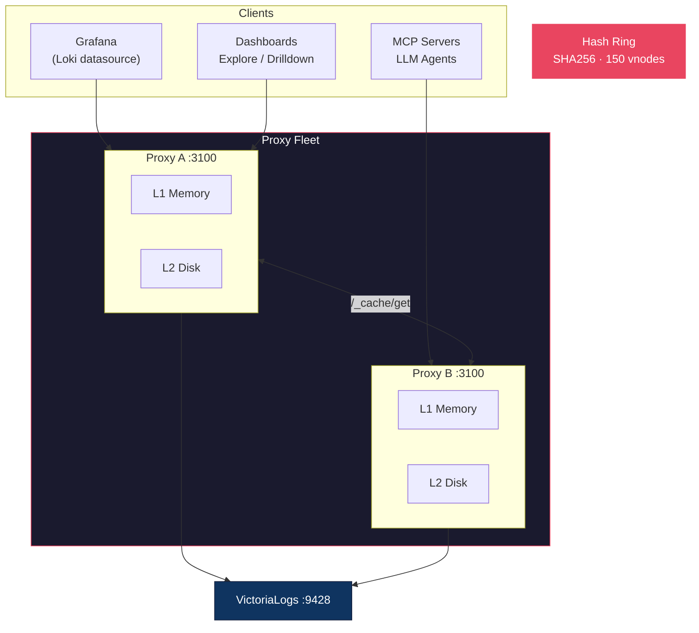
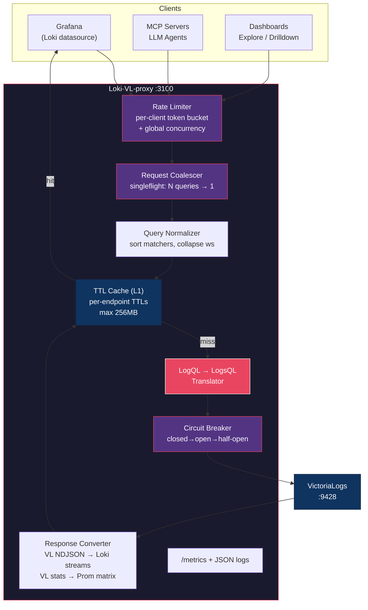

# Loki-VL-proxy

[](https://github.com/szibis/Loki-VL-proxy/actions/workflows/ci.yaml)
[](https://github.com/szibis/Loki-VL-proxy/actions/workflows/compat-loki.yaml)
[](https://github.com/szibis/Loki-VL-proxy/actions/workflows/compat-drilldown.yaml)
[](https://github.com/szibis/Loki-VL-proxy/actions/workflows/compat-vl.yaml)
[](https://go.dev/)
[](https://github.com/szibis/Loki-VL-proxy/releases)
[](#tests)
[](#logql-compatibility)
[](LICENSE)
[](https://github.com/szibis/Loki-VL-proxy/actions/workflows/codeql.yaml)

HTTP proxy that exposes a **Loki-compatible API** on the frontend and translates requests to **VictoriaLogs** on the backend. Use Grafana's native Loki datasource (Explore, Drilldown, dashboards) with VictoriaLogs -- no custom datasource plugin needed.

**Single static binary**, ~10MB Docker image, zero external runtime dependencies.

## Architecture



## Request Flow



See [Architecture](docs/architecture.md) for component design, [Observability](docs/observability.md) for metrics/logging/integration guidance, and [Fleet Cache](docs/fleet-cache.md) for distributed caching.

## Key Features

### Query Translation
See [Architecture](docs/architecture.md), [API Reference](docs/api-reference.md), and [Loki Compatibility](docs/compatibility-loki.md).

- **100% LogQL coverage** -- stream selectors, line filters, parsers, metric queries, binary expressions, subqueries
- **Proxy-side evaluation** for features VL doesn't support natively: `without()`, `on()`/`ignoring()`, `group_left()`/`group_right()`, subquery `[range:step]`, `bool` modifier, `| decolorize`, `| line_format`
- **OTel label translation** -- bidirectional dot/underscore conversion for 50+ semantic convention fields
- **Hybrid metadata fields by default** -- keep Loki-compatible labels while exposing both dotted OTel fields and underscore aliases for Drilldown, Explore, and correlation paths
- **VL stream selector optimization** -- known `_stream_fields` bypass full-text scan for native performance

### Caching & Performance
See [Fleet Cache](docs/fleet-cache.md), [Performance Guide](docs/performance.md), and [Scaling](docs/scaling.md).

- **3-tier cache**: L1 in-memory (LRU + TTL) → L2 on-disk (bbolt + gzip) → L3 peer (consistent hash ring)
- **Fleet-distributed cache** -- consistent hashing across proxy replicas, shadow copies with TTL preservation, per-peer circuit breakers ([details](docs/fleet-cache.md))
- **Request coalescing** -- N identical queries become 1 backend request (singleflight)
- **Query normalization** -- sort matchers, collapse whitespace for better cache hit rates

### Protection & Security
See [Security](docs/security.md), [Configuration](docs/configuration.md), and [Known Issues](docs/KNOWN_ISSUES.md).

- **6-layer protection** -- rate limiting, concurrency cap, coalescing, normalization, cache, circuit breaker
- **Secret redaction** -- all log output passes through a redacting handler that masks API keys, bearer tokens, passwords, AWS credentials, and URL-embedded secrets
- **Delete with safeguards** -- confirmation header, tenant scoping, time range limits, audit logging
- **TLS support** -- server-side HTTPS, backend TLS, OTLP TLS

### Operations
See [Configuration](docs/configuration.md), [Observability](docs/observability.md), [Testing](docs/testing.md), [Compatibility Matrix](docs/compatibility-matrix.md), [Logs Drilldown Compatibility](docs/compatibility-drilldown.md), and [Rules And Alerts Migration](docs/rules-alerts-migration.md).

- **Multitenancy** -- Loki `X-Scope-OrgID` mapped to VL `AccountID`/`ProjectID`, SIGHUP hot-reload
- **Observability** -- Prometheus `/metrics`, OTLP push with matching core metric names, OTel-friendly JSON logs, per-tenant breakdowns, per-client offender metrics, fleet peer-cache metrics
- **Rules and alerts migration tool** -- convert Loki-style rule files into `vmalert` `type: vlogs` rule files for read-compatible Grafana alert visibility through the proxy
- **WebSocket tail** -- live log tailing via Loki's WebSocket protocol with fast handshake, origin controls, and synthetic fallback when native VL tail streaming is unavailable
- **GOMEMLIMIT auto-tuning** -- Helm chart calculates Go memory limit as % of k8s resource limits

## Quick Start

```bash
# Build and run
go build -o loki-vl-proxy ./cmd/proxy
./loki-vl-proxy -backend=http://your-victorialogs:9428

# Docker
docker build -t loki-vl-proxy .
docker run -p 3100:3100 loki-vl-proxy -backend=http://victorialogs:9428

# Docker Compose (dev/test with Grafana)
docker-compose up -d
# Grafana at http://localhost:3000
```

### Helm (Kubernetes)

```bash
helm install loki-vl-proxy ./charts/loki-vl-proxy \
  --set extraArgs.backend=http://victorialogs:9428
```

### Fleet Cache (Multi-Replica)

```bash
# Kubernetes (DNS discovery via headless service)
helm install loki-vl-proxy ./charts/loki-vl-proxy \
  --set replicaCount=3 \
  --set extraArgs.peer-self='$(POD_IP):3100' \
  --set extraArgs.peer-discovery=dns \
  --set extraArgs.peer-dns=loki-vl-proxy-headless.default.svc.cluster.local
```

### Grafana Datasource

```yaml
datasources:
  - name: Loki (via VL proxy)
    type: loki
    access: proxy
    url: http://loki-vl-proxy:3100
    jsonData:
      maxLines: 5000
      timeout: 600
      httpHeaderName1: X-Scope-OrgID
    secureJsonData:
      httpHeaderValue1: team-alpha
```

### Grafana Datasource with OTel Label Translation

```yaml
datasources:
  - name: Loki (VL + OTel)
    type: loki
    access: proxy
    url: http://loki-vl-proxy:3100
    # Use with: loki-vl-proxy -label-style=underscores
    # Queries like {service_name="api"} auto-translate to VL's service.name
```

Proxy-side datasource helpers:

- `-backend-timeout` for long Grafana queries against VL
- `-forward-headers` and `-forward-cookies` for backend auth/context passthrough
- `-metrics.trust-proxy-headers` to trust `X-Grafana-User` and surface per-user client metrics/log context
- `-metadata-field-mode=hybrid` by default, so field APIs expose both dotted OTel names and Loki-style aliases without changing the label surface
- built-in default-tenant aliases `0`, `fake`, and `default` for VL's `0:0` tenant during single-tenant migrations
- explicit Loki-style multi-tenant fanout on read/query endpoints with `X-Scope-OrgID: tenant-a|tenant-b`
- synthetic `__tenant_id__` labels in merged query results so Explore and Drilldown filters can narrow multi-tenant reads back down
- `-tenant.allow-global` to let `X-Scope-OrgID: *` use VL's default `0:0` tenant as a proxy-specific wildcard bypass
- `-tls-client-ca-file` and `-tls-require-client-cert` for HTTPS client auth
- `-tail.allowed-origins` when Grafana or another browser client must use `/tail`

### Grafana Datasource for Multi-Tenant Read Fanout

```yaml
datasources:
  - name: Loki (VL multi-tenant)
    type: loki
    access: proxy
    url: http://loki-vl-proxy:3100
    jsonData:
      httpHeaderName1: X-Scope-OrgID
    secureJsonData:
      httpHeaderValue1: team-a|team-b
```

Use `__tenant_id__` in Explore or Drilldown-compatible queries when you want to narrow a multi-tenant datasource back to a single tenant:

```logql
{app="api-gateway", __tenant_id__="team-b"}
{service_name="api-gateway", __tenant_id__=~"team-.*"}
```

## Docs

- [Observability](docs/observability.md)
- [Configuration](docs/configuration.md)
- [Rules And Alerts Migration](docs/rules-alerts-migration.md)
- [API Reference](docs/api-reference.md)
- [Architecture](docs/architecture.md)
- [Fleet Cache](docs/fleet-cache.md)
- [Performance](docs/performance.md)
- [Compatibility Matrix](docs/compatibility-matrix.md)
- [Testing](docs/testing.md)

## API Coverage

20 Loki endpoints implemented. See [API Reference](docs/api-reference.md) for the full table.

| Category | Endpoints |
|---|---|
| Data queries | `query_range`, `query`, `series`, `labels`, `label/{name}/values` |
| Analytics | `index/stats`, `index/volume`, `index/volume_range`, `patterns` |
| Metadata | `detected_fields`, `detected_labels`, `detected_field/{name}/values` |
| Streaming | `tail` (WebSocket), `format_query` |
| Write | `push` (blocked 405), `delete` (safeguarded) |
| Admin | `rules`, `alerts`, `config`, `buildinfo`, `ready` |

**887 tests** (unit + fuzz + perf regression + race-safe)

## Compatibility Tracks

The repo now reports compatibility as three separate tracks instead of one blended percentage:

| Track | Scope | Versions tracked |
|---|---|---|
| Loki | Loki API and LogQL behavior for Loki clients | `3.6.x`, `3.7.x` |
| Logs Drilldown | Grafana Logs Drilldown app contracts and service-detail flows | `1.0.x`, `2.0.x` |
| VictoriaLogs | Backend integration and translation behavior | `v1.3x.x`, `v1.4x.x` |

The support window is deliberate. We do not try to carry unlimited historical compatibility. Loki tracks the current minor family plus one minor behind, Logs Drilldown tracks the current family plus one family behind, and VictoriaLogs currently tracks the `v1.3x.x` and `v1.4x.x` backend bands.
Those compatibility workflows read their version matrices from the shared manifest in `test/e2e-compat/compatibility-matrix.json`, so one update moves CI and docs together.

See [Compatibility Matrix](docs/compatibility-matrix.md), [Loki Compatibility](docs/compatibility-loki.md), [Logs Drilldown Compatibility](docs/compatibility-drilldown.md), and [VictoriaLogs Compatibility](docs/compatibility-victorialogs.md).

## LogQL Compatibility

**100% of LogQL features handled** -- no errors, no silent failures. Every feature either translates natively to VL or is evaluated at the proxy layer.

| Feature | Status | Implementation |
|---------|--------|----------------|
| Stream selectors `{app="x"}` | Native | Field filters (or VL stream selectors with `-stream-fields`) |
| Line filters `\|= "text"` | Native | Substring match via `~"text"` |
| Parsers `\| json`, `\| logfmt`, `\| pattern`, `\| regexp` | Native | VL `unpack_json`, `unpack_logfmt`, `extract`, `extract_regexp` |
| Label filters `\| level="error"` | Native | VL field filters |
| Metric queries `rate()`, `count_over_time()`, etc. | Native | VL `stats` pipeline |
| Binary expressions `A / B`, `A * 100` | Proxy | Parallel VL queries + arithmetic |
| `quantile_over_time()` | Native | VL `quantile(phi, field)` |
| `without()` grouping | Proxy | VL returns all labels, proxy strips excluded labels |
| `on()`/`ignoring()` | Proxy | Label-subset matching with join semantics |
| `group_left()`/`group_right()` | Proxy | One-to-many join with label inclusion |
| `bool` modifier | Proxy | Stripped; comparisons return 1/0 |
| `offset` / `@` modifiers | Proxy | Stripped at translation |
| Subquery `rate(...)[1h:5m]` | Proxy | Concurrent sub-step evaluation + aggregation |
| `unwrap duration()/bytes()` | Proxy | Unit conversion parsers |
| `\| decolorize` | Proxy | ANSI stripping |
| `absent_over_time()` | Native | Mapped to `count()` |
| `\| line_format` / `\| label_format` | Proxy | Template evaluation |

All features produce correct results. Implementation details for advanced features in [Known Issues](docs/KNOWN_ISSUES.md).

## Documentation

| Document | Contents |
|---|---|
| [Architecture](docs/architecture.md) | Component design, data flow, protection layers, data model mapping |
| [Fleet Cache](docs/fleet-cache.md) | Distributed cache: hash ring, shadow copies, TTL preservation, circuit breakers |
| [Configuration](docs/configuration.md) | All flags, environment variables, cache, tenancy, TLS, OTLP |
| [API Reference](docs/api-reference.md) | Endpoint table, delete safeguards, metrics, observability |
| [Translation Reference](docs/translation-reference.md) | LogQL to LogsQL mapping table, supported/unsupported features |
| [Performance](docs/performance.md) | Benchmarks, optimization techniques, scaling profile, CI regression gates |
| [Benchmarks](docs/benchmarks.md) | Raw benchmark numbers, connection pool tuning, hot path analysis |
| [Scaling](docs/scaling.md) | Capacity planning, resource projections, per-tenant/client metrics, Helm sizing |
| [Operations](docs/operations.md) | Deployment, performance tuning, troubleshooting |
| [Testing](docs/testing.md) | Test categories, running tests, fuzz testing |
| [Compatibility Matrix](docs/compatibility-matrix.md) | Separate Loki, Drilldown, and VictoriaLogs compatibility tracks |
| [Loki Compatibility](docs/compatibility-loki.md) | Loki API and LogQL version matrix |
| [Logs Drilldown Compatibility](docs/compatibility-drilldown.md) | Drilldown app version matrix and app contracts |
| [VictoriaLogs Compatibility](docs/compatibility-victorialogs.md) | VictoriaLogs backend version matrix and translation focus |
| [Known Issues](docs/KNOWN_ISSUES.md) | VL compatibility gaps, data model differences |
| [Roadmap](docs/roadmap.md) | Completed features and planned work |
| [Changelog](CHANGELOG.md) | Release history |

## License

Apache License 2.0. See [LICENSE](LICENSE) for details.
