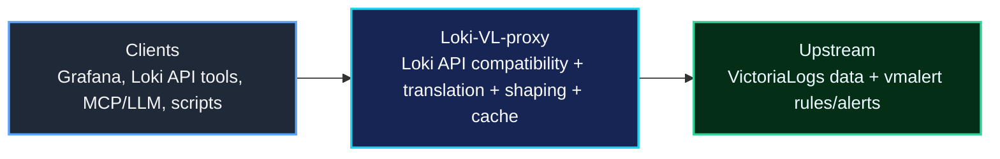
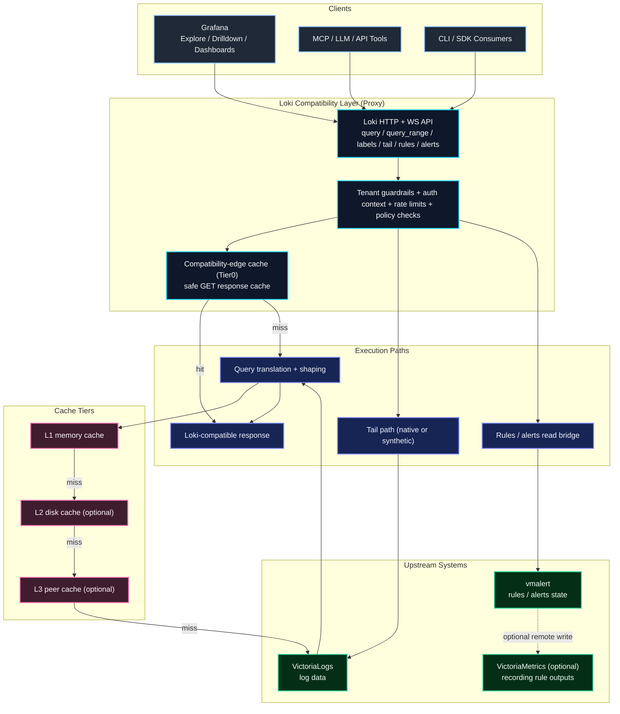

# Loki-VL-proxy

[](https://github.com/ReliablyObserve/Loki-VL-proxy/actions/workflows/ci.yaml)
[](https://github.com/ReliablyObserve/Loki-VL-proxy/actions/workflows/compat-loki.yaml)
[](https://github.com/ReliablyObserve/Loki-VL-proxy/actions/workflows/compat-drilldown.yaml)
[](https://github.com/ReliablyObserve/Loki-VL-proxy/actions/workflows/compat-vl.yaml)
[](https://go.dev/)
[](https://github.com/ReliablyObserve/Loki-VL-proxy/releases)
[](https://github.com/ReliablyObserve/Loki-VL-proxy)
[](#tests)
[](#tests)
[](#logql-compatibility)
[](LICENSE)
[](https://github.com/ReliablyObserve/Loki-VL-proxy/actions/workflows/codeql.yaml)

Use **Grafana Loki clients** with **VictoriaLogs** through a **Loki-compatible read proxy**.

No custom Grafana datasource plugin. No sidecar translation service. One small static binary.

## Why Teams Use It

- **Drop-in Loki frontend**: Keep Grafana Explore, Drilldown, dashboards, and Loki API tooling.
- **VictoriaLogs backend economics**: Query VL while preserving Loki client experience.
- **Dual-schema compatibility**: Keep Loki-safe underscore labels while exposing OTel/VL dotted structured metadata where needed.
- **Strict compatibility contracts**: Default 2-tuple responses, explicit 3-tuple only when `categorize-labels` is requested.
- **Production guardrails**: Tenant isolation, bounded fanout, circuit breaking, rate limits, and safe caching.
- **Fast repeat reads**: Tiered cache with optional disk and fleet peer reuse.

Related docs: [Architecture](docs/architecture.md), [Compatibility Matrix](docs/compatibility-matrix.md), [Operations](docs/operations.md)

## Key Features

### Compatibility

- Loki-compatible read API for Grafana datasource, Explore, Drilldown, and API clients.
- Strict tuple contracts: default 2-tuple, explicit 3-tuple only via `categorize-labels`.
- Multi-tenant read fanout with tenant isolation guardrails.
- Rules and alerts read compatibility from `vmalert`.

### Performance

- Query-range windowing with historical window reuse.
- Adaptive bounded parallel fanout for long time ranges.
- Tiered caching: compatibility-edge, memory, disk, and optional peer cache.
- Request coalescing and protective limits to reduce backend pressure.

### Operations

- Structured metrics and logs for cache, latency, fanout, tenant/client visibility.
- Helm-ready deployment model for production clusters.
- Compatibility CI tracks for Loki, Logs Drilldown, and VictoriaLogs.
- Runbook-backed alerting assets for operational response.

Related docs: [Compatibility Matrix](docs/compatibility-matrix.md), [Observability](docs/observability.md), [Testing](docs/testing.md)

## High-Level Flow



Related docs: [Architecture](docs/architecture.md), [API Reference](docs/api-reference.md)

## Detailed Architecture



Related docs: [Architecture](docs/architecture.md), [Fleet Cache](docs/fleet-cache.md), [Peer Cache Design](docs/peer-cache-design.md)

## Product Scope

Loki-VL-proxy is intentionally a **read/query proxy**.

- In scope: Loki-compatible query/read endpoints, metadata paths, rules/alerts read views.
- Out of scope: ingestion pipeline ownership (`push` is blocked), rule write lifecycle.

Use VictoriaLogs-side ingestion (`vlagent`, OTLP, native JSON/OTel, Loki-push-to-VL) and query that data through this proxy.

Related docs: [API Reference](docs/api-reference.md), [Rules And Alerts Migration](docs/rules-alerts-migration.md), [Known Issues](docs/KNOWN_ISSUES.md)

## Quick Start

```bash
# Binary
go build -o loki-vl-proxy ./cmd/proxy
./loki-vl-proxy -backend=http://victorialogs:9428

# Docker
docker build -t loki-vl-proxy .
docker run -p 3100:3100 loki-vl-proxy -backend=http://victorialogs:9428

# Compose (includes Grafana)
docker-compose up -d
```

### Helm

```bash
helm install loki-vl-proxy oci://ghcr.io/reliablyobserve/charts/loki-vl-proxy \
  --version <release> \
  --set extraArgs.backend=http://victorialogs:9428
```

For deployment recipes (StatefulSet + persistence, peer-cache fleet setup, OTLP push wiring) and image source selection (GHCR vs Docker Hub vs custom registry), see:
- [Getting Started](docs/getting-started.md)
- [Operations](docs/operations.md)

### Grafana Datasource

```yaml
datasources:
  - name: Loki (via VL proxy)
    type: loki
    access: proxy
    url: http://loki-vl-proxy:3100
    jsonData:
      httpHeaderName1: X-Scope-OrgID
    secureJsonData:
      httpHeaderValue1: team-alpha
```

Related docs: [Getting Started](docs/getting-started.md), [Configuration](docs/configuration.md), [Operations](docs/operations.md)

## Compatibility Guarantees (Operator-Relevant)

- **Loki tuple safety**:
  - default requests return strict `[timestamp, line]`
  - `X-Loki-Response-Encoding-Flags: categorize-labels` enables Loki 3-tuple metadata mode
- **Cache mode segregation**:
  - query cache keys are split by tuple mode to prevent 3-tuple/2-tuple cross-contamination
- **Grafana-first behavior**:
  - compatibility tracks continuously verify Loki API, Logs Drilldown, and VictoriaLogs integration

### Label/Field Compatibility Profiles

| Profile | Label surfaces (`stream`, `/labels`) | Field/metadata surfaces (`/detected_fields`, 3-tuple metadata) | Best fit |
|---|---|---|---|
| Loki-conservative | underscore-only | translated underscore aliases | strict Loki UX |
| Mixed (default) | underscore-only | dotted + translated aliases | Grafana + OTel correlation |
| Native-field | underscore-only (when `label-style=underscores`) | dotted-native only | VL/OTel-native field workflows |

Operational note:
- Grafana datasource queries can use dotted field filters (for example `k8s.cluster.name = \`my-cluster\``) while stream labels remain Loki-compatible underscores.
- Grafana Loki query builder UI may tokenize dotted keys as `label=host`, `operator=.`, `value=id` for `host.id`. Query execution still works in code mode, but builder editing is safest with underscore aliases (`label-style=underscores`, `metadata-field-mode=translated`).

Related docs: [Compatibility Matrix](docs/compatibility-matrix.md), [Loki Compatibility](docs/compatibility-loki.md), [Logs Drilldown Compatibility](docs/compatibility-drilldown.md), [VictoriaLogs Compatibility](docs/compatibility-victorialogs.md)

## LogQL Compatibility

Loki-VL-proxy targets Loki client compatibility while translating execution to VictoriaLogs.

- Stream selectors, filters, parser pipelines, metric queries, and common range functions are supported.
- Proxy-side compatibility logic covers semantic gaps where Loki behavior differs from native VictoriaLogs primitives.
- Compatibility is validated continuously in CI against separate Loki, Drilldown, and VictoriaLogs tracks.

For full detail:
- [Translation Modes Guide](docs/translation-modes.md)
- [Translation Reference](docs/translation-reference.md)
- [Loki Compatibility](docs/compatibility-loki.md)
- [Known Issues](docs/KNOWN_ISSUES.md)

## Performance Model

- Multi-layer cache: compatibility-edge + memory + optional disk + optional peer cache.
- Query-range windowing: historical range reuse with adaptive bounded parallel fetch.
- Built-in metrics/logs for tuning cache hit ratio, backend latency, fanout behavior, and tenant/client pressure.

### Query-Range Tuning (Long-Range Efficiency)

- Split long ranges into cacheable windows (for example `1h`) and reuse historical windows.
- Keep near-now windows uncached (or very short TTL) and use longer TTL for historical windows.
- Use adaptive bounded parallelism to improve long-range latency without overloading VictoriaLogs.
- Track tuning with window cache hit/miss, window fetch latency, and adaptive parallelism metrics.

### Why The Cache Stack Matters

- `Tier0` compatibility-edge cache reduces repeated frontend compatibility work.
- `L1` memory cache gives fastest hot-path reads.
- `L2` disk cache keeps useful historical windows warm across larger working sets.
- `L3` peer cache lets warm replicas help the fleet instead of refetching from backend.

See [Performance](docs/performance.md), [Fleet Cache](docs/fleet-cache.md), [Scaling](docs/scaling.md), and [Observability](docs/observability.md).

## Documentation Map

### Core
- [Getting Started](docs/getting-started.md)
- [Configuration](docs/configuration.md)
- [Operations](docs/operations.md)
- [Architecture](docs/architecture.md)
- [API Reference](docs/api-reference.md)
- [Security](docs/security.md)
- [Observability](docs/observability.md)
- [Performance](docs/performance.md)
- [Scaling](docs/scaling.md)

### Compatibility
- [Compatibility Matrix](docs/compatibility-matrix.md)
- [Loki Compatibility](docs/compatibility-loki.md)
- [Logs Drilldown Compatibility](docs/compatibility-drilldown.md)
- [VictoriaLogs Compatibility](docs/compatibility-victorialogs.md)
- [Translation Modes Guide](docs/translation-modes.md)
- [Translation Reference](docs/translation-reference.md)

### Cache and Runtime Design
- [Fleet Cache](docs/fleet-cache.md)
- [Peer Cache Design](docs/peer-cache-design.md)
- [Benchmarks](docs/benchmarks.md)

### Runbooks
- [Alert Runbooks Index](docs/runbooks/alerts.md)
- [Deployment Best Practices](docs/runbooks/deployment-best-practices.md)
- [Backend High Latency](docs/runbooks/loki-vl-proxy-backend-high-latency.md)
- [Backend Unreachable](docs/runbooks/loki-vl-proxy-backend-unreachable.md)
- [Circuit Breaker Open](docs/runbooks/loki-vl-proxy-circuit-breaker-open.md)
- [Client Bad Request Burst](docs/runbooks/loki-vl-proxy-client-bad-request-burst.md)
- [Proxy Down](docs/runbooks/loki-vl-proxy-down.md)
- [Grafana Tuple Contract](docs/runbooks/loki-vl-proxy-grafana-tuple-contract.md)
- [High Error Rate](docs/runbooks/loki-vl-proxy-high-error-rate.md)
- [High Latency](docs/runbooks/loki-vl-proxy-high-latency.md)
- [Rate Limiting](docs/runbooks/loki-vl-proxy-rate-limiting.md)
- [System Resources](docs/runbooks/loki-vl-proxy-system-resources.md)
- [Tenant High Error Rate](docs/runbooks/loki-vl-proxy-tenant-high-error-rate.md)

### Testing and Release
- [Testing](docs/testing.md)
- [Release Info](docs/release-info.md)

### Migration and Project Status
- [Rules And Alerts Migration](docs/rules-alerts-migration.md)
- [Known Issues](docs/KNOWN_ISSUES.md)
- [Roadmap](docs/roadmap.md)
- [Changelog](CHANGELOG.md)

## License

Apache License 2.0. See [LICENSE](LICENSE).
