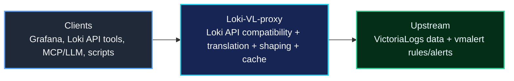
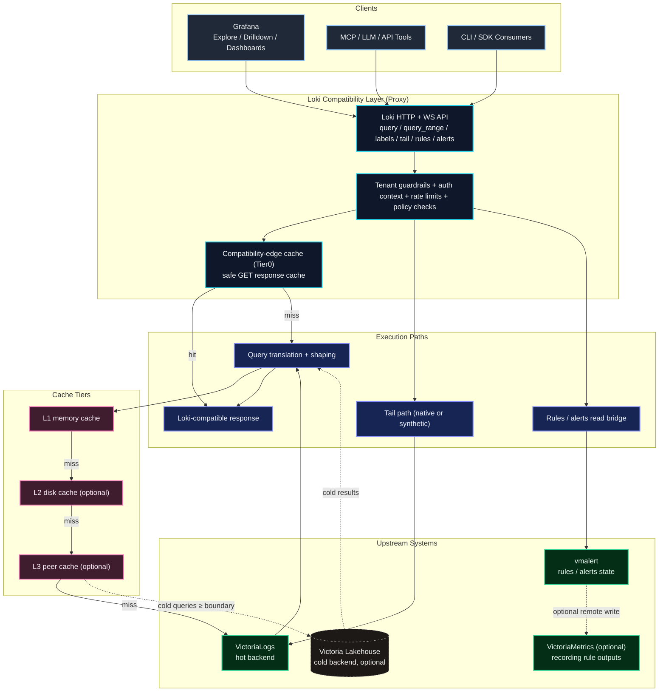

# Loki-VL-proxy

<p align="center">
  <picture>
    <source media="(prefers-color-scheme: dark)" srcset="website/static/img/loki-vl-proxy-logo-white.jpg">
    
  </picture>
</p>

[](https://github.com/ReliablyObserve/Loki-VL-proxy/actions/workflows/ci.yaml)
[](https://goreportcard.com/report/github.com/ReliablyObserve/Loki-VL-proxy)
[](https://github.com/ReliablyObserve/Loki-VL-proxy/actions/workflows/compat-loki.yaml)
[](https://github.com/ReliablyObserve/Loki-VL-proxy/actions/workflows/compat-drilldown.yaml)
[](https://github.com/ReliablyObserve/Loki-VL-proxy/actions/workflows/compat-vl.yaml)
[](https://go.dev/)
[](https://github.com/ReliablyObserve/Loki-VL-proxy/releases)
[](https://hub.docker.com/r/reliablyobserve/loki-vl-proxy)
[](https://github.com/ReliablyObserve/Loki-VL-proxy/pkgs/container/loki-vl-proxy)
[](https://github.com/ReliablyObserve/Loki-VL-proxy/pkgs/container/charts%2Floki-vl-proxy)
[](https://github.com/ReliablyObserve/Loki-VL-proxy)
[](https://github.com/ReliablyObserve/Loki-VL-proxy)
[](#tests)
[](#tests)
[](#logql-compatibility)
[](LICENSE)
[](https://github.com/ReliablyObserve/Loki-VL-proxy/actions/workflows/codeql.yaml)

<details>
<summary><strong>How it works (TLDR)</strong></summary>

LogQL queries arrive → parsed into a typed AST (`internal/logql`) → translated into LogsQL via a typed builder (`internal/logsql`) → sent to VictoriaLogs.

Both parsers are hand-written recursive descent. The LogQL side handles the full Loki grammar. The LogsQL side uses a builder API that produces typed, syntactically valid LogsQL at construction time. Translation uses two tiers: stable string operations for well-understood paths (stream selectors, line filters), and typed AST construction for complex paths (stats aggregations). Future PRs tagged `TODO(ast-migration)` in the source will migrate remaining string paths.

**Label metadata — fast and complete:** first request returns a 1h VL scan immediately (sub-ms proxy overhead); a background goroutine fetches the full requested range (1h → 7d) so the second request has complete historical label data from cache. Disk-backed cache survives proxy restarts; a 90-second keep-warm loop ensures labels stay hot even with no user queries. Time-bucketed cache keys (5-min / 1h / 6h buckets by range) collapse dashboard refresh drift to the same entry. Label-value routing uses `stream_field_names` as an endpoint gate — only stream-indexed labels use `stream_field_values`; non-stream labels fall through to `field_values` so queries like `cluster` always return results.

**Fleet restart safety:** rolling restarts of N proxy pods don't hammer VL. Startup jitter (`-warmup-max-jitter`) spreads instances across a configurable window; a two-phase peer discovery protocol (`/_cache/has` for batch presence check → `/_cache/get` from the freshest peer) means only the first instance per label window hits VL — the rest pull from peers. For a 30-pod fleet this reduces warmup VL queries from 120 to ≤8 on restart.

</details>

**Keep your entire Loki stack — Grafana Explore, Drilldown, dashboards, API tooling — and run it on VictoriaLogs.**

- **Drop-in Loki API.** Point your existing Grafana Loki datasource at the proxy. Zero plugin changes, zero query rewrites.
- **Measured resource difference.** At 310 GiB/day ingest: VL + proxy runs on **1.4 cores and 6.1 GiB RAM**. Loki's published minimum for that ingest class: 38 cores, 59 GiB. That gap is real — not a benchmark artifact.
- **Proxy intelligence built in.** Disk-backed label cache with keep-warm loop, progressive full-range background fetch, time-bucketed keys, adaptive parallelism, circuit breaker, rate limits, tenant isolation. Fleet restart safety: jitter + peer-first warmup keeps rolling restarts from thundering VL. One ~14 MB static binary.

Project site: `https://reliablyobserve.github.io/Loki-VL-proxy/`

---

## Query Performance

Measured head-to-head against tuned Loki: Apple M5 Pro (18 cores, 64 GB RAM), ~8 M log entries across 15 services, 7-day window.

### Cold proxy — honest baseline

No cache, no coalescer. Pure translation overhead + HTTP proxying + VictoriaLogs response time. This is the floor — what you get before any caching kicks in.

| Workload | Concurrency | Cold proxy | Loki | Ratio |
|---|:---:|---:|---:|:---:|
| Small metadata queries | c=10 | 1,212 req/s | ~880 req/s | **1.4× faster** |
| Small metadata queries | c=50 | 1,583 req/s | ~780 req/s | **2× faster** |
| Heavy pipeline queries | c=10 | 126–188 req/s | ~161–472 req/s | **~parity** |
| Heavy pipeline queries | c=100 | 139 req/s | ~33 req/s | **4.2× faster** |
| Long-range (6 h–72 h) | c=10 | 2× faster than Loki | — | parallel sub-window fetching |
| Compute (rate, topk) | c=10 | 210 req/s | ~2,403 req/s | 0.09× — N VL calls per metric query |
| Binary metric queries† | c=10 | ✓ working | ✓ working | correctness restored — were silently erroring |

- **Small and metadata queries:** 1.4–2× faster than Loki cold — VL scans are faster than Loki's chunk store for label/series queries.
- **Heavy pipeline queries:** parity to 4.2× faster depending on concurrency — `stats_query_range` fast path eliminates 39% cold CPU for `count_over_time`/`rate` queries.
- **Long-range queries:** 2× faster cold — parallel sub-window fetching completes before Loki's sequential chunk scan.
- **Compute aggregations (`quantile_over_time`, `topk`, multi-stage pipelines):** each metric query fans out to N VL calls; pprof-guided alloc fixes lifted cold throughput from 40 to 210 req/s. Historical sub-windows are cached on first fetch (24 h TTL), so repeated compute queries approach warm performance.

† `sum(rate(...)) / sum(rate(...))`, `rate(...) * 100`, `sum(...) + sum(...)` — the AST migration in v1.35.0 fixed a parse error that caused these queries to silently return empty results from VictoriaLogs.

### Translation overhead

LogQL→LogsQL translation is **2.7–7.2 µs per query** (arm64). For a 100–500 ms VL round-trip this is under 0.007% of wall time.

| Query type | Time | Allocs |
|---|---:|---:|
| Selector `{app="nginx"}` | 2.7 µs | 18 |
| `rate({...}[5m])` | 3.6 µs | 45 |
| `sum(rate({...}[5m])) by (host)` | 4.9 µs | 48 |
| `sum(bytes_rate({...}[5m])) by (host)` | 5.2 µs | 48 |
| `ip("10.0.0.0/8")` filter (v1.45+, capability-aware) | 4.4 µs | 36 |
| Binary metric `sum(rate) / sum(rate)` | 7.2 µs | 76 |
| `PipeMath.String()` (AST serialisation) | 55 ns | 3 |
| `PipeStats.String()` (AST serialisation) | 70 ns | 5 |

Measured: `go test ./internal/translator/ -bench BenchmarkTranslate -benchmem -count=5` (Apple M5 Pro, Go 1.26, darwin/arm64). Binary metric queries are included in the compute workload above; the AST migration in v1.35.0 restored correctness — previously they silently returned empty results.

### Warm cache — what production steady-state looks like

Grafana dashboards auto-refresh every 30 s. After the first fetch, repeated queries are served from in-memory cache without touching VictoriaLogs. The numbers below are **100% cache-hit results** — they represent the ceiling, not the typical case. Real production performance sits between the cold floor above and these warm numbers depending on your dashboard diversity and refresh interval.

| Workload | Concurrency | Loki req/s | Proxy cold req/s | Proxy warm req/s | Warm gain | P50 Loki | P50 cold | P50 warm | Latency gain |
|---|:---:|---:|---:|---:|:---:|---:|---:|---:|:---:|
| Small panels | c=10 | 2,011 | 1,201 | 15,626 | **7.8×** | 4 ms | 4 ms | 587 µs | **6.8×** |
| Small panels | c=100 | 2,290 | — | 27,513 | **12×** | 42 ms | — | 3 ms | **14×** |
| Heavy queries | c=10 | 407 | 179 | 5,944 | **14.6×** | 4 ms | 21 ms | 1 ms | **4×** |
| Heavy queries | c=100 | 162† | — | 7,134 | **44×** | ~1,800 ms† | — | 12 ms | **150×** |
| Long-range | c=10 | 8 | 19 | 157 | **18.7×** | 481 ms | 39 ms | 1 ms | **481×** |
| Compute | c=10 | 2,803 | 352 | 11,162 | **4×** | 1 ms | 10 ms | 675 µs | **1.5×** |
| Compute | c=100 | 1,611 | 366 | 16,456 | **10.2×** | 4 ms | 261 ms | 4 ms | parity |

CPU: **6–408× less** than Loki under cache load. RAM: **1.7–3.9× less** for most workloads.

† Loki heavy c=100 was saturated — P90=1,818 ms, P99=6,950 ms, delivering only 162 req/s vs 7,134 for the proxy.

### Dashboard load spikes — request coalescer

When many panels hit the same query simultaneously, the proxy collapses them into a single backend call. First-hit coalescing avoids the N-fan-out but pays one backend round-trip (cold proxy P50 for a single request); subsequent hits are served from cache.

| Workload | Loki P50 | Proxy P50 (first hit) | Proxy P50 (warm) |
|---|---:|---:|---:|
| Metadata queries | 196 ms | **~4 ms** | **1 ms** |
| Heavy aggregations | 2,399 ms | **~21 ms** | **1 ms** |
| Content search | 13,415 ms | **~39 ms** | **1 ms** |

Full throughput tables, P90/P99 latency, CPU and RSS breakdowns: [Benchmarks](docs/benchmarks.md) · [Performance](docs/performance.md)

---

## The Cost Case

This is a production deployment, not a synthetic benchmark. The numbers below come from a real VictoriaLogs installation running at **310 GiB/day** raw ingest with **800 M total log entries** and **7.1 days** of retention.

**What VictoriaLogs actually consumed at that load:**

| Component | Cores | Memory |
|---|---:|---:|
| `vlstorage` | 1.0 | 5.0 GiB |
| `vlinsert` | 0.1 | 0.6 GiB |
| `vlselect` | 0.1 | 0.25 GiB |
| `loki-vl-proxy` | ~0.1–0.2 | ~0.15–0.26 GiB |
| **VL + loki-vl-proxy, combined** | **~1.4** | **~6.1 GiB** |

For comparison, [Loki's own documentation](https://grafana.com/docs/loki/latest/setup/size/) puts the **minimum** hardware requirement at **38 cores and 59 GiB** for the same ingest class (`<3 TB/day`). That's the floor — a minimal, single-tenant, non-HA deployment.

**Caveat:** `vlselect` was measured at zero read concurrency — query load will add to that number. If you run heavy aggregation queries at scale, benchmark your own workload with `loki-bench` before sizing.

**Storage:** 2,201 GiB of raw logs (310 GiB/day × 7.1 days) compressed to **40.5 GiB on disk — 54.9× compression**. TrueFoundry ran an independent migration and reported ~40% less storage versus their Loki deployment at the same retention.

**Replication:** Loki's recommended production setup uses RF=3 — tripling write load, disk, and cross-AZ egress. VictoriaLogs is designed for AZ-local deployment with no mandatory replication. If you're paying for cross-AZ data transfer today, that alone can outweigh compute savings.

**Migration cost:** Zero changes to Grafana, dashboards, alerts, or any Loki API client. The proxy handles translation transparently; remove it and point back at Loki if needed.

Full cost worksheet, scaling projections, and EC2/GCP sizing tables: [Cost Model](docs/cost-model.md) · [Scaling](docs/scaling.md)

---

## Quick Start

### Docker

```bash
docker run -p 3100:3100 \
  ghcr.io/reliablyobserve/loki-vl-proxy:latest \
  -backend=http://victorialogs:9428
```

### Helm

```bash
helm install loki-vl-proxy oci://ghcr.io/reliablyobserve/charts/loki-vl-proxy \
  --version <release> \
  --set extraArgs.backend=http://victorialogs:9428 \
  --set extraArgs.patterns-enabled=true
```

### Grafana Datasource

Point your existing Loki datasource at the proxy — no other changes needed.

```yaml
datasources:
  - name: Loki (via VL proxy)
    type: loki
    access: proxy
    url: http://loki-vl-proxy:3100
    jsonData:
      httpHeaderName1: X-Scope-OrgID
    secureJsonData:
      httpHeaderValue1: team-alpha
```

That's it. Grafana Explore, Drilldown, and all dashboards work immediately.

For StatefulSet persistence, peer-cache fleet setup, OTLP push wiring, and image source options, see [Getting Started](docs/getting-started.md) and [Operations](docs/operations.md).

**Peer fleet discovery** — four modes, all refresh every 15 s and rebuild the hash ring live:

| Mode | Flag | Best for |
|------|------|----------|
| `dns` | `-peer-dns=proxy-headless.ns.svc.cluster.local` | Kubernetes headless service — only ready pods appear |
| `srv` | `-peer-srv=_loki-vl-proxy._tcp.proxy-headless.ns.svc.cluster.local` | Kubernetes StatefulSet, Consul DNS — port embedded in record |
| `http` | `-peer-http-url=http://consul:8500/v1/health/service/loki-vl-proxy?passing=true` | Outside k8s: Consul, Nomad, Prometheus HTTP SD, or custom endpoint |
| `static` | `-peer-static=10.0.0.1:3100,10.0.0.2:3100` | Fixed fleets, development |

Verify the live ring at any time: `curl http://proxy:3100/_cache/peers` → `{"peers":[...],"self":"...","count":N}`.

Non-Kubernetes examples (static, Consul, Prometheus SD, CoreDNS) are in [`examples/peers/`](examples/peers/).

---

## Why It's Fast

**4-tier cache:**
- **Tier0** — compatibility-edge cache for safe GET responses (no backend hit at all)
- **L1** — in-memory hot path
- **L2** — disk (bbolt), survives restarts, warms historical windows across large working sets
- **L3** — peer cache, lets warm fleet replicas share results instead of all hitting the backend. Four peer discovery modes: `dns` (k8s headless A-records), `srv` (DNS SRV with embedded port, works with Consul DNS and k8s StatefulSets), `http` (polls any JSON endpoint — Consul catalog, Prometheus HTTP SD, custom registry), `static` (fixed list). Discovery refreshes every 15 s; the hash ring updates atomically so peer add/remove is live without restarts.

**Window reuse.** Long `query_range` requests are split into 1h windows. Historical windows are served from cache; only the live edge fetches from VictoriaLogs. A 7-day query with warm cache may hit the backend for a single window.

**Adaptive parallelism.** Parallel window fetches use EWMA-based backpressure — ramps up when VictoriaLogs is fast, backs off automatically before it becomes a problem.

**Request coalescing.** Concurrent identical queries collapse into one upstream request.

---

## What Works Out of the Box

- Grafana Explore — log browsing, filtering, live tail
- Grafana Logs Drilldown — patterns, service view, field breakdown
- Dashboards — all LogQL panel types
- Multi-tenant — `X-Scope-OrgID` isolation with per-tenant rate limits
- Live tail — native WebSocket tail or synthetic polling fallback
- Rules and alerts — read bridge to vmalert (no write lifecycle)
- LogQL — 100% coverage: stream selectors, filters, parsers, metric queries, range functions, vector operators
- OTel labels — dotted structured metadata exposed correctly in detected fields, underscore-safe in stream labels

---

## Production Features

- **Circuit breaker** — opens on backend failure, closes automatically on recovery
- **Per-client rate limits** — token bucket, configurable per tenant
- **Tenant isolation** — strict `X-Scope-OrgID` fanout guardrails; no cross-tenant data bleed
- **TLS / mTLS** — configurable on both northbound (client) and southbound (backend) boundaries
- **OTLP push** — proxy emits its own traces to any OTLP endpoint
- **Operator dashboard** — packaged Grafana dashboard covering Client → Proxy → VictoriaLogs, cache behavior, fanout, and resource utilization
- **Runbook-backed alerts** — 13 alert rules, each with a linked runbook
- **100+ Prometheus metrics** — all under `loki_vl_proxy_*` prefix
- **Read-only by default** — `/push` blocked, delete gated, debug/admin disabled unless explicitly enabled
- **Cold storage routing** — time-boundary split to Victoria Lakehouse for long-range queries

---

## High-Level Flow



## Detailed Architecture



---

## Compatibility

Loki-VL-proxy is validated continuously in CI against three separate tracks: Loki API, Grafana Logs Drilldown, and VictoriaLogs integration.

### Label and Field Compatibility

| Profile | Stream labels (`/labels`) | Detected fields / metadata | Best for |
|---|---|---|---|
| Loki-compatible (default) | underscore-only | translated underscore aliases | strict Loki UX, Grafana Explore/Drilldown |
| Mixed | underscore-only | dotted + translated aliases | Grafana + OTel correlation |
| Native-field | underscore-only (`label-style=underscores`) | dotted-native only | VL/OTel-native field workflows |

Default flags: `-label-style=underscores`, `-metadata-field-mode=translated`. Grafana query builder works best with underscore aliases; code mode accepts dotted expressions and translates them to VL-native field matching.

**Tuple safety:** Default responses return strict `[timestamp, line]` 2-tuples. 3-tuple metadata mode activates only when the client sends `X-Loki-Response-Encoding-Flags: categorize-labels`. Cache keys are segregated by tuple mode.

### LogQL Compatibility

Stream selectors, filters, parser pipelines, metric queries, range functions, scalar bool comparisons, vector set operators, and invalid LogQL error forms are all covered and machine-validated in CI against a real Loki oracle. The suite spans 316 exhaustive LogQL parity test cases with machine-validated compatibility scores.

**Typed LogQL parser:** The proxy includes a fully typed recursive-descent LogQL parser (`internal/logql`) that produces a structured AST for query validation, structural routing, and drop/keep extraction — replacing the previous regex-based approach. The parser enforces Loki-compatible semantic constraints (missing `| unwrap` in `rate_counter`, invalid `ip()` filter addresses, unclosed template delimiters, etc.) and generates the exact error messages Loki 3.x returns, so Grafana datasource clients receive the expected error shape.

For full detail: [Loki Compatibility](docs/compatibility-loki.md), [Translation Reference](docs/translation-reference.md), [LogQL Parser](docs/logql-parser.md), [Known Issues](docs/KNOWN_ISSUES.md)

---

## Observability

- **100+ Prometheus metrics** under `loki_vl_proxy_*` — cache hit ratios, window fetch latency, fanout behavior, per-tenant and per-client pressure, circuit breaker state
- **Packaged operator dashboard** — rows for Client-Side Loki API Visibility, Proxy Internal, and Backend-Side VictoriaLogs fanout; fast incident attribution
- **13 runbook-backed alert rules** — backend latency, backend unreachable, circuit breaker open, high error rate, rate limiting, tenant isolation, and more
- **Structured JSON logs** — route-aware, semconv-aligned, with user-pattern attribution from trusted Grafana headers
- **OTLP tracing** — proxy emits traces to any OTLP endpoint

See [Observability](docs/observability.md) and [Alert Runbooks Index](docs/runbooks/alerts.md).

---

## Security

- Read-only API surface by default: `/push` blocked, delete gated, debug/admin disabled
- Non-root runtime image, read-only root filesystem, restricted Helm security contexts
- Hardening headers on all HTTP responses including 404s and disabled routes
- CI security gates: `gitleaks`, `gosec`, Trivy, `actionlint`, `hadolint`, OpenSSF Scorecard, OWASP ZAP, curated Nuclei
- Proxy-specific coverage: tenant isolation, cache boundary enforcement, browser-origin checks on `/tail`, forwarded auth handling

See [Security](docs/security.md) and [Security Policy](SECURITY.md).

---

## UI Gallery

VictoriaLogs backend with Loki-VL-proxy as the Loki-compatible query layer.

<a href="docs/images/ui/explore-main.png">
  
</a>
<a href="docs/images/ui/explore-details.png">
  
</a>
<a href="docs/images/ui/drilldown-main.png">
  
</a>
<a href="docs/images/ui/drilldown-service.png">
  
</a>
<a href="docs/images/ui/explore-tail-multitenant.png">
  
</a>

---

## Documentation Map

### Core
- [Getting Started](docs/getting-started.md)
- [Configuration](docs/configuration.md)
- [Operations](docs/operations.md)
- [Architecture](docs/architecture.md)
- [API Reference](docs/api-reference.md)
- [Security](docs/security.md)
- [Observability](docs/observability.md)
- [Performance](docs/performance.md)
- [Scaling](docs/scaling.md)

### Compatibility
- [Compatibility Matrix](docs/compatibility-matrix.md)
- [Loki Compatibility](docs/compatibility-loki.md)
- [Logs Drilldown Compatibility](docs/compatibility-drilldown.md)
- [Grafana Loki Datasource Compatibility](docs/compatibility-grafana-datasource.md)
- [VictoriaLogs Compatibility](docs/compatibility-victorialogs.md)
- [Translation Modes Guide](docs/translation-modes.md)
- [Translation Reference](docs/translation-reference.md)

### Cache and Runtime Design
- [Fleet Cache](docs/fleet-cache.md)
- [Peer Cache Design](docs/peer-cache-design.md)
- [Benchmarks](docs/benchmarks.md)

### Runbooks
- [Alert Runbooks Index](docs/runbooks/alerts.md)
- [Deployment Best Practices](docs/runbooks/deployment-best-practices.md)
- [Backend High Latency](docs/runbooks/loki-vl-proxy-backend-high-latency.md)
- [Backend Unreachable](docs/runbooks/loki-vl-proxy-backend-unreachable.md)
- [Circuit Breaker Open](docs/runbooks/loki-vl-proxy-circuit-breaker-open.md)
- [Client Bad Request Burst](docs/runbooks/loki-vl-proxy-client-bad-request-burst.md)
- [Proxy Down](docs/runbooks/loki-vl-proxy-down.md)
- [Grafana Tuple Contract](docs/runbooks/loki-vl-proxy-grafana-tuple-contract.md)
- [High Error Rate](docs/runbooks/loki-vl-proxy-high-error-rate.md)
- [High Latency](docs/runbooks/loki-vl-proxy-high-latency.md)
- [Rate Limiting](docs/runbooks/loki-vl-proxy-rate-limiting.md)
- [Operational Resources](docs/runbooks/loki-vl-proxy-system-resources.md)
- [Tenant High Error Rate](docs/runbooks/loki-vl-proxy-tenant-high-error-rate.md)

### Testing and Release
- [Testing](docs/testing.md)
- [Release Info](docs/release-info.md)

### Migration and Project Status
- [Rules And Alerts Migration](docs/rules-alerts-migration.md)
- [Known Issues](docs/KNOWN_ISSUES.md)
- [Roadmap](docs/roadmap.md)
- [Changelog](CHANGELOG.md)

---

## License

Apache License 2.0. See [LICENSE](LICENSE).
