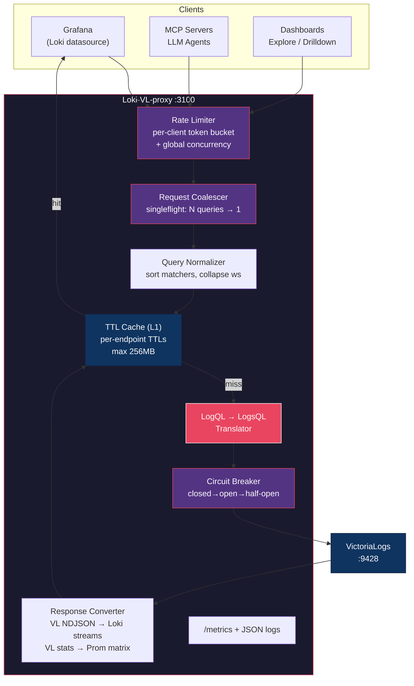
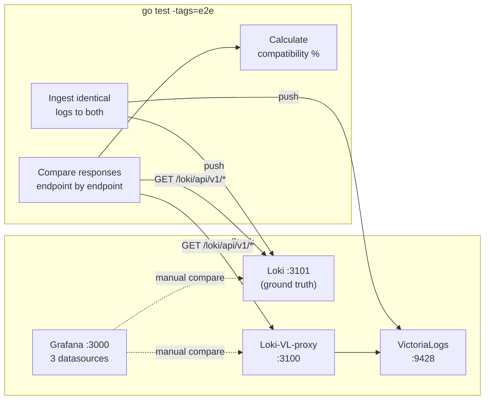

# Architecture

## Overview

Loki-VL-proxy is an HTTP proxy that sits between Grafana (or any Loki API client) and VictoriaLogs. It translates Loki's LogQL API into VictoriaLogs' LogsQL API, allowing Grafana's native Loki datasource to query VictoriaLogs without a custom plugin.

## Request Flow



## Protection Layers

| Layer | Purpose | Default Config |
|---|---|---|
| Per-client rate limiter | Prevent individual client abuse | 50 req/s, burst 100 |
| Global concurrent limit | Cap total backend load | 100 concurrent queries |
| Request coalescing | Deduplicate identical queries | Automatic (singleflight) |
| Query normalization | Improve cache hit rate | Sort matchers, collapse whitespace |
| In-memory TTL cache | Reduce backend calls | Per-endpoint TTLs, 256MB max |
| Circuit breaker | Protect VL from cascading failure | Opens after 5 failures, 10s backoff |

### How Coalescing Works

When 50 Grafana dashboards send `{app="nginx"} |= "error"` simultaneously:

```
Client 1 ──┐
Client 2 ──┤
Client 3 ──┤──→ 1 request to VL ──→ response shared to all 50
  ...      │
Client 50 ─┘
```

Only **1** request reaches VictoriaLogs. All clients get the same response. Coalescing keys include the tenant header to prevent cross-tenant data leaks.

## Data Model Mapping

### Loki vs VictoriaLogs

| Loki Concept | VL Equivalent |
|---|---|
| Stream labels | `_stream` fields (declared at ingestion) |
| Structured metadata | Regular fields (all others) |
| Timestamp | `_time` |
| Log line body | `_msg` |
| Parsed labels | Fields from `| unpack_json` / `| unpack_logfmt` |

VictoriaLogs treats all fields equally, while Loki 3.x distinguishes stream labels, structured metadata, and parsed labels. In practice, Grafana Explore handles both transparently.

### Label Translation

VictoriaLogs stores OTel attributes with native dotted names (`service.name`), while Loki uses underscores (`service_name`). The `-label-style` flag controls translation:

| Mode | Response Direction | Query Direction |
|---|---|---|
| `passthrough` | No translation | No translation |
| `underscores` | `service.name` → `service_name` | `{service_name="x"}` → VL `"service.name":"x"` |

Built-in reverse mappings cover 50+ OTel semantic convention fields.

## E2E Test Architecture



## Component Design

### Translator (`internal/translator/`)
Pure string manipulation parser — no external LogQL parser library. Converts LogQL to LogsQL left-to-right using prefix matching and regex for templates.

### Proxy (`internal/proxy/`)
HTTP handlers for all Loki API endpoints. Each handler: validates input, translates the query, calls VL, converts the response to Loki format.

### Middleware (`internal/middleware/`)
- **Rate limiter**: per-client token bucket + global semaphore
- **Coalescer**: singleflight-based request deduplication
- **Circuit breaker**: 3-state (closed/open/half-open) with configurable thresholds

### Cache (`internal/cache/`)
Three-tier: L1 in-memory (sync.Map + atomic counters), optional L2 on-disk (bbolt with gzip compression), and optional L3 peer cache (consistent hash ring). Disk encryption is delegated to cloud provider (EBS, PD, etc.).

### Metrics (`internal/metrics/`)
Prometheus text exposition at `/metrics`. Per-endpoint request counts, per-tenant breakdowns, cache stats, circuit breaker state gauge.
