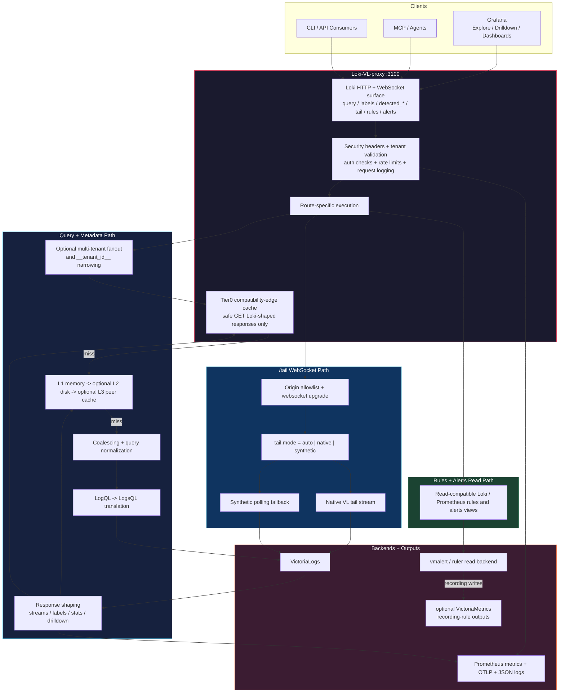
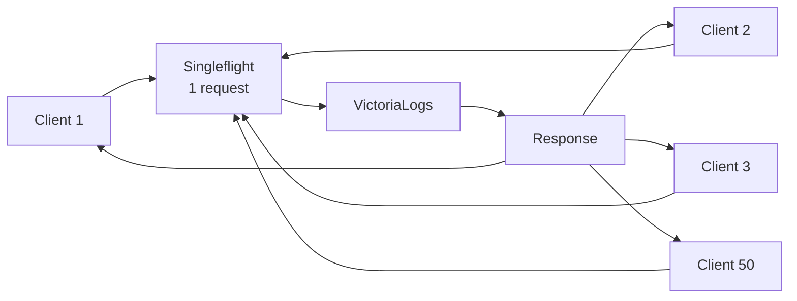
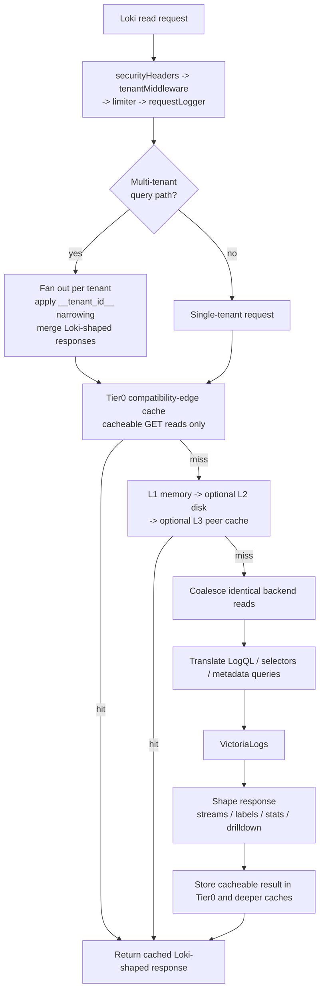
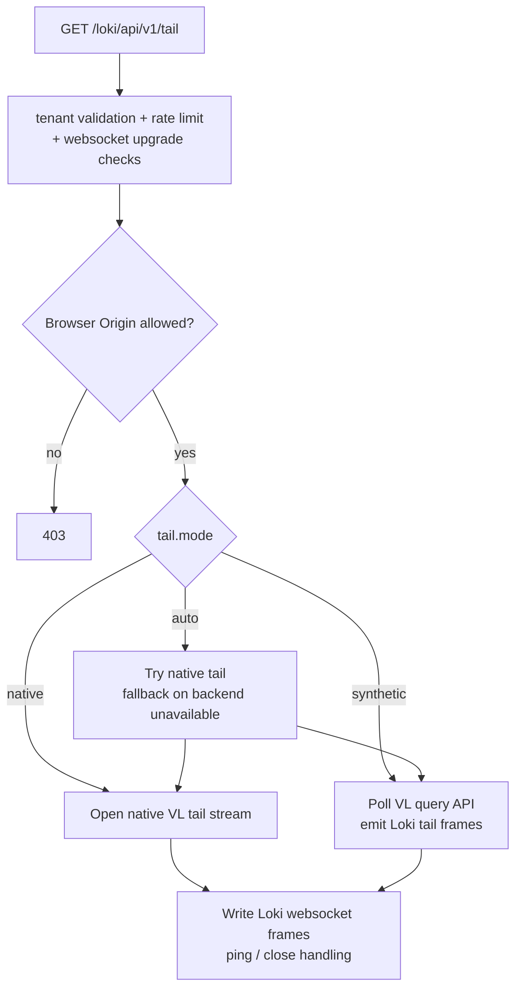
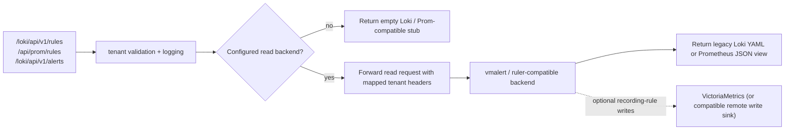
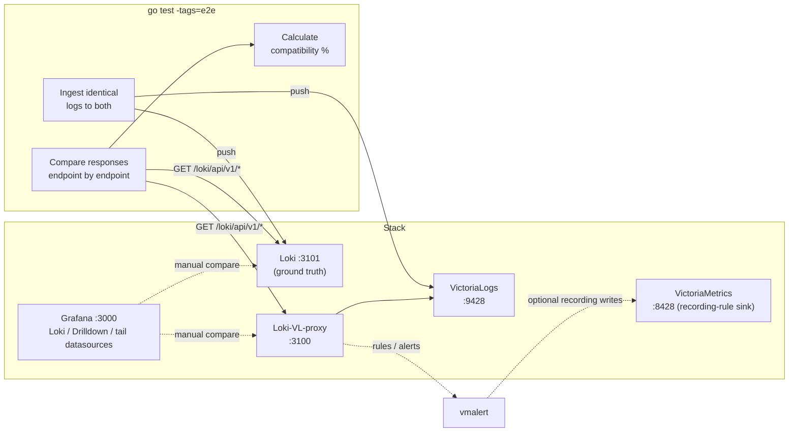

# Architecture

## Overview

Loki-VL-proxy is a read-only Loki compatibility proxy that sits between Grafana (or any Loki API client) and VictoriaLogs. It exposes Loki-compatible HTTP and WebSocket routes on the frontend, translates LogQL into LogsQL where needed, shapes VictoriaLogs responses back into Loki-compatible structures, and optionally exposes rules and alerts reads from a separate backend such as `vmalert`.

## Runtime Paths

## Protection Layers

| Layer | Purpose | Default Config |
|---|---|---|
| Tenant validation | Enforce Loki-style tenant header policy and mapping rules before backend access | Enabled on tenant-scoped routes |
| Per-client rate limiter | Prevent individual client abuse | Built-in default `50 req/s`, burst `100` |
| Global concurrent limit | Cap total backend load | Built-in default `100` concurrent backend queries |
| Request coalescing | Deduplicate identical queries | Automatic (singleflight) |
| Query normalization | Improve cache hit rate | Sort matchers, collapse whitespace |
| Tier0 response cache | Short-circuit repeated safe GET reads after tenant validation | Enabled, 10% of L1 memory budget, safe GET read endpoints only |
| Tiered cache | Reduce backend calls with local, disk, and peer reuse | L1 memory, optional L2 disk, optional L3 peer cache |
| Circuit breaker | Protect VL from cascading failure | Built-in default: opens after `5` failures, `10s` backoff |
| Tail origin allowlist | Reject browser websocket origins unless explicitly trusted | Deny browser origins by default |

### How Coalescing Works

When 50 Grafana dashboards send `{app="nginx"} |= "error"` simultaneously:

Only **1** request reaches VictoriaLogs. All clients get the same response. Coalescing keys include the tenant header to prevent cross-tenant data leaks.

## Query And Metadata Flow

### Tier0 Cache Guardrails

- Tier0 is a separate cache instance that reuses the same cache implementation, but not the same keyspace, as the deeper L1/L2/L3 caches.
- It runs only after tenant validation, auth checks, request logging setup, and route classification.
- It only serves cacheable `GET` read endpoints such as `query`, `query_range`, `series`, labels, volume, patterns, and Drilldown metadata.
- It never covers `/tail`, write/delete/admin paths, websocket upgrades, or non-JSON responses.
- Its memory budget is derived from `-cache-max-bytes` through `-compat-cache-max-percent`, defaulting to 10% and capped at 50%.
- Tenant-map and field-mapping reloads invalidate Tier0 immediately so label translation and metadata exposure changes cannot go stale.

## Tail Flow

## Rules And Alerts Read Flow

## Data Model Mapping

### Loki vs VictoriaLogs

| Loki Concept | VL Equivalent |
|---|---|
| Stream labels | `_stream` fields (declared at ingestion) |
| Structured metadata | Regular fields (all others) |
| Timestamp | `_time` |
| Log line body | `_msg` |
| Parsed labels | Fields from `| unpack_json` / `| unpack_logfmt` |

VictoriaLogs treats all fields equally, while Loki 3.x distinguishes stream labels, structured metadata, and parsed labels. In practice, Grafana Explore handles both transparently.

### Label Translation

VictoriaLogs stores OTel attributes with native dotted names (`service.name`), while Loki uses underscores (`service_name`). The `-label-style` flag controls translation:

| Mode | Response Direction | Query Direction |
|---|---|---|
| `passthrough` | No translation | No translation |
| `underscores` | `service.name` → `service_name` | `{service_name="x"}` → VL `"service.name":"x"` |

Built-in reverse mappings cover 50+ OTel semantic convention fields.

## E2E Test Architecture

## Component Design

### Translator (`internal/translator/`)
Pure string manipulation parser — no external LogQL parser library. Converts LogQL to LogsQL left-to-right using prefix matching and regex for templates.

### Proxy (`internal/proxy/`)
HTTP handlers for Loki-compatible read endpoints. The main execution paths are:
- query and metadata handlers with tenant validation, optional fanout, translation, cache reuse, and response shaping
- `/tail` websocket handling with native and synthetic modes
- rules and alerts read-through compatibility against a configured backend such as `vmalert`

### Middleware (`internal/middleware/`)
- **Rate limiter**: per-client token bucket + global semaphore (current defaults are built in, not user-exposed flags)
- **Coalescer**: singleflight-based request deduplication
- **Circuit breaker**: 3-state (closed/open/half-open) with current built-in defaults

### Cache (`internal/cache/`)
Three-tier: L1 in-memory (sync.Map + atomic counters), optional L2 on-disk (bbolt with gzip compression), and optional L3 peer cache (consistent hash ring, `zstd`/`gzip` on larger peer transfers). Disk encryption is delegated to cloud provider (EBS, PD, etc.).

### Metrics (`internal/metrics/`)
Prometheus text exposition at `/metrics` plus OTLP push. Route-aware downstream and upstream request metrics, tenant/client breakdowns, cache and windowing metrics, peer-cache state, circuit-breaker state, and prefixed process/runtime health.
