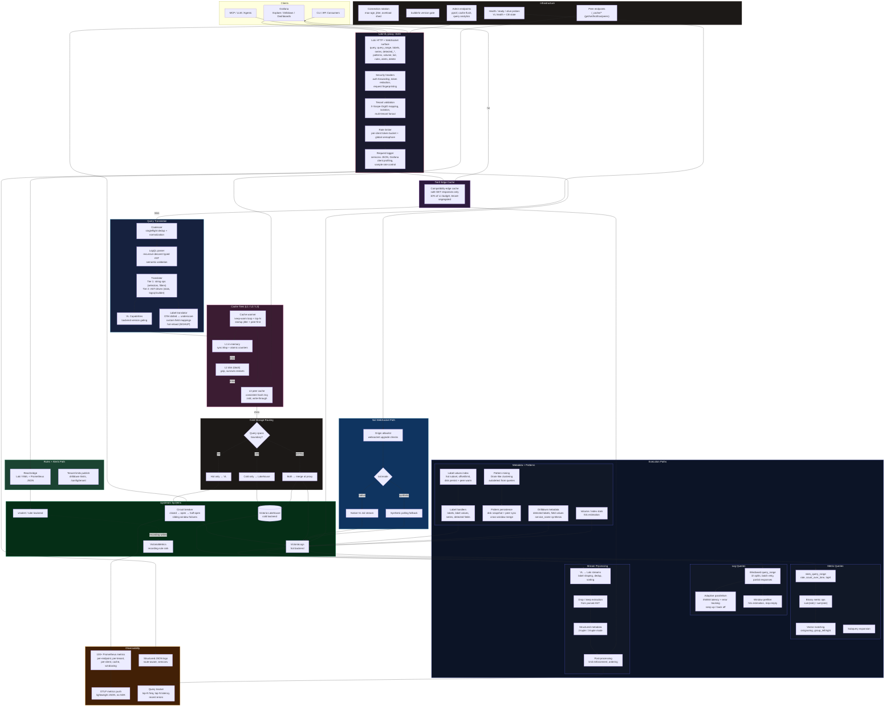
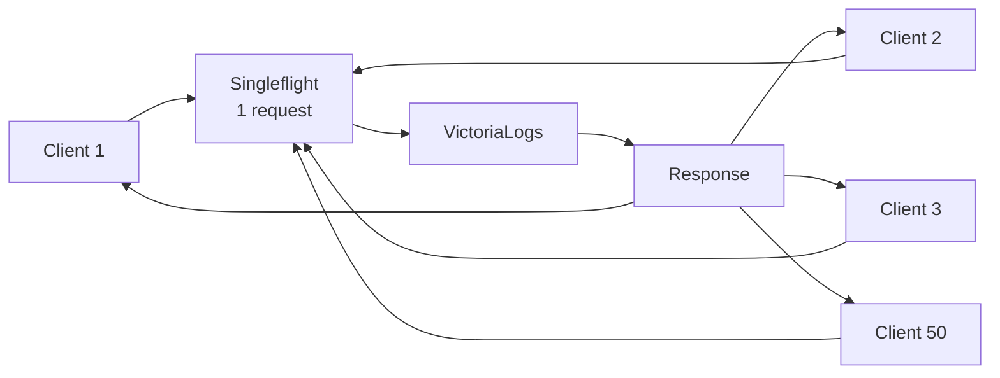
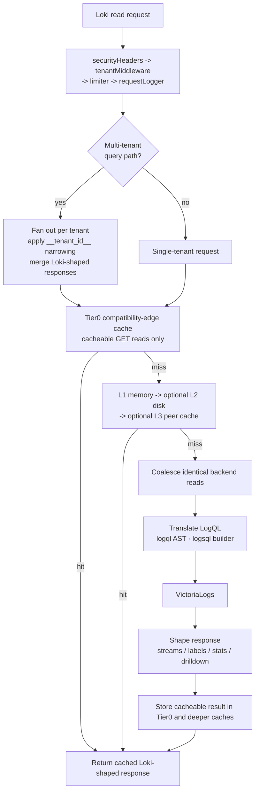
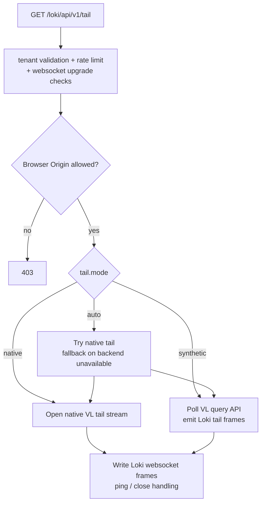
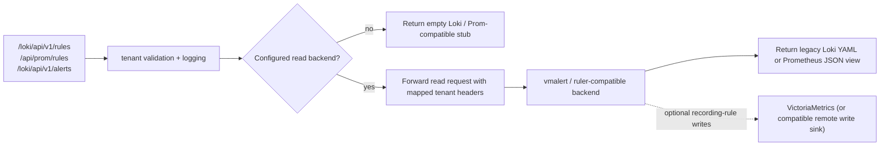
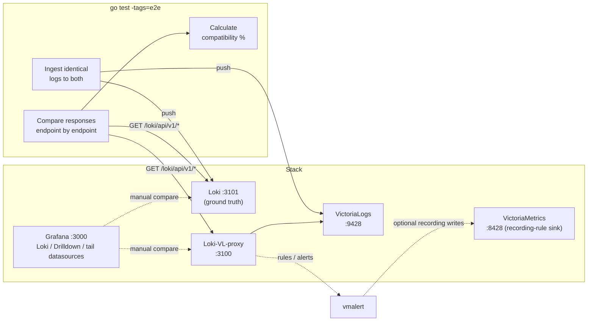
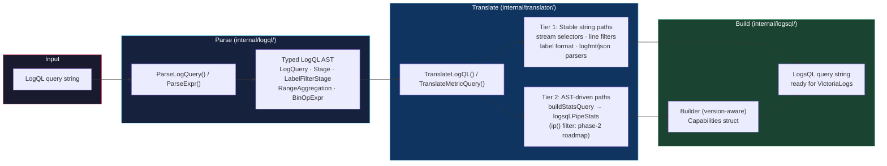

# Architecture

## Overview

Loki-VL-proxy is a read-only Loki compatibility proxy that sits between Grafana (or any Loki API client) and VictoriaLogs. It exposes Loki-compatible HTTP and WebSocket routes on the frontend, translates LogQL into LogsQL where needed, shapes VictoriaLogs responses back into Loki-compatible structures, and optionally exposes rules and alerts reads from a separate backend such as `vmalert`.

## Runtime Paths

## Protection Layers

| Layer | Purpose | Default Config |
|---|---|---|
| Tenant validation | Enforce Loki-style tenant header policy and mapping rules before backend access | Enabled on tenant-scoped routes |
| Per-client rate limiter | Prevent individual client abuse | Built-in default `50 req/s`, burst `100` |
| Global concurrent limit | Cap total backend load | Built-in default `100` concurrent backend queries |
| Request coalescing | Deduplicate identical queries | Automatic (singleflight) |
| Query normalization | Improve cache hit rate | Sort matchers, collapse whitespace |
| Tier0 response cache | Short-circuit repeated safe GET reads after tenant validation | Enabled, 10% of L1 memory budget, safe GET read endpoints only |
| Tiered cache | Reduce backend calls with local, disk, and peer reuse | L1 memory, optional L2 disk, optional L3 peer cache |
| Circuit breaker | Protect VL from cascading failure | Built-in default: opens after `5` failures, `10s` backoff |
| Tail origin allowlist | Reject browser websocket origins unless explicitly trusted | Deny browser origins by default |

### How Coalescing Works

When 50 Grafana dashboards send `{app="nginx"} |= "error"` simultaneously:

Only **1** request reaches VictoriaLogs. All clients get the same response. Coalescing keys include the tenant header to prevent cross-tenant data leaks.

## Query And Metadata Flow

### Tier0 Cache Guardrails

- Tier0 is a separate cache instance that reuses the same cache implementation, but not the same keyspace, as the deeper L1/L2/L3 caches.
- It runs only after tenant validation, auth checks, request logging setup, and route classification.
- It only serves cacheable `GET` read endpoints such as `query`, `query_range`, `series`, labels, volume, patterns, and Drilldown metadata.
- It never covers `/tail`, write/delete/admin paths, websocket upgrades, or non-JSON responses.
- Its memory budget is derived from `-cache-max-bytes` through `-compat-cache-max-percent`, defaulting to 10% and capped at 50%.
- Tenant-map and field-mapping reloads invalidate Tier0 immediately so label translation and metadata exposure changes cannot go stale.

### Cold Storage Routing

When `-cold-enabled=true` and `-cold-backend` is set, the proxy time-splits queries based on their time range:

| Query range | Route |
|---|---|
| Entirely within hot boundary | Hot backend (VictoriaLogs) only |
| Entirely beyond cold boundary | Cold backend (Victoria Lakehouse) only |
| Spans the boundary (overlap zone) | Both backends; results merged at proxy |

The boundary is configured via `-cold-boundary` (default `168h` = 7 days). The overlap window (`-cold-overlap`, default `1h`) ensures no gaps around the boundary by querying both backends in that zone.

For backward-direction queries spanning both backends, the proxy reads the cold response into memory to reverse it before merging — avoid very large backward time ranges when cold storage is enabled.

## Tail Flow

## Rules And Alerts Read Flow

## Data Model Mapping

### Loki vs VictoriaLogs

| Loki Concept | VL Equivalent |
|---|---|
| Stream labels | `_stream` fields (declared at ingestion) |
| Structured metadata | Regular fields (all others) |
| Timestamp | `_time` |
| Log line body | `_msg` |
| Parsed labels | Fields from `| unpack_json` / `| unpack_logfmt` |

VictoriaLogs treats all fields equally, while Loki 3.x distinguishes stream labels, structured metadata, and parsed labels. In practice, Grafana Explore handles both transparently.

### Label Translation

VictoriaLogs stores OTel attributes with native dotted names (`service.name`), while Loki uses underscores (`service_name`). The `-label-style` flag controls translation:

| Mode | Response Direction | Query Direction |
|---|---|---|
| `passthrough` | No translation | No translation |
| `underscores` | `service.name` → `service_name` | `{service_name="x"}` → VL `"service.name":"x"` |

Built-in reverse mappings cover 50+ OTel semantic convention fields.

## E2E Test Architecture

## Component Design

### LogQL Parser (`internal/logql/`)
Typed recursive-descent parser for LogQL. Produces a fully-typed AST (`Expr` interface with concrete node types: `*LogQuery`, `*RangeAggregation`, `*VectorAggregation`, `*BinOpExpr`, `*OpaqueMetricExpr`, …) that drives three subsystems:

- **Validation** — `ValidateLogQL(query)` returns Loki-compatible error strings for invalid queries before any work is done.
- **Routing** — `proxy.go` type-switches on the parsed AST to dispatch subqueries, binary metric expressions, and stream queries to separate execution paths (more reliable than regex-based marker injection).
- **Drop/Keep extraction** — `stream_processing.go` extracts `| drop`/`| keep` matchers from the AST for VL response post-processing.

The parser includes a semantic pass for structural constraints (missing `| unwrap` inside `rate_counter`, `__error__` inside `rate()`, malformed `ip()` filters, quantile phi bounds, line-format template validity). All error messages are formatted to match Loki 3.x exactly so Grafana clients receive the expected error shape.

See [LogQL Parser deep dive](logql-parser.md) for grammar, data flow diagrams, and extension points.

### Translator (`internal/translator/`)
LogQL→LogsQL converter. Receives canonical LogQL (produced by `Expr.String()` after AST normalisation). Translation uses two tiers: stable string operations for well-understood paths (stream selectors, line filters, label format) and typed `logsql` builder calls for complex paths (stats aggregations, IP filters). Remaining string paths are tagged `TODO(ast-migration)` for future migration — run `grep -r "TODO(ast-migration)" internal/` to see the full backlog.

### Translation Pipeline

### Proxy (`internal/proxy/`)
HTTP handlers for Loki-compatible read endpoints, split into domain-focused modules:

| Module | Responsibility |
|---|---|
| `proxy.go` | Proxy struct, configuration, constructor, and HTTP router setup |
| `middleware.go` | Request middleware chain: security headers, tenant validation, rate limiting, WebSocket upgrade checks |
| `middleware_security.go` | Security-specific middleware: auth forwarding, token redaction, request fingerprinting |
| `query_translation.go` | LogQL→LogsQL translation per request, structured request logging |
| `query_range_windowing.go` | Time-window splitting and stitching for long-range metric queries |
| `stream_processing.go` | VL→Loki stream conversion, label shaping, log line proxying |
| `postprocess.go` | Post-query response shaping: limit enforcement, deduplication, sorting |
| `multitenant.go` | Multi-tenant fanout, per-tenant narrowing, and Loki-shaped response merging |
| `label_handlers.go` | `/labels`, `/label/{name}/values`, `/series`, `/detected_fields` HTTP handlers |
| `label_metadata.go` | VL metadata fetching: field discovery, OTel attribute detection |
| `label_index.go` | In-process label-values index for low-latency label cardinality queries |
| `cache_keys.go` | Cache key construction: query_range, labels, series, detected_fields, volume |
| `patterns.go` | Pattern query handling, autodetection from query history, pattern clustering |
| `patterns_persistence.go` | Pattern snapshot persistence: load, save, and rotation |
| `metric_agg.go` | Instant-vector queries and post-aggregation metric math |
| `metric_binary.go` | Stats queries and binary metric expression evaluation |
| `volume.go` | `/loki/api/v1/index/volume` and `/index/volume_range` handlers |
| `drilldown.go` | Logs Drilldown plugin metadata endpoints |
| `tail.go` | WebSocket `/tail` with native VL stream and synthetic polling fallback |
| `alerting.go` | Health/readiness probes, rules and alerts read-through handlers |
| `backend.go` | Backend HTTP client construction, TLS config, compression negotiation |
| `telemetry.go` | Per-route Prometheus instrumentation, OTLP push, request duration histograms |
| `time_utils.go` | Timestamp parsing, range normalization, step alignment helpers |
| `http_utils.go` | HTTP error helpers, response header forwarding, Accept-Encoding negotiation |
| `subquery.go` | Subquery expansion and execution planning |
| `range_metric_compat.go` | Range metric compatibility shims for Loki 2.x vs 3.x divergences |
| `vector_matching.go` | Vector matching logic for binary metric operations |
| `unwrap_convert.go` | `unwrap` expression conversion between LogQL and LogsQL forms |
| `redact.go` | Token and credential redaction from logs and error messages |
| `safety.go` | Query safety checks: cardinality limits, expression complexity guards |

### Middleware (`internal/middleware/`)
- **Rate limiter**: per-client token bucket + global semaphore (current defaults are built in, not user-exposed flags)
- **Coalescer**: singleflight-based request deduplication
- **Circuit breaker**: 3-state (closed/open/half-open) with current built-in defaults

### Cache (`internal/cache/`)
Three-tier: L1 in-memory (sync.Map + atomic counters), optional L2 on-disk (bbolt with gzip compression), and optional L3 peer cache (consistent hash ring, `zstd`/`gzip` on larger peer transfers). Disk encryption is delegated to cloud provider (EBS, PD, etc.).

### Metrics (`internal/metrics/`)
Prometheus text exposition at `/metrics` plus OTLP push. Route-aware downstream and upstream request metrics, tenant/client breakdowns, cache and windowing metrics, peer-cache state, circuit-breaker state, and prefixed process/runtime health.
