# Fleet Cache Architecture

## Overview

The fleet cache enables multiple Loki-VL-proxy replicas to share cached data with minimal network overhead. Each key lives on exactly one peer (the **owner**, determined by consistent hashing). Non-owner peers fetch from the owner on local miss and keep short-lived **shadow copies**. With owner write-through enabled (default), non-owner pods also push eligible long-TTL writes to the owner shard so hot traffic pinned to one pod still warms the full fleet.

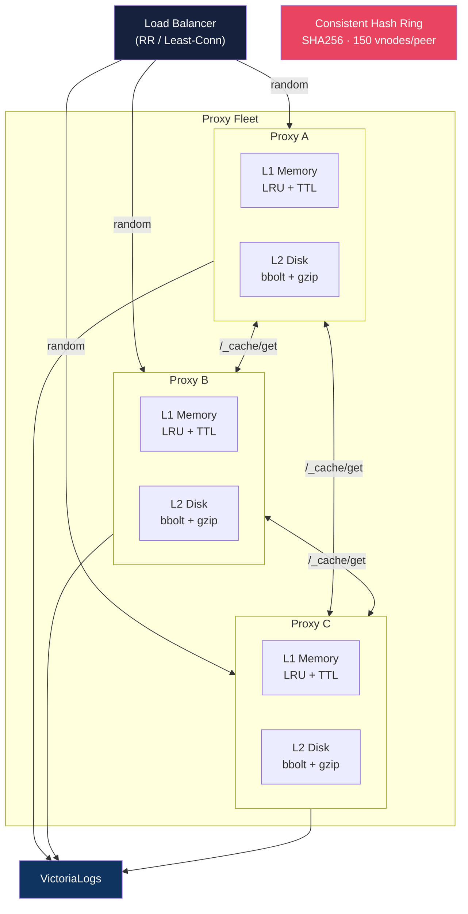

## Request Flow

### Cache Hit (Local) — 0 Hops

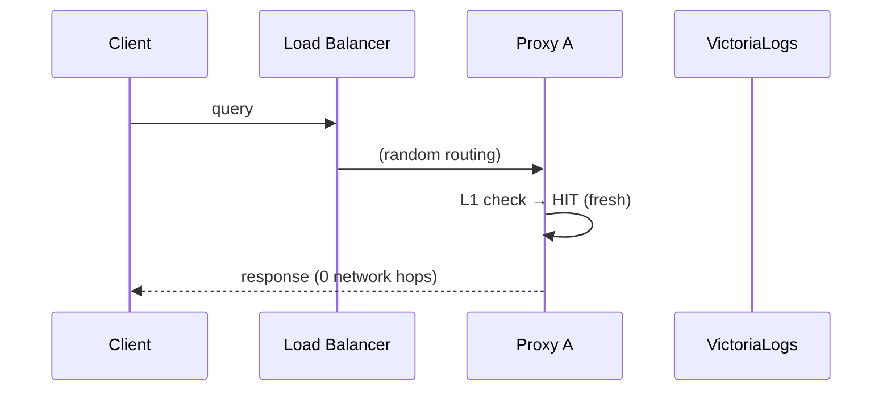

### Cache Hit (Peer) — 1 Hop

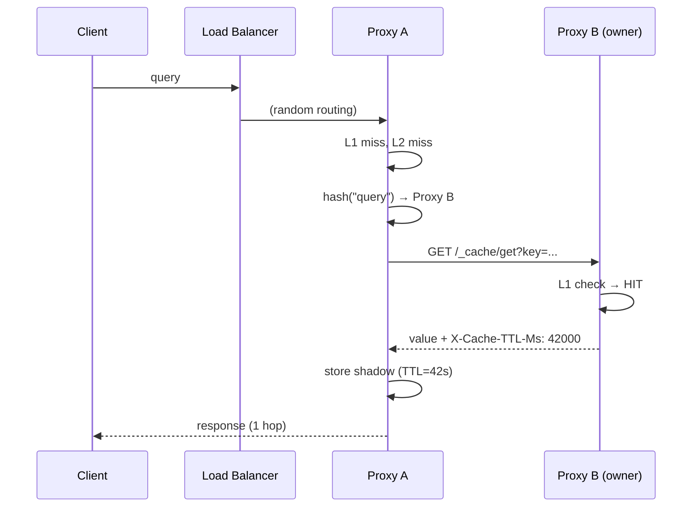

### Cache Miss (VL Fetch)

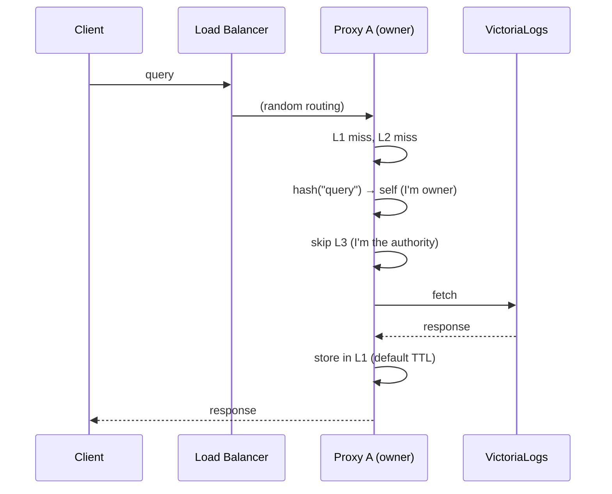

### Non-Owner Miss + Owner Write-Through (default)

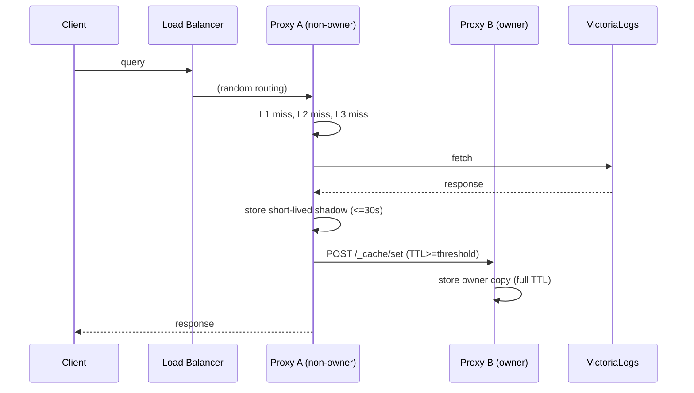

## TTL Preservation

Shadow copies use the **owner's remaining TTL**, not a fresh default:

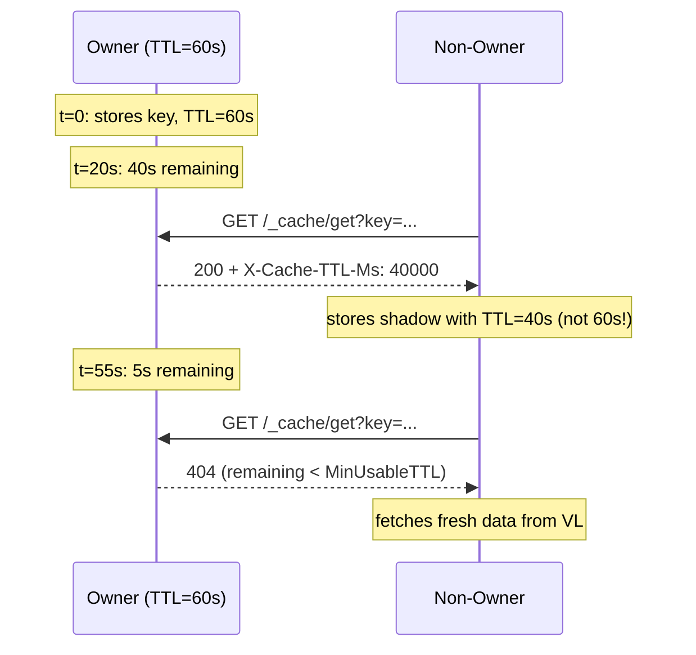

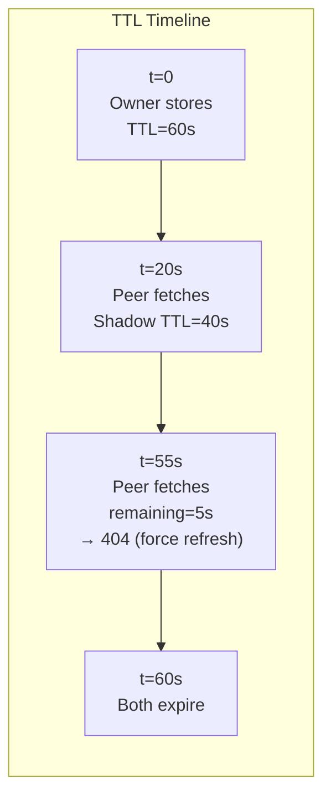

## Consistent Hash Ring

Keys map to peers deterministically — no communication needed:

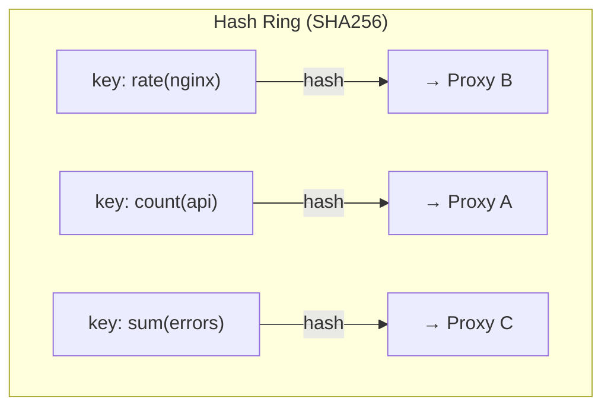

**150 virtual nodes per peer** ensures even distribution:
- 2 peers → ~50/50 split
- 3 peers → ~33/33/33 split
- Adding a peer moves ~1/N keys (minimal rebalancing)

## Circuit Breaker

Per-peer circuit breaker prevents cascading failures:

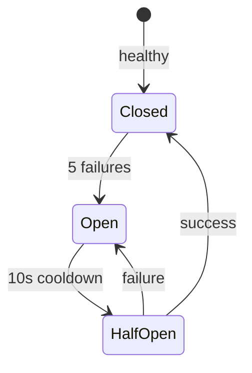

## Peer Discovery

Four discovery modes are supported. All share the same mechanics: a background goroutine re-runs discovery every `DiscoveryInterval` (default 15 s) and atomically rebuilds the consistent hash ring. Peers that disappear from the source are automatically removed; new peers that appear are added. No restart required.

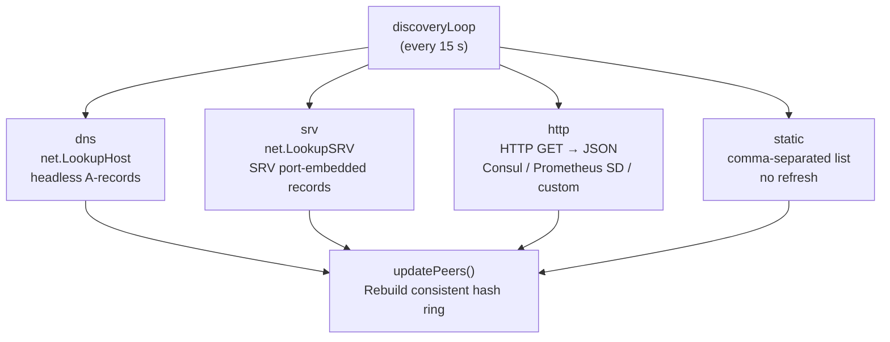

### `dns` — Kubernetes headless service (A records)

```bash
-peer-discovery=dns
-peer-dns=loki-vl-proxy-headless.monitoring.svc.cluster.local
```

`net.LookupHost` resolves the headless service name to the IP addresses of all running pods. In Kubernetes, a headless service DNS entry only includes pods that **pass their readiness probe** — unhealthy pods fall out of DNS within one TTL (typically 5–30 s), so the peer ring automatically excludes them.

Use when:
- Running in Kubernetes with an HPA-managed Deployment or StatefulSet
- You want readiness-probe gating to control peer inclusion automatically
- Pods have stable cluster IP (not required) but stable DNS subdomain

### `srv` — DNS SRV records

```bash
-peer-discovery=srv
-peer-srv=_loki-vl-proxy._tcp.loki-vl-proxy-headless.monitoring.svc.cluster.local
```

`net.LookupSRV` resolves a full SRV record (`_service._proto.domain`) and extracts host+port from each record. SRV records embed the port number, so no `-peer-port` flag is needed — each SRV record can point to a different port if required.

In Kubernetes, StatefulSet headless services publish SRV records per pod (e.g., `_http._tcp.proxy-headless.ns.svc.cluster.local`). These carry the same readiness gating as A records.

Outside Kubernetes, any DNS server that publishes SRV records works:
- HAProxy DNS resolver
- CoreDNS with custom zone
- Consul DNS (`_service._tcp.service.consul`)
- Manual BIND zone file

The SRV name format is `_service._proto.domain`. All three segments are required and must start with `_`.

### `http` — HTTP JSON endpoint

```bash
-peer-discovery=http
-peer-http-url=http://consul:8500/v1/catalog/service/loki-vl-proxy
```

The proxy fetches the configured URL every `DiscoveryInterval`. The response body is parsed as JSON and must return a list of `host:port` strings. Four response formats are supported and auto-detected:

| Format | Example |
|--------|---------|
| Simple array | `["10.0.0.1:3100","10.0.0.2:3100"]` |
| Object with `peers` key | `{"peers":["10.0.0.1:3100"]}` |
| Prometheus HTTP SD | `[{"targets":["10.0.0.1:3100"],"labels":{}}]` |
| Consul catalog | `[{"ServiceAddress":"10.0.0.1","ServicePort":3100}]` |

**Consul example** (includes health check filtering):
```bash
-peer-http-url=http://localhost:8500/v1/health/service/loki-vl-proxy?passing=true
```
Consul's `?passing=true` parameter returns only healthy instances — equivalent to Kubernetes readiness gating.

**Prometheus HTTP SD example** (custom endpoint):
```bash
-peer-http-url=http://my-registry/sd/loki-vl-proxy
```

**Nomad example**:
```bash
-peer-http-url=http://nomad:4646/v1/service/loki-vl-proxy
```

Use when:
- Running outside Kubernetes (VMs, bare metal, Nomad, Docker Swarm)
- Already using Consul or another service registry
- You have a custom service registry or health-checked load balancer
- You want fine-grained control over which instances participate in the peer ring

**How add/remove works:** The HTTP endpoint is the authoritative source. On each discovery tick the proxy fetches the URL and passes the result to `updatePeers()`. If an instance disappears from the response (failed health check, deregistered, shut down), it is removed from the hash ring within one `DiscoveryInterval`. There is no explicit register/deregister on the proxy side — that is handled by whatever manages the registry (Consul agent, health check cron, deployment tooling).

### `static` — Fixed peer list

```bash
-peer-discovery=static
-peer-static=10.0.0.1:3100,10.0.0.2:3100,10.0.0.3:3100
```

The peer list is parsed once at startup and never refreshed. Useful for small, fixed fleets where the topology does not change without a restart. Requires manual update (redeploy) when peers are added or removed.

### Peer discovery comparison

| Mode | Readiness gating | Dynamic add/remove | Works outside k8s | Port in config |
|------|-----------------|-------------------|------------------|----------------|
| `dns` | ✅ (k8s headless) | ✅ (every 15 s) | ⚠️ requires headless-style DNS | Yes (`-peer-port`) |
| `srv` | ✅ (k8s or Consul DNS) | ✅ (every 15 s) | ✅ | No (embedded in SRV) |
| `http` | ✅ (endpoint controls list) | ✅ (every 15 s) | ✅ | Yes (in response) |
| `static` | ❌ | ❌ (restart required) | ✅ | Yes (in flag) |

### Diagnostic endpoint

`GET /_cache/peers` returns the current known peer list as JSON:

```json
{"peers":["10.0.0.1:3100","10.0.0.2:3100"],"self":"10.0.0.3:3100","count":2}
```

This reflects the ring at the moment of the request and is useful for verifying that discovery is working correctly.

## AZ-Aware Peer Selection

When a proxy instance needs to fetch a key from a peer (startup warmup, L1 miss, read-ahead), it picks the peer with the **highest remaining TTL** by default — maximising cache freshness. With AZ-aware selection enabled it applies a two-tier preference:

1. **Same-AZ peers with fresh data** — lowest latency and no cross-AZ transfer cost.
2. **Any peer with fresh data** — fallback when no same-AZ peer has the key.

This reduces cross-AZ data-transfer costs and latency in multi-AZ cloud deployments without sacrificing correctness. If no peer has the key, the proxy falls through to VictoriaLogs as usual.

### How to configure

**Flag:**
```bash
-peer-self-az=us-east-1a
```

Set this to the availability zone of the current instance. When empty (the default), AZ preference is disabled and peers are selected purely by TTL freshness.

**Helm — explicit AZ:**
```yaml
peerCache:
  enabled: true
  selfAZ: "us-east-1a"
```

**Helm — automatic detection from pod topology label (recommended for Kubernetes):**
```yaml
peerCache:
  enabled: true
  # selfAZ: ""         # empty = auto-detect from topologyLabel (default)
  topologyLabel: "topology.kubernetes.io/zone"  # default; matches standard k8s node topology label

# Ensure pods carry the topology zone label so the downward API can read it:
podLabels:
  topology.kubernetes.io/zone: "us-east-1a"
```

The chart injects a `PEER_SELF_AZ` env var sourced from `metadata.labels['topology.kubernetes.io/zone']` via the Kubernetes Downward API and passes it as `-peer-self-az=$(PEER_SELF_AZ)`. If the pod does not carry the label (e.g., it was not set via `podLabels` or a platform webhook), the env var resolves to `""` and AZ preference is silently disabled.

**Kubernetes platforms that populate the topology label automatically:**

| Platform | How to enable |
|----------|--------------|
| Karpenter | Add the label to `NodePool.spec.template.metadata.labels` |
| GKE Autopilot | Use `cloud.google.com/gke-nodepool` or set `podLabels` in Helm values |
| EKS with Karpenter or managed node groups | `NodePool.spec.template.metadata.labels: {topology.kubernetes.io/zone: <zone>}` |
| Cluster with a node label syncer / mutating webhook | Labels propagated automatically |

**HTTP SD — AZ from discovery labels:**

When using `peer-discovery=http` with a Prometheus HTTP SD endpoint, the proxy extracts AZ from the target group's `labels.az` or `labels.availability_zone` field automatically — no extra flag needed:

```json
[
  {
    "targets": ["10.0.0.1:3100", "10.0.0.2:3100"],
    "labels": {"az": "us-east-1a", "env": "prod"}
  },
  {
    "targets": ["10.0.0.3:3100"],
    "labels": {"az": "us-east-1b"}
  }
]
```

Each target's AZ is stored at discovery refresh time and used during peer selection. No configuration beyond the SD labels is required.

## Configuration Examples

```bash
# Kubernetes: DNS discovery via headless service (single-AZ or no AZ preference)
./loki-vl-proxy \
  -peer-self=$(hostname -i):3100 \
  -peer-discovery=dns \
  -peer-dns=loki-vl-proxy-headless.monitoring.svc.cluster.local

# Kubernetes: DNS discovery with AZ-aware peer selection
./loki-vl-proxy \
  -peer-self=$(hostname -i):3100 \
  -peer-self-az=us-east-1a \
  -peer-discovery=dns \
  -peer-dns=loki-vl-proxy-headless.monitoring.svc.cluster.local

# Kubernetes: SRV discovery (StatefulSet with headless service)
./loki-vl-proxy \
  -peer-self=$(hostname -i):3100 \
  -peer-discovery=srv \
  -peer-srv=_loki-vl-proxy._tcp.loki-vl-proxy-headless.monitoring.svc.cluster.local

# Consul (health-checked, works outside k8s)
./loki-vl-proxy \
  -peer-self=$(hostname -i):3100 \
  -peer-discovery=http \
  -peer-http-url=http://localhost:8500/v1/health/service/loki-vl-proxy?passing=true

# Prometheus HTTP SD with AZ labels (AZ extracted automatically from labels.az)
./loki-vl-proxy \
  -peer-self=$(hostname -i):3100 \
  -peer-self-az=us-east-1a \
  -peer-discovery=http \
  -peer-http-url=http://my-registry/sd/loki-vl-proxy

# Static peer list
./loki-vl-proxy \
  -peer-self=10.0.0.1:3100 \
  -peer-discovery=static \
  -peer-static=10.0.0.1:3100,10.0.0.2:3100,10.0.0.3:3100 \
  -peer-auth-token=shared-secret
```

### Helm Values

```yaml
# Minimal — chart auto-wires peer-self, peer-discovery, and peer-dns
peerCache:
  enabled: true
```

```yaml
# With AZ-aware peer selection — automatic from pod topology label
peerCache:
  enabled: true
  topologyLabel: "topology.kubernetes.io/zone"  # default

# Ensure pods carry the label (set by platform or explicitly):
podLabels:
  topology.kubernetes.io/zone: "us-east-1a"
```

```yaml
# With AZ-aware peer selection — explicit zone
peerCache:
  enabled: true
  selfAZ: "us-east-1a"
```

When you use the Helm chart, prefer `peerCache.enabled=true` and let the chart wire the discovery flags. Use `peerCache.authToken` or `peerCache.existingSecret` when you need to provide the shared secret yourself; `extraArgs.peer-auth-token` is intentionally rejected while `peerCache.enabled=true` because the chart owns that CLI flag.

## Performance Characteristics

| Metric | Value |
|--------|-------|
| L1 latency | ~2µs |
| L2 latency | ~1ms |
| L3 latency (peer) | ~1-5ms |
| VL latency | ~10-100ms |
| Background traffic | Near zero; only request-path peer fetches and write-through pushes |
| Startup warmup VL queries | ≤W (one per window, regardless of fleet size, with peer-first warmup) |
| `/_cache/has` response size | ~50 bytes per key (JSON metadata, no values) |
| Max VL calls per key | 1 (per owner) |
| Shadow copy overhead | ~0 (uses owner's remaining TTL) |
| Hash ring lookup | O(log N) |
| Discovery refresh | Every 15s (dns / srv / http modes) |

Peer fetch behavior details:

- larger `/_cache/get` payloads are compressed when peers request `Accept-Encoding`, preferring `zstd` and falling back to `gzip`
- when `-peer-write-through=true`, non-owner writes above `-peer-write-through-min-ttl` are pushed to owners via `/_cache/set`
- set `-peer-auth-token` fleet-wide in Kubernetes deployments so peer fetches authenticate by token instead of only by the currently discovered peer IP set
- when `-peer-auth-token` is set, both peer fetch and peer write-through calls must carry the shared token or endpoints fail closed

## Fleet Metrics

The `/metrics` endpoint exports fleet-specific visibility for peer-cache behavior:

```text
loki_vl_proxy_peer_cache_peers                 # remote peers, excluding self
loki_vl_proxy_peer_cache_cluster_members       # total ring members, including self
loki_vl_proxy_peer_cache_hits_total            # successful peer fetches
loki_vl_proxy_peer_cache_misses_total          # owner returned miss / near-expiry miss
loki_vl_proxy_peer_cache_errors_total          # peer fetch failures
loki_vl_proxy_peer_cache_write_through_pushes_total   # successful owner write-through pushes
loki_vl_proxy_peer_cache_write_through_errors_total   # failed owner write-through pushes
```

Use these together with the normal client metrics to tell apart:
- backend pain caused by specific Grafana users or tenants
- cache-ring imbalance or shrinking fleets
- peer-to-peer failures that are forcing traffic back to VictoriaLogs

## Collapse Forwarding Status

Current behavior already includes request collapsing in two critical places:

- Proxy -> VictoriaLogs collapse uses singleflight coalescing (`internal/middleware/coalescer.go`) so concurrent identical requests share one upstream call.
- Peer-cache `/_cache/get` collapse uses per-key in-flight dedupe (`internal/cache/peer.go`) so concurrent non-owner pulls for the same key share one owner fetch.

Recent verification coverage:

- `TestCoalescer_DedupConcurrentRequests`
- `TestCoalescer_TenantIsolation`
- `TestPeerCache_CoalescingAndCacheIntegration`
- `TestPeerCache_ThreePeers_ShadowCopiesAvoidRepeatedOwnerFetches`

Peer payload exchange already prefers `zstd`, then `gzip`, then identity.

## Hot Read-Ahead (Bounded)

Bounded hot read-ahead is implemented and remains disabled by default (`-peer-hot-read-ahead-enabled=false`).

Runtime behavior:

1. Owners expose a compact hot-key index on `/_cache/hot` (top N keys with score, size, and remaining TTL).
2. Peers pull owner hot indexes on a periodic, jittered loop.
3. Prefetch selection is bounded and tenant-fair:
   - remaining TTL must be above threshold
   - object size must stay below prefetch object limit
   - selected keys must stay within key budget
   - selected bytes must stay within byte budget
   - first pass enforces per-tenant fairness cap, second pass backfills remaining budget
4. Prefetch fetches use existing `/_cache/get` with `Accept-Encoding: zstd, gzip`.
5. Prefetched values are inserted as local shadow copies (no write-through fanout loops).
6. Existing collapse-forwarding stays in place: concurrent pulls for the same key coalesce.

Anti-storm controls:

- max concurrency for hot-index and prefetch pulls
- strict per-interval key/byte budgets
- jittered scheduling
- circuit-breaker-aware peer selection
- error-streak backoff before next read-ahead cycle

Read-ahead observability metrics:

```text
loki_vl_proxy_peer_cache_hot_index_requests_total
loki_vl_proxy_peer_cache_hot_index_errors_total
loki_vl_proxy_peer_cache_read_ahead_prefetches_total
loki_vl_proxy_peer_cache_read_ahead_prefetch_bytes_total
loki_vl_proxy_peer_cache_read_ahead_budget_drops_total
loki_vl_proxy_peer_cache_read_ahead_tenant_skips_total
```

These are additive to existing peer-cache counters and are also used by CI regression guards.

Expected effect:

- Lower VictoriaLogs fetch rate for repeatedly accessed hot keys.
- Better p95/p99 cache hit latency on non-owner replicas.
- More even read pressure across a fleet behind L4/L7 load balancers.

## Design Decisions

| Decision | Why |
|----------|-----|
| Consistent hashing (not gossip) | Zero background traffic, deterministic routing |
| Owner write-through + shadow copies | Preserve owner-centric cache warmth under skewed traffic while keeping non-owner shadows short-lived |
| TTL preservation (not extension) | Never serve stale data beyond original intent |
| MinUsableTTL=5s (force refresh) | Don't transfer data that expires in transit |
| Singleflight per key | Prevent cache stampede on L3 misses |
| Per-peer circuit breaker | Isolate failures, auto-recover after cooldown |
| No disk encryption | Delegated to cloud provider (EBS/PD encryption at rest) |

---

## Startup Coordination and Fleet Restart Safety

### The Problem: Thundering Herd

Without coordination, a rolling restart of N proxy instances causes every instance to
fire expensive metadata warmup queries to VL simultaneously:

```
t=0s: instance-1 restarts → stream_field_names [1h] → stream_field_names [6h] → ... (4 queries)
t=0s: instance-2 restarts → stream_field_names [1h] → stream_field_names [6h] → ... (4 queries)
t=0s: instance-3 restarts → ...
...
t=0s: instance-9 restarts → stream_field_names [7d] → (4 queries)

Total: 9 instances × 4 windows × 14-46s query = 36 wide-range VL queries in parallel
Result: VL OOM / restart
```

### Solution: Three-Layer Startup Defense

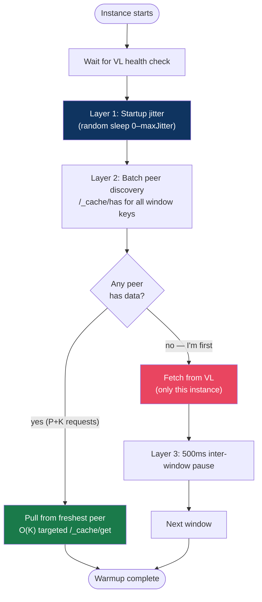

#### Layer 1: Startup Jitter

Controlled by `-warmup-max-jitter`. Each instance sleeps for a random duration
`[0, maxJitter)` before starting warmup queries. This staggers the fleet so instances
don't all hit VL simultaneously.

**Recommended settings:**

| Fleet size | `-warmup-max-jitter` | Expected VL hits per window |
|------------|----------------------|----------------------------|
| 2–5 pods | `5s` | 1 (first pod only) |
| 6–15 pods | `10s` | 1–2 |
| 16–30 pods | `20s` | 2–3 |
| 30+ pods | `30s` | ≤3 |

A warmup of the 4 standard label windows takes ~2–8 s total. With `maxJitter=10s`
a pod waking up at t=4s will find fresh data from a pod that woke at t=0s.

#### Layer 2: Batch Peer Discovery (`/_cache/has`)

After jitter, each instance checks whether any peer already has the data before
touching VL. This is a **two-phase operation**:

**Phase 1 — Discovery (metadata only, no value transfer):**

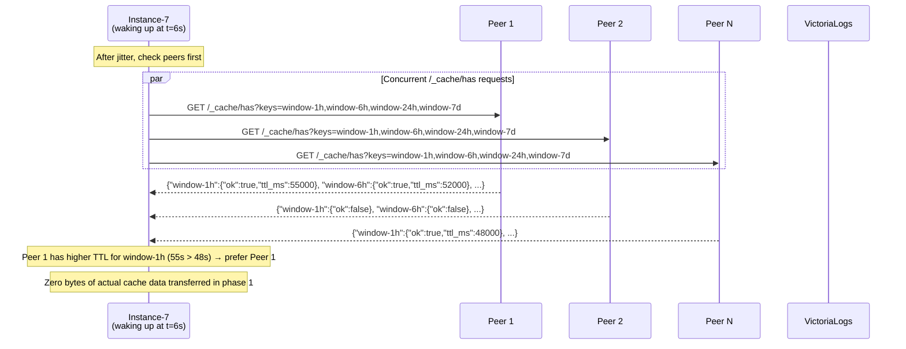

**Phase 2 — Targeted fetch (values only from the freshest peer):**

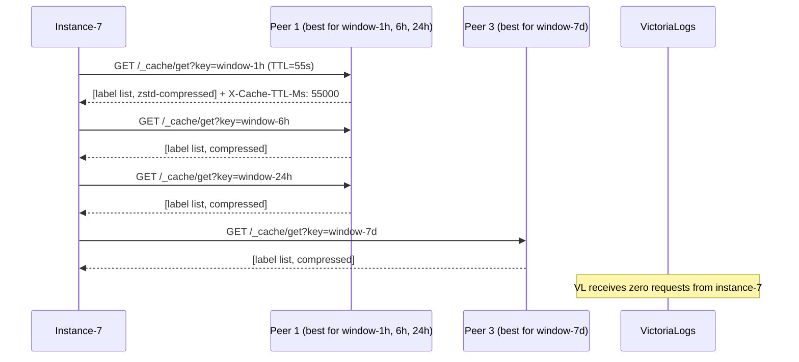

#### Layer 3: Inter-Window Sleep

When an instance must fetch from VL (it's the first one up or peers had nothing),
a 500ms pause between each window prevents consecutive wide-range queries from
monopolizing VL's query concurrency slots.

---

### Network Traffic Analysis

#### Per-Restart Request Count

For a fleet of **P peers** warming **W label windows** (default W=4):

| Strategy | Requests per instance | Total fleet requests | Data transferred |
|----------|----------------------|----------------------|------------------|
| Old (per-key get) | P × W (worst case) | P² × W | full values × P² × W |
| New (batch has + targeted get) | P + W' (W' ≤ W) | P² + P×W' | tiny JSON × P² + values × P×W' |

**Example: 9-pod fleet restarting simultaneously**

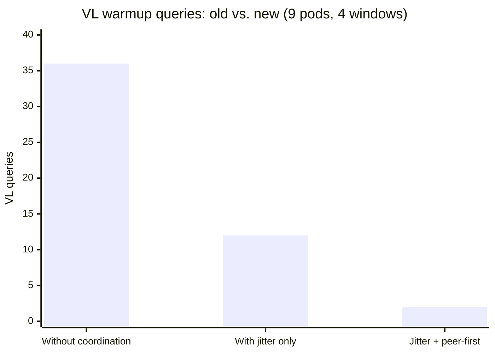

**Example: 30-pod fleet**

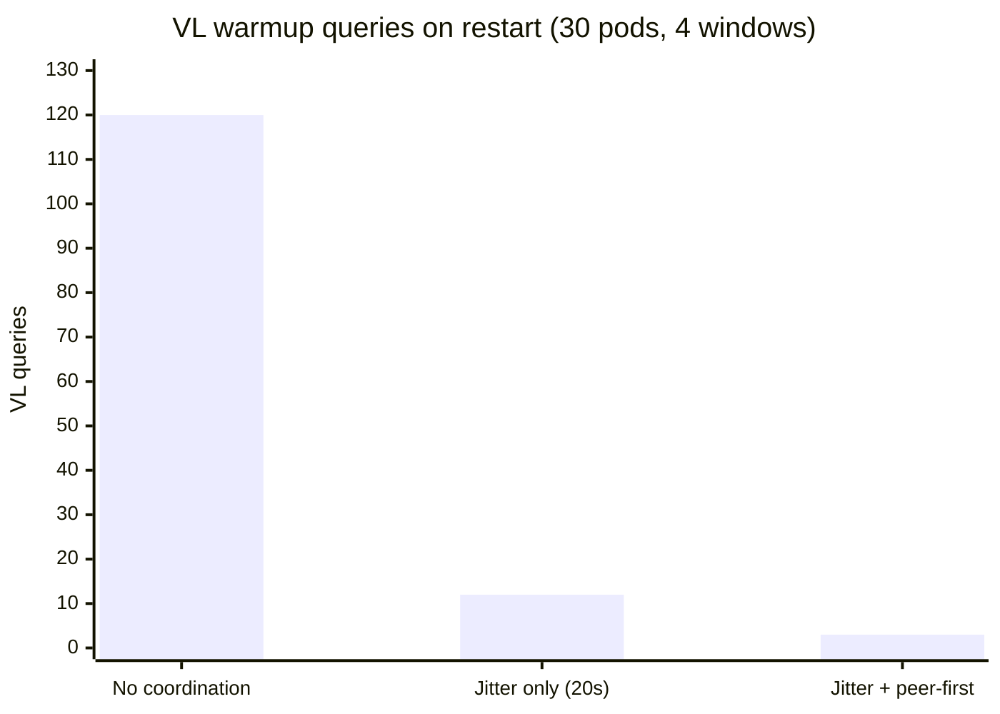

The peer-first strategy means only the **first pod per window** needs to hit VL;
all subsequent pods pull from that pod. With 4 windows and staggered jitter, the
realistic steady state is 4 VL warmup queries total regardless of fleet size.

---

### Timeline: 30-Pod Rolling Restart

```mermaid
gantt
    title 30-pod rolling restart with maxJitter=20s (one label window shown)
    dateFormat  s
    axisFormat  %Ss

    section Instance 1 (wakes at t=1s)
    Jitter sleep       :done, j1, 0, 1s
    Peer check (miss)  :done, p1, 1s, 2s
    VL fetch (window)  :crit, v1, 2s, 6s
    Cache warm         :done, c1, 6s, 30s

    section Instance 2 (wakes at t=2s)
    Jitter sleep       :done, j2, 0, 2s
    Peer check (miss)  :done, p2, 2s, 3s
    VL fetch (window)  :crit, v2, 3s, 7s
    Cache warm         :done, c2, 7s, 30s

    section Instance 5 (wakes at t=7s)
    Jitter sleep       :done, j5, 0, 7s
    Peer check (HIT)   :active, ph5, 7s, 8s
    Pull from peer 1   :active, pf5, 8s, 9s
    Cache warm         :done, cf5, 9s, 30s

    section Instance 15 (wakes at t=11s)
    Jitter sleep       :done, j15, 0, 11s
    Peer check (HIT)   :active, ph15, 11s, 12s
    Pull from peer 2   :active, pf15, 12s, 13s
    Cache warm         :done, cf15, 13s, 30s

    section Instance 30 (wakes at t=19s)
    Jitter sleep       :done, j30, 0, 19s
    Peer check (HIT)   :active, ph30, 19s, 20s
    Pull from peer     :active, pf30, 20s, 21s
    Cache warm         :done, cf30, 21s, 30s
```

Key observation: VL only sees warmup queries from the first 2 instances. All
subsequent instances pull from peers. This is true for **any fleet size** as long
as `maxJitter` is larger than the warmup duration (~6–8s for 4 windows).

---

### `/_cache/has` Endpoint Reference

**`GET /_cache/has?keys=key1,key2,key3`**

Batch key-presence check. Returns JSON presence and remaining TTL for each
requested key. No value data is transferred — responses are tiny (~50 bytes per key).

**Query parameters:**

| Parameter | Description |
|-----------|-------------|
| `keys` | Comma-separated cache keys (max 200) |

**Response** — `200 OK`, `Content-Type: application/json`:

```json
{
  "labels:start=1716278400000000000&end=1716282000000000000&query=%2A": {
    "ok": true,
    "ttl_ms": 55000
  },
  "labels:start=1716257200000000000&end=1716282000000000000&query=%2A": {
    "ok": false
  }
}
```

| Field | Description |
|-------|-------------|
| `ok` | `true` if key is present and has > `MinUsableTTL` (5s) remaining |
| `ttl_ms` | Remaining TTL in milliseconds; only present when `ok=true` |

**Behavior:**
- Keys near expiry (`remaining < 5s`) are reported as `ok: false` (treat as miss)
- Response can be `zstd`- or `gzip`-compressed when `Accept-Encoding` header is set
- Protected by the same `X-Peer-Token` authentication as `/_cache/get` and `/_cache/set`

**Use case — pick the freshest peer before fetching:**

```
caller → each peer: GET /_cache/has?keys=k1,k2,k3,k4   (metadata, ~200 bytes/peer)
caller ← each peer: {k1: {ok:true, ttl_ms:55000}, k2: {ok:false}, ...}
caller selects peer with highest ttl_ms per key
caller → best peer: GET /_cache/get?key=k1              (value fetch, only if needed)
```

---

### Peer Endpoint Summary

| Endpoint | Method | Purpose | Body transferred |
|----------|--------|---------|-----------------|
| `/_cache/get?key=K` | GET | Fetch value for one key | Full value (compressed) |
| `/_cache/set?key=K&ttl_ms=T` | POST | Push a value to a peer (write-through) | Full value |
| `/_cache/has?keys=k1,k2,...` | GET | Batch presence + TTL check | JSON metadata only (~50B/key) |
| `/_cache/hot?limit=N` | GET | Top N hot keys with scores and TTL | JSON index (no values) |

All endpoints respect `X-Peer-Token` when `-peer-auth-token` is configured.
Responses ≥1 KB are offered compressed (`zstd` preferred, `gzip` fallback).

---

### Large-Fleet Configuration Reference

#### Kubernetes (30+ pods)

```yaml
# values.yaml
extraArgs:
  peer-self: "$(POD_IP):3100"
  peer-discovery: "dns"
  peer-dns: "loki-vl-proxy-headless.monitoring.svc.cluster.local"
  peer-auth-token: "$(PEER_AUTH_TOKEN)"  # from Secret
  warmup-max-jitter: "20s"               # spread 30 pods over 20s window

# Headless service for peer discovery
# (chart creates this automatically when peerCache.enabled=true)
```

#### Jitter Sizing Formula

```
recommended_jitter = max(single_warmup_duration × 1.5, 5s)
single_warmup_duration ≈ 4 windows × (avg_VL_latency + 500ms_inter_window_sleep)
                       ≈ 4 × (2s + 0.5s) = 10s  (typical)
recommended_jitter    ≈ 10s × 1.5 = 15s
```

For large fleets (30+ pods) add extra buffer: `recommended_jitter = 20–30s`.

#### Expected Steady-State VL Load

| Fleet size | maxJitter | VL warmup queries per full restart |
|------------|-----------|-------------------------------------|
| 3 pods | 5s | ≤4 (1 per window) |
| 9 pods | 10s | ≤4 |
| 20 pods | 15s | ≤4–8 |
| 30 pods | 20s | ≤4–8 |
| 50 pods | 30s | ≤8 |

The theoretical minimum is W (one VL query per label window, regardless of fleet
size) because the peer-first strategy means only the first instance per window
touches VL. In practice, 1–2 additional instances may overlap before the first
completes, giving ≤2W queries for the most contended windows.
