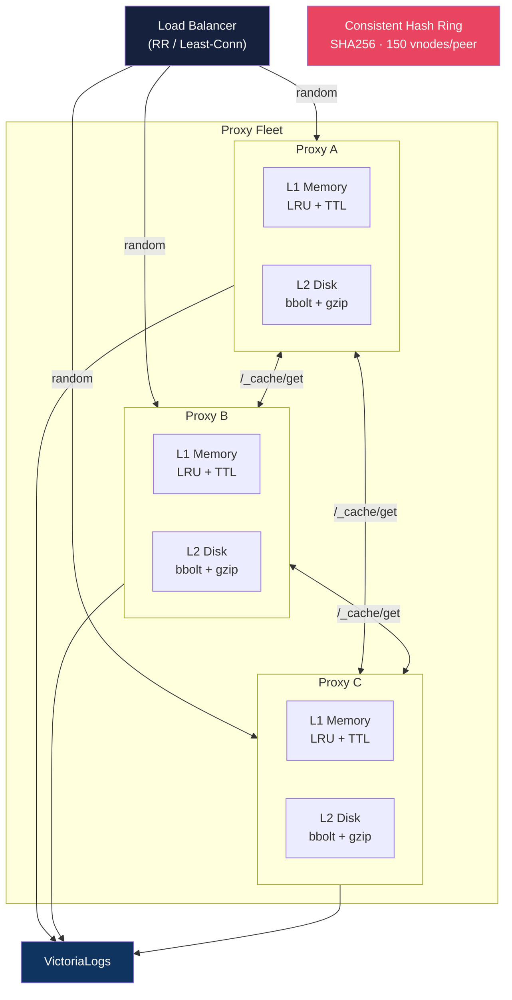
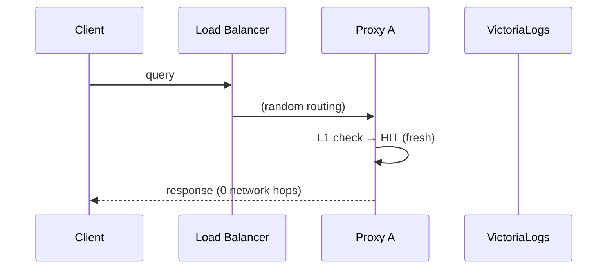
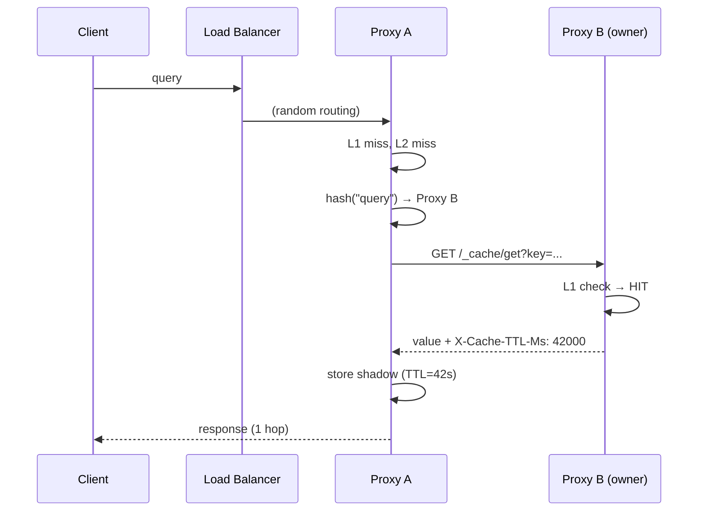
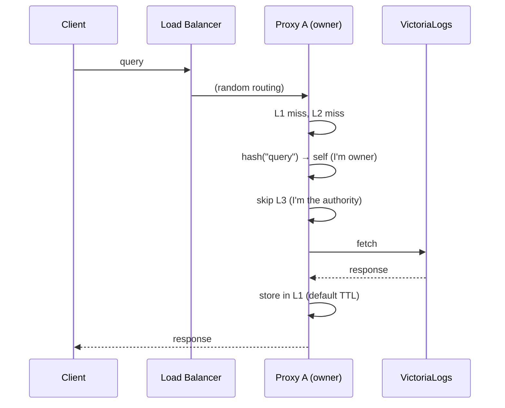
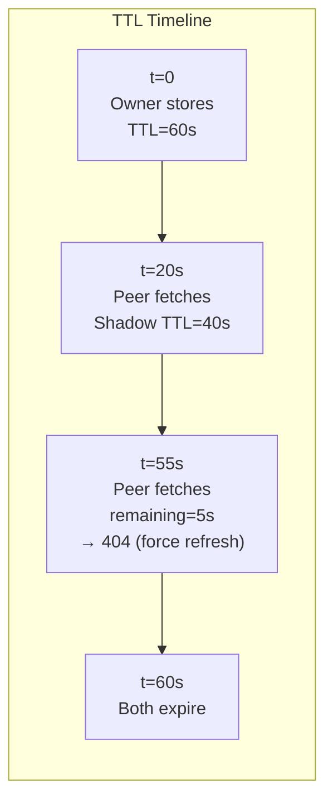
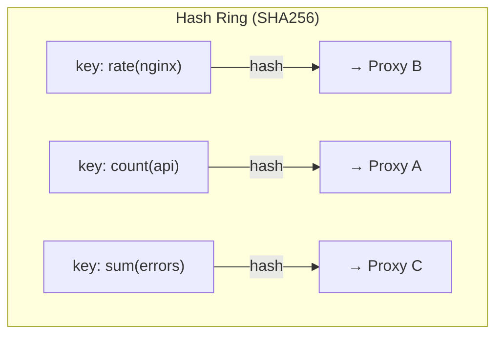
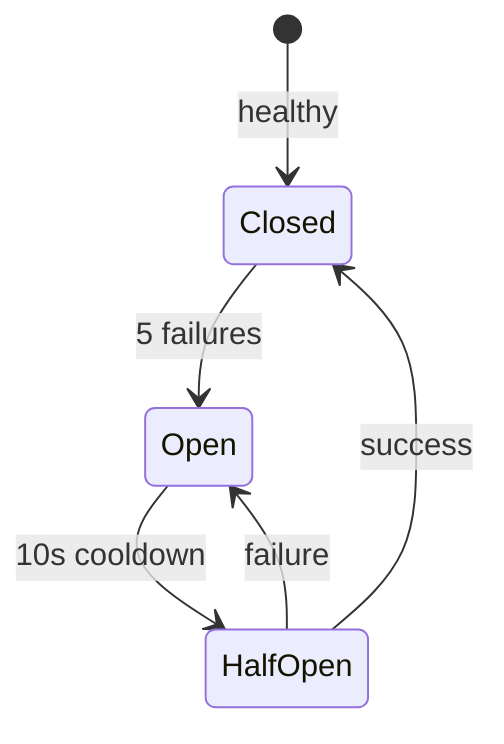

# Fleet Cache Architecture

## Overview

The fleet cache enables multiple Loki-VL-proxy replicas to share cached data with minimal network overhead. Each key lives on exactly one peer (the **owner**, determined by consistent hashing). Non-owner peers fetch from the owner on local miss and keep short-lived **shadow copies**.



## Request Flow

### Cache Hit (Local) — 0 Hops



### Cache Hit (Peer) — 1 Hop



### Cache Miss (VL Fetch)



## TTL Preservation

Shadow copies use the **owner's remaining TTL**, not a fresh default:

```
Owner stores key with TTL=60s
Time passes... 20s elapsed, 40s remaining

Non-owner fetches from owner:
  Owner responds with X-Cache-TTL-Ms: 40000
  Non-owner stores shadow with TTL=40s (not 60s!)

If remaining < 5s (MinUsableTTL):
  Owner responds 404 → non-owner goes to VL for fresh data
```



## Consistent Hash Ring

Keys map to peers deterministically — no communication needed:



**150 virtual nodes per peer** ensures even distribution:
- 2 peers → ~50/50 split
- 3 peers → ~33/33/33 split
- Adding a peer moves ~1/N keys (minimal rebalancing)

## Circuit Breaker

Per-peer circuit breaker prevents cascading failures:



## Configuration

```bash
# Kubernetes (DNS discovery via headless service)
./loki-vl-proxy \
  -peer-self=$(hostname -i):3100 \
  -peer-discovery=dns \
  -peer-dns=proxy-headless.ns.svc.cluster.local

# Static peer list
./loki-vl-proxy \
  -peer-self=10.0.0.1:3100 \
  -peer-discovery=static \
  -peer-static=10.0.0.1:3100,10.0.0.2:3100,10.0.0.3:3100
```

### Helm Values

```yaml
extraArgs:
  peer-self: "$(POD_IP):3100"
  peer-discovery: "dns"
  peer-dns: "loki-vl-proxy-headless.default.svc.cluster.local"
```

## Performance Characteristics

| Metric | Value |
|--------|-------|
| L1 latency | ~2µs |
| L2 latency | ~1ms |
| L3 latency (peer) | ~1-5ms |
| VL latency | ~10-100ms |
| Background traffic | Zero |
| Max VL calls per key | 1 (per owner) |
| Shadow copy overhead | ~0 (uses owner's remaining TTL) |
| Hash ring lookup | O(log N) |
| Discovery refresh | Every 15s (DNS only) |

## Design Decisions

| Decision | Why |
|----------|-----|
| Consistent hashing (not gossip) | Zero background traffic, deterministic routing |
| Shadow copies (not write-through) | Non-owner fetches on demand, no push overhead |
| TTL preservation (not extension) | Never serve stale data beyond original intent |
| MinUsableTTL=5s (force refresh) | Don't transfer data that expires in transit |
| Singleflight per key | Prevent cache stampede on L3 misses |
| Per-peer circuit breaker | Isolate failures, auto-recover after cooldown |
| No disk encryption | Delegated to cloud provider (EBS/PD encryption at rest) |
