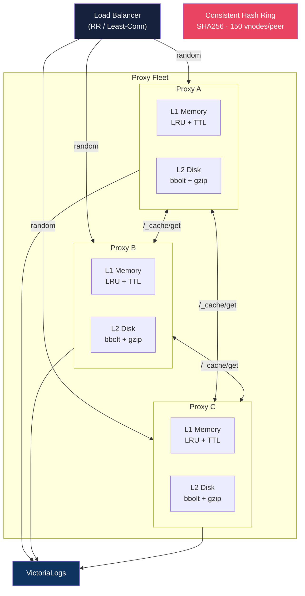
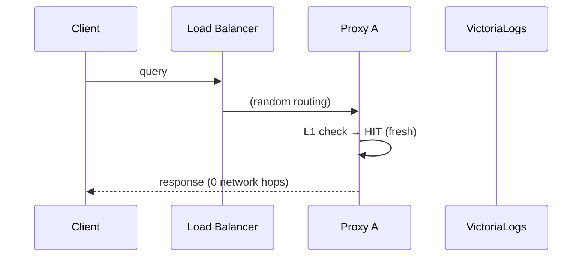
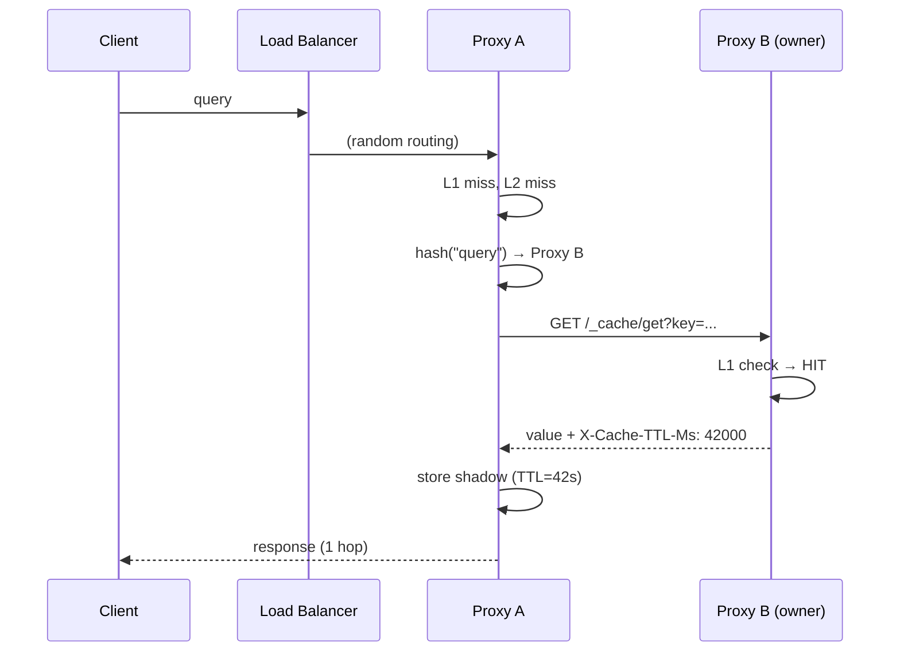
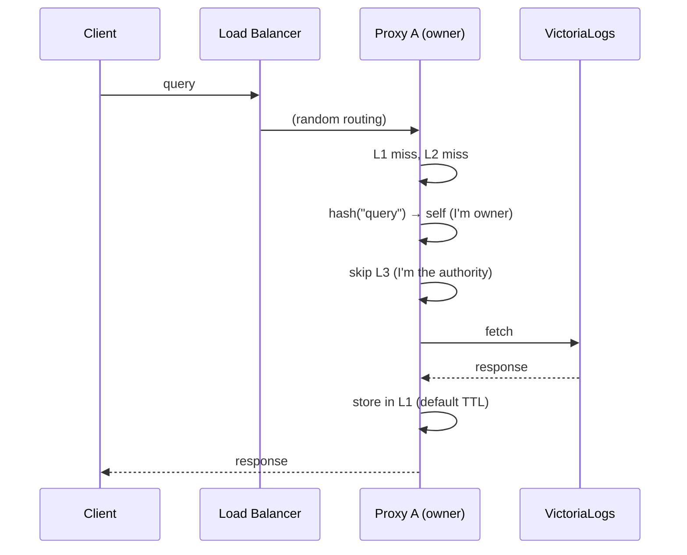
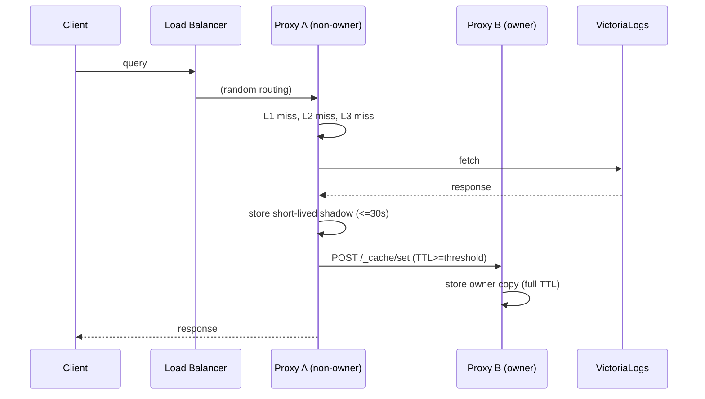
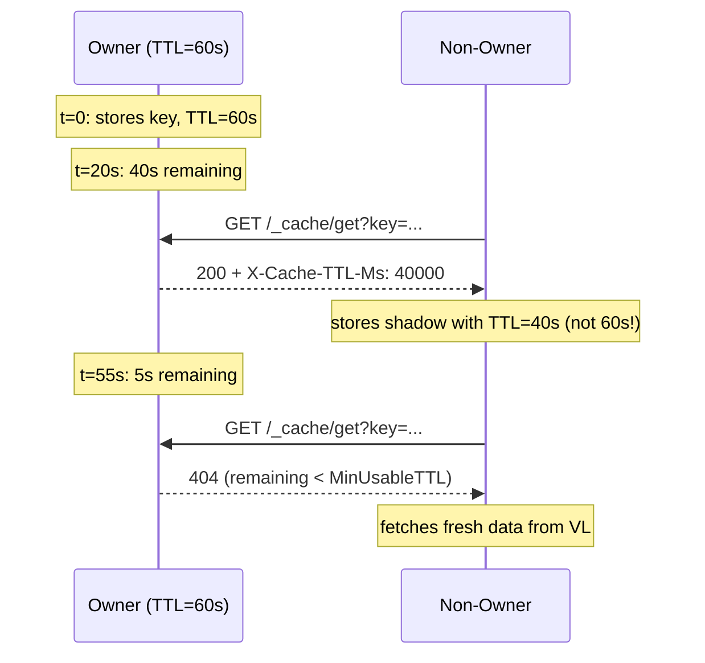
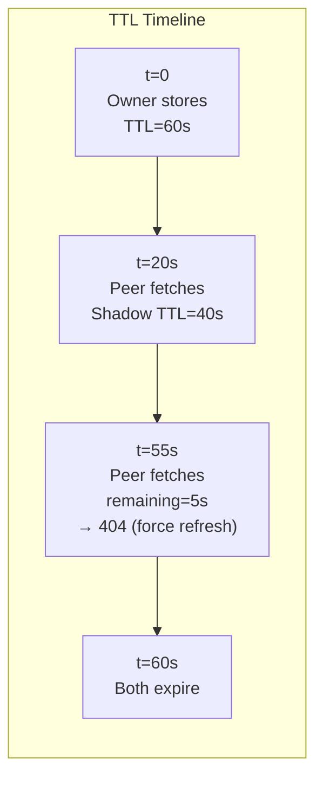
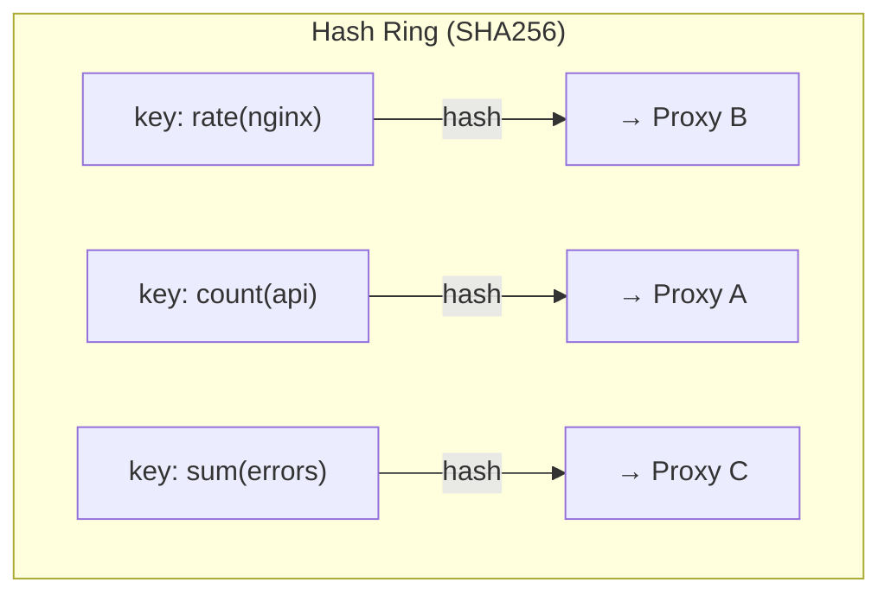
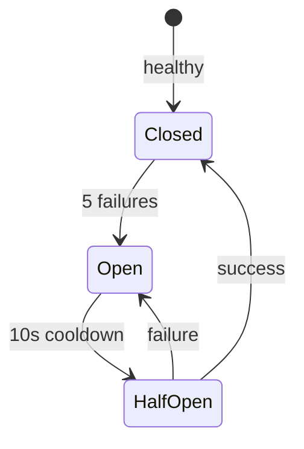

# Fleet Cache Architecture

## Overview

The fleet cache enables multiple Loki-VL-proxy replicas to share cached data with minimal network overhead. Each key lives on exactly one peer (the **owner**, determined by consistent hashing). Non-owner peers fetch from the owner on local miss and keep short-lived **shadow copies**. With owner write-through enabled (default), non-owner pods also push eligible long-TTL writes to the owner shard so hot traffic pinned to one pod still warms the full fleet.



## Request Flow

### Cache Hit (Local) — 0 Hops



### Cache Hit (Peer) — 1 Hop



### Cache Miss (VL Fetch)



### Non-Owner Miss + Owner Write-Through (default)



## TTL Preservation

Shadow copies use the **owner's remaining TTL**, not a fresh default:





## Consistent Hash Ring

Keys map to peers deterministically — no communication needed:



**150 virtual nodes per peer** ensures even distribution:
- 2 peers → ~50/50 split
- 3 peers → ~33/33/33 split
- Adding a peer moves ~1/N keys (minimal rebalancing)

## Circuit Breaker

Per-peer circuit breaker prevents cascading failures:



## Configuration

```bash
# Kubernetes (DNS discovery via headless service)
./loki-vl-proxy \
  -peer-self=$(hostname -i):3100 \
  -peer-discovery=dns \
  -peer-dns=proxy-headless.ns.svc.cluster.local

# Static peer list
./loki-vl-proxy \
  -peer-self=10.0.0.1:3100 \
  -peer-discovery=static \
  -peer-static=10.0.0.1:3100,10.0.0.2:3100,10.0.0.3:3100

# Shared-token protected peer cache
./loki-vl-proxy \
  -peer-self=10.0.0.1:3100 \
  -peer-discovery=static \
  -peer-static=10.0.0.1:3100,10.0.0.2:3100,10.0.0.3:3100 \
  -peer-auth-token=shared-secret
```

### Helm Values

```yaml
extraArgs:
  peer-self: "$(POD_IP):3100"
  peer-discovery: "dns"
  peer-dns: "loki-vl-proxy-headless.default.svc.cluster.local"
```

When you use the Helm chart, prefer `peerCache.enabled=true` and let the chart wire the discovery flags. Use `extraArgs.peer-auth-token` only when you need a shared secret for peer fetches.

## Performance Characteristics

| Metric | Value |
|--------|-------|
| L1 latency | ~2µs |
| L2 latency | ~1ms |
| L3 latency (peer) | ~1-5ms |
| VL latency | ~10-100ms |
| Background traffic | Near zero; only request-path peer fetches and write-through pushes |
| Max VL calls per key | 1 (per owner) |
| Shadow copy overhead | ~0 (uses owner's remaining TTL) |
| Hash ring lookup | O(log N) |
| Discovery refresh | Every 15s (DNS only) |

Peer fetch behavior details:

- larger `/_cache/get` payloads are compressed when peers request `Accept-Encoding`, preferring `zstd` and falling back to `gzip`
- when `-peer-write-through=true`, non-owner writes above `-peer-write-through-min-ttl` are pushed to owners via `/_cache/set`
- set `-peer-auth-token` fleet-wide in Kubernetes deployments so peer fetches authenticate by token instead of only by the currently discovered peer IP set
- when `-peer-auth-token` is set, both peer fetch and peer write-through calls must carry the shared token or endpoints fail closed

## Fleet Metrics

The `/metrics` endpoint exports fleet-specific visibility for peer-cache behavior:

```text
loki_vl_proxy_peer_cache_peers                 # remote peers, excluding self
loki_vl_proxy_peer_cache_cluster_members       # total ring members, including self
loki_vl_proxy_peer_cache_hits_total            # successful peer fetches
loki_vl_proxy_peer_cache_misses_total          # owner returned miss / near-expiry miss
loki_vl_proxy_peer_cache_errors_total          # peer fetch failures
loki_vl_proxy_peer_cache_write_through_pushes_total   # successful owner write-through pushes
loki_vl_proxy_peer_cache_write_through_errors_total   # failed owner write-through pushes
```

Use these together with the normal client metrics to tell apart:
- backend pain caused by specific Grafana users or tenants
- cache-ring imbalance or shrinking fleets
- peer-to-peer failures that are forcing traffic back to VictoriaLogs

## Collapse Forwarding Status

Current behavior already includes request collapsing in two critical places:

- Proxy -> VictoriaLogs collapse uses singleflight coalescing (`internal/middleware/coalescer.go`) so concurrent identical requests share one upstream call.
- Peer-cache `/_cache/get` collapse uses per-key in-flight dedupe (`internal/cache/peer.go`) so concurrent non-owner pulls for the same key share one owner fetch.

Recent verification coverage:

- `TestCoalescer_DedupConcurrentRequests`
- `TestCoalescer_TenantIsolation`
- `TestPeerCache_CoalescingAndCacheIntegration`
- `TestPeerCache_ThreePeers_ShadowCopiesAvoidRepeatedOwnerFetches`

Peer payload exchange already prefers `zstd`, then `gzip`, then identity.

## Hot Read-Ahead (Bounded)

Bounded hot read-ahead is implemented and remains disabled by default (`-peer-hot-read-ahead-enabled=false`).

Runtime behavior:

1. Owners expose a compact hot-key index on `/_cache/hot` (top N keys with score, size, and remaining TTL).
2. Peers pull owner hot indexes on a periodic, jittered loop.
3. Prefetch selection is bounded and tenant-fair:
   - remaining TTL must be above threshold
   - object size must stay below prefetch object limit
   - selected keys must stay within key budget
   - selected bytes must stay within byte budget
   - first pass enforces per-tenant fairness cap, second pass backfills remaining budget
4. Prefetch fetches use existing `/_cache/get` with `Accept-Encoding: zstd, gzip`.
5. Prefetched values are inserted as local shadow copies (no write-through fanout loops).
6. Existing collapse-forwarding stays in place: concurrent pulls for the same key coalesce.

Anti-storm controls:

- max concurrency for hot-index and prefetch pulls
- strict per-interval key/byte budgets
- jittered scheduling
- circuit-breaker-aware peer selection
- error-streak backoff before next read-ahead cycle

Read-ahead observability metrics:

```text
loki_vl_proxy_peer_cache_hot_index_requests_total
loki_vl_proxy_peer_cache_hot_index_errors_total
loki_vl_proxy_peer_cache_read_ahead_prefetches_total
loki_vl_proxy_peer_cache_read_ahead_prefetch_bytes_total
loki_vl_proxy_peer_cache_read_ahead_budget_drops_total
loki_vl_proxy_peer_cache_read_ahead_tenant_skips_total
```

These are additive to existing peer-cache counters and are also used by CI regression guards.

Expected effect:

- Lower VictoriaLogs fetch rate for repeatedly accessed hot keys.
- Better p95/p99 cache hit latency on non-owner replicas.
- More even read pressure across a fleet behind L4/L7 load balancers.

## Design Decisions

| Decision | Why |
|----------|-----|
| Consistent hashing (not gossip) | Zero background traffic, deterministic routing |
| Owner write-through + shadow copies | Preserve owner-centric cache warmth under skewed traffic while keeping non-owner shadows short-lived |
| TTL preservation (not extension) | Never serve stale data beyond original intent |
| MinUsableTTL=5s (force refresh) | Don't transfer data that expires in transit |
| Singleflight per key | Prevent cache stampede on L3 misses |
| Per-peer circuit breaker | Isolate failures, auto-recover after cooldown |
| No disk encryption | Delegated to cloud provider (EBS/PD encryption at rest) |