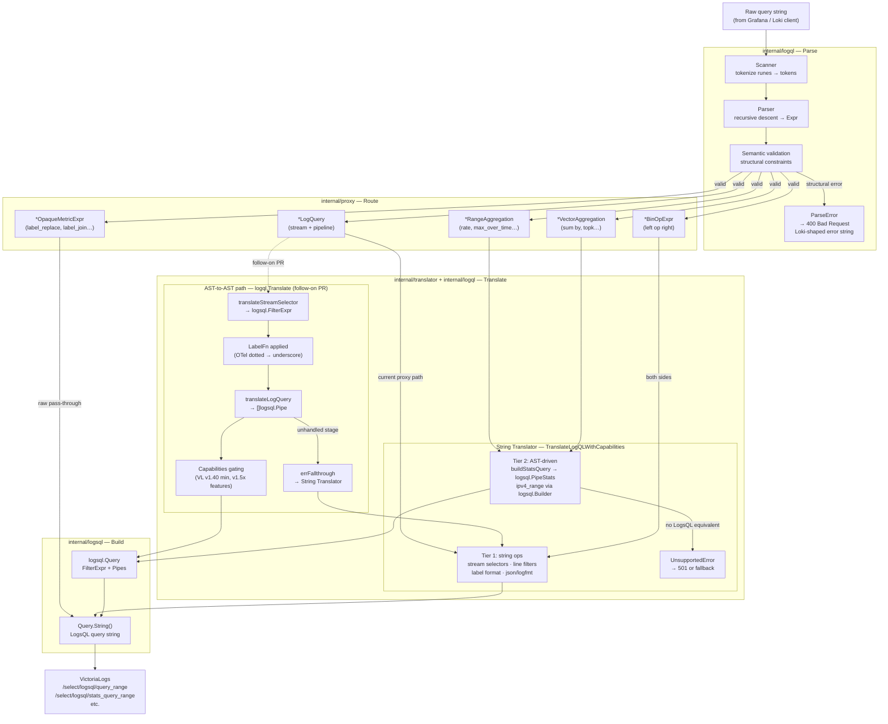
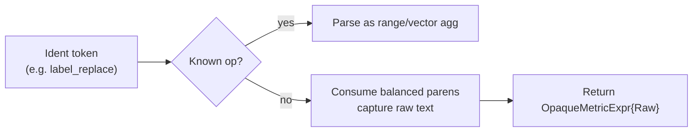
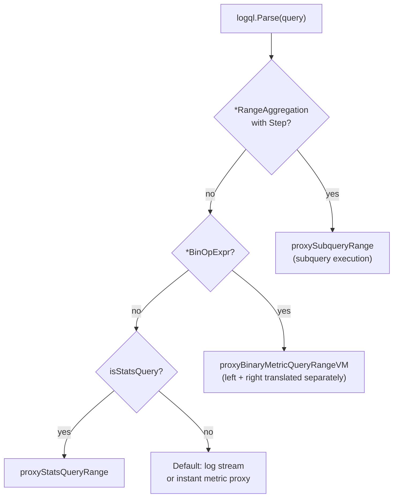

# LogQL Parser — Internal Design

The `internal/logql` package provides a typed LogQL parser that powers query validation, structural routing, and drop/keep extraction throughout the proxy. It replaced the previous regex-based approach with a proper recursive-descent parser that builds a typed AST, enabling accurate semantic validation and reliable query decomposition without false positives.

## Why a Typed AST?

The old approach used regular expressions layered on top of the raw query string. This worked for simple cases but broke on:

- Nested expressions (subqueries, vector matching with `on()`/`group_left()`)
- Embedded regex inside label matchers (e.g. `{app=~"api|web"}`)
- Ambiguous operator sequences (`!=` inside a string vs. between labels)
- `rate_counter` requiring `| unwrap` — impossible to validate structurally without an AST

The typed AST makes these cases explicit. Each node type is a Go struct with typed fields, so routing logic (is this a range aggregation? a binary expression? a subquery?) becomes a type switch rather than a regex match.

## Package Structure

| File | Purpose |
|---|---|
| `scanner.go` | Lexer: converts raw query string to a token stream |
| `parser.go` | Recursive-descent parser: builds typed AST from tokens |
| `ast.go` | AST node types (`LogQuery`, `RangeAggregation`, `VectorAggregation`, `BinOpExpr`, …) |
| `semantic.go` | Semantic validation pass: checks constraints that require AST understanding |
| `validate.go` | Public API: `ValidateLogQL(query) string` — Loki-compatible error messages |
| `translate.go` | Bridges AST to the translator package: normalises to canonical LogQL, then delegates |

## Data Flow



**Four consumers of the LogQL AST:**

1. **Validation** (`ValidateLogQL`) — called on every inbound query before any work is done. Returns a Loki-shaped error string (`"parse error at line 1, col 1: ..."`) or `""` if valid.

2. **Routing** (`proxy.go`) — calls `logql.Parse()` on the validated query and type-switches to dispatch subqueries, binary expressions, and range aggregations to separate execution paths.

3. **Translation** (`TranslateLogQLWithCapabilities` and `logql.Translate`) — two paths described in detail below.

4. **Drop/Keep extraction** (`stream_processing.go`) — calls `logql.ParseAndValidate()` to extract `| drop` / `| keep` matchers for post-processing VL response streams.

## AST Node Hierarchy

```
Expr (interface)
├── *StreamSelector          {app="api", env=~"prod.*"}
├── *LogQuery                StreamSelector + []Stage pipeline
│   └── Stage (interface)
│       ├── *LineFilterStage         |= "text" / |~ "re" / |> "pattern"
│       ├── *ParserStage             | json / | logfmt / | regexp / | pattern / | unpack
│       ├── *LabelFilterStage        | level="error" (raw, opaque)
│       ├── *LineFormatStage         | line_format "{{.msg}}"
│       ├── *LabelFormatStage        | label_format dst=src (raw, opaque)
│       ├── *UnwrapStage             | unwrap bytes(label)
│       ├── *DropStage               | drop a, b, c=~"re"
│       ├── *KeepStage               | keep a, b
│       └── *DecolorizeStage         | decolorize
├── *RangeAggregation        rate({...}[5m]) / max_over_time(...[1h:5m]) subquery
├── *VectorAggregation       sum by (label) (rate(...)) / topk(5, ...)
├── *BinOpExpr               left op right, optional VectorMatching
├── *LiteralExpr             scalar 3.14
└── *OpaqueMetricExpr        label_replace(...), label_join(...) — raw pass-through
```

### Opaque pass-through nodes

Two node types capture content without parsing it:

- **`LabelFilterStage`** / **`LabelFormatStage`** — the inner expression grammar for `| level > 1` or `| label_format dst=src` is complex and context-dependent. These stages capture the raw text after the keyword so the translator sees exactly what Loki would see.

- **`OpaqueMetricExpr`** — metric-level functions that aren't yet expressible in the AST (e.g. `label_replace`, `label_join`). The parser captures the full raw text including balanced parentheses and returns it verbatim so VictoriaLogs receives the original expression unchanged.

## Scanner

The scanner (`scanner.go`) is a hand-written lexer with no external dependencies. Key design choices:

- **Single-pass, no backtracking.** Each call to `scan()` advances exactly one token.
- **Disambiguates `!=` vs `!~` vs `!>` vs `!=` (label vs line filter).** Context is resolved by the parser, not the scanner — the scanner emits separate `TokBangEq`, `TokBangTilde`, `TokBangGt` tokens.
- **Range durations** (`5m`, `1h`, `$__auto`) are emitted as `TokRange` with the unit string preserved.
- **Quoted strings** are unescaped; raw backtick strings are returned verbatim.

## Parser

The parser (`parser.go`) is a recursive-descent parser with one-token lookahead. The top-level entry points are:

```go
// Parse returns the typed AST or an error.
func Parse(input string) (Expr, error)

// ParseAndValidate parses and runs the semantic pass; returns the first error.
func ParseAndValidate(input string) error
```

### Grammar summary (simplified)

```
Expr           := Primary (BinOp Primary)*
Primary        := VectorAgg | RangeAgg | UnknownMetricFn | LogQuery | '(' Expr ')' | Literal
VectorAgg      := VecOp [Grouping] '(' [Param ','] Expr ')'
RangeAgg       := RangeOp '(' LogQuery '[' Range [':' Step] ']' [Offset] ')' [Grouping]
UnknownMetricFn:= Ident '(' ... ')' → OpaqueMetricExpr (raw text)
LogQuery       := StreamSelector Pipeline*
Pipeline       := '|=' | '!=' | '|~' | '!~' | '|>' | '!>'   LineFilter
               |  '|' json | logfmt | regexp | pattern | unpack
               |  '|' LabelFilter (raw)
               |  '|' line_format | label_format (raw)
               |  '|' unwrap [Converter] Label
               |  '|' drop DropList
               |  '|' keep DropList
               |  '|' decolorize
```

### Unknown function handling

When the parser encounters an identifier followed by `(` that isn't a known range op or vector op, it captures the **raw input text** from the start of the identifier to the matching close paren (tracking nesting depth) and returns an `OpaqueMetricExpr`. This ensures `label_replace(sum by (level)(rate(...)), ...)` passes through to VictoriaLogs unchanged instead of causing a 503.



## Semantic Validation

After parsing, `validateSemantics` walks the AST and enforces constraints:

| Check | Error message |
|---|---|
| Empty stream selector `{}` | `parse error at line 1, col 2: queries require at least one matcher that is not a wildcard` |
| `rate_counter` without `\| unwrap` | `parse error : rate_counter requires \| unwrap expression` |
| Multiple `\| unwrap` stages | `parse error : syntax error: unexpected unwrap` |
| `rate()` / `bytes_rate()` referencing `__error__` | `parse error : __error__ and __error_details__ are not allowed inside rate() range vectors` |
| `quantile_over_time` phi < 0 | `parse error at line 1, col 1: invalid parameter for quantile_over_time: …` |
| `\| line_format` with unclosed `{{ }}` | `parse error : stage '…' : invalid line template: …` |
| Binary op with log stream on either side | `parse error at line 1, col 1: unexpected expression for binary operation` |

All error strings are formatted to match Loki 3.x responses so Grafana datasource clients receive the error shape they expect.

### ip() filter validation

The `ip("value")` line filter extension validates the inner value as a valid IP address, CIDR block, or IP range (`a.b.c.d-e.f.g.h`) at parse time using `net.ParseIP` and `net.ParseCIDR`. Invalid values like `ip("999.999.999.999")` produce a parse error matching what Loki returns, rather than silently passing to VictoriaLogs and returning unexpected results.

## ValidateLogQL API

```go
// ValidateLogQL returns a Loki-compatible error string, or "" if valid.
func ValidateLogQL(query string) string
```

Fast-path cases handled before parsing:
- Empty string → `parse error : syntax error: unexpected $end`
- Bare `*` → valid (Grafana sends this as a wildcard)
- Starts with `|` → `parse error at line 1, col 1: syntax error: unexpected |`
- Contains `<>` → parse error at the `>` position

Everything else goes through the full parse + semantic pass.

## Translation

### LogQL stage → LogsQL pipe mapping

The AST-to-AST translator (`logql.Translate`) maps LogQL pipeline stages to `logsql` typed pipe nodes:

| LogQL stage | Condition | LogsQL output | Notes |
|---|---|---|---|
| `*StreamSelectorExpr` | always | `logsql.FilterExpr` | Label matchers `=`, `!=`, `=~`, `!~` |
| `*LineFilterStage` | `\|=` / `!=` / `\|~` / `!~` / `\|>` / `!>` | `logsql.PipeFilter` | Pattern filter `\|>` mapped to VL `seq()` or regexp |
| `*LabelFilterStage` | bare label condition | `logsql.PipeFilter` | Raw expression preserved; complex filters fall through |
| `*ParserStage` — json | always | `logsql.PipeUnpackJSON` | |
| `*ParserStage` — logfmt | always | `logsql.PipeUnpackLogfmt` | |
| `*ParserStage` — regexp | always | `logsql.PipeExtractRegexp` | |
| `*ParserStage` — unpack | always | `logsql.PipeUnpackJSON` | |
| `*DropStage` | bare labels only | `logsql.PipeDelete` | Matcher-based drop → `errFallthrough` |
| `*KeepStage` | bare labels only | `logsql.PipeKeep` | Matcher-based keep → `errFallthrough` |
| `*LineFormatStage` | simple templates | `logsql.PipeFormat` | Complex `{{` templates → `errFallthrough` |
| `*LabelFormatStage` | any | `errFallthrough` | No LogsQL equivalent yet |
| `*UnwrapStage` | any | `errFallthrough` | Handled by metric translator |
| `*DecolorizeStage` | any | `errFallthrough` | No LogsQL equivalent |
| `*RangeAggregation` | any | `errFallthrough` | Metric path via string translator |
| `*VectorAggregation` | any | `errFallthrough` | Metric path via string translator |
| `*BinOpExpr` | any | `errFallthrough` | Binary metric path |
| `*OpaqueMetricExpr` | any | raw pass-through | `label_replace`, `label_join` etc. |

`errFallthrough` is a package-private sentinel — callers route to `TranslateLogQLWithCapabilities` unchanged.

### Edge cases

| Situation | Behaviour |
|---|---|
| Empty stream selector `{}` | Semantic validation rejects before translation: `"queries require at least one matcher that is not a wildcard"` |
| `*=` / `!*=` matchers | Converted to `=~.*` / `!=.*` (LogsQL has no native glob) |
| Label names with dots (`service.name`) | `LabelFn` rewrites to underscores if OTel mode enabled; otherwise passed through |
| `\|~ ".+"` — always-true regex | Optimised away (no LogsQL equivalent needed) |
| `rate()` / `bytes_rate()` over `__error__` | Rejected at semantic pass: 400 |
| `quantile_over_time` φ < 0 | Rejected at semantic pass: 400 |
| Unknown function (`label_replace`, custom) | `OpaqueMetricExpr`: raw text forwarded to VL unchanged |
| VL version < required capability | `Capabilities` gating downgrades construct (e.g. `BestIPv4Range` → regexp fallback) |
| No LogsQL equivalent for valid LogQL | `UnsupportedError` — handler decides: 501, partial result, or silent drop |
| `| line_format` unclosed template | Rejected at semantic pass: 400 with template parse error |
| `| pattern` parser stage | Mapped to VL `seq()` word-match filter if caps allow, else regexp |

## How Routing Uses the AST

`proxy.go` calls `logql.Parse()` on the already-validated query (error cannot occur at this point) and type-switches to dispatch:



This is more reliable than the previous approach of injecting routing markers into the translated LogsQL string and re-detecting them downstream.

## Testing

The package has five test files:

| File | What it covers |
|---|---|
| `scanner_test.go` | Token-level scanning: identifiers, strings, operators, ranges |
| `parser_test.go` | Round-trip parse → String() for representative expressions |
| `ast_test.go` | AST node String() methods and edge cases |
| `semantic.go` tests (in `edge_cases_test.go`) | All semantic validation constraints |
| `edge_cases_test.go` | 116 exhaustive parity cases against Loki's behaviour |
| `bench_test.go` | Allocation and throughput benchmarks |
| `fuzz_test.go` | Corpus-based fuzzing: `go test -fuzz=FuzzParse` |

The 116 edge-case parity tests are driven by `query-semantics-matrix.json` and cover: invalid selectors, missing unwrap, quantile bounds, rate/bytes_rate with `__error__`, line format template validation, binary op constraints, and exhaustive LogQL syntax acceptance/rejection matching Loki's exact error strings.
