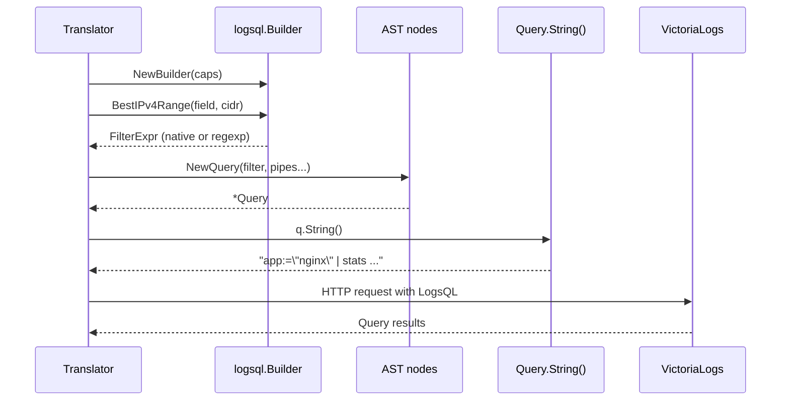

# LogsQL Typed AST — Architecture Reference

## Overview

`internal/logsql` provides a typed AST, recursive-descent parser, capability-aware builder, and version gating for VictoriaLogs LogsQL queries. It mirrors the structure of `internal/logql` (the existing LogQL parser) and targets VictoriaLogs v1.40 and later.

The package is used in two modes:
1. **Direct construction** — callers assemble `logsql.Expr` nodes with the builder API and call `String()` to emit the final query.
2. **Parse + re-emit** — callers parse an existing LogsQL string into an AST, inspect or transform nodes, and re-emit via `String()`.

---

## Package Structure

| File | Responsibility |
|------|----------------|
| `ast.go` | All typed AST nodes — interfaces, filter nodes, pipe stages, stats functions |
| `scanner.go` | Lexer — tokenises LogsQL syntax |
| `parser.go` | Recursive-descent parser — `Parse(string) (*Query, error)`, `ParseFilter(string) (FilterExpr, error)` |
| `capabilities.go` | `Capabilities` struct, `CapabilitiesFor(semver string) Capabilities` |
| `builder.go` | Builder API — `NewQuery()`, `NewBuilder(caps)`, constructor helpers, `BestTopN()`, `BestIPv4Range()` |

---

## AST Node Hierarchy

```mermaid
classDiagram
    class Expr {
        <<interface>>
        +String() string
        +expr()
    }
    class FilterExpr {
        <<interface>>
        +String() string
        +filterExpr()
    }
    class Pipe {
        <<interface>>
        +String() string
        +pipe()
    }
    class StatsFunc {
        <<interface>>
        +String() string
        +statsFunc()
    }

    class Query {
        +Filter FilterExpr
        +Pipes []Pipe
        +String() string
    }
    class DeferredExpr {
        +Raw string
        +String() string
    }

    class Word { +Value string }
    class Phrase { +Value string }
    class Prefix { +Value string }
    class Substring { +Value string }
    class Exact { +Value string }
    class Regexp { +Pattern string }
    class Sequence { +Parts []string }
    class CaseInsensitive { +Value string }
    class Wildcard

    class FieldFilter {
        +Field string
        +Op FieldOp
        +Value string
        +Negate bool
    }
    class StreamFilter { +Matchers []LabelMatcher }
    class TimeFilter { +Range string }
    class AndExpr { +Left FilterExpr; +Right FilterExpr }
    class OrExpr { +Left FilterExpr; +Right FilterExpr }
    class NotExpr { +Expr FilterExpr }

    class PipeUnpackJSON
    class PipeUnpackLogfmt
    class PipeFilter { +Expr FilterExpr }
    class PipeFields { +Labels []string }
    class PipeDelete { +Labels []string }
    class PipeLimit { +N int }
    class PipeSort { +By []SortField; +Limit int }
    class PipeStats { +By []GroupKey; +Funcs []StatsFuncAlias }
    class PipeMath { +Alias string; +Expr string }

    Expr <|.. Query
    Expr <|.. DeferredExpr
    FilterExpr <|.. DeferredExpr
    FilterExpr <|.. Word
    FilterExpr <|.. Phrase
    FilterExpr <|.. Prefix
    FilterExpr <|.. Substring
    FilterExpr <|.. Exact
    FilterExpr <|.. Regexp
    FilterExpr <|.. Sequence
    FilterExpr <|.. CaseInsensitive
    FilterExpr <|.. Wildcard
    FilterExpr <|.. FieldFilter
    FilterExpr <|.. StreamFilter
    FilterExpr <|.. TimeFilter
    FilterExpr <|.. AndExpr
    FilterExpr <|.. OrExpr
    FilterExpr <|.. NotExpr
    Pipe <|.. PipeUnpackJSON
    Pipe <|.. PipeUnpackLogfmt
    Pipe <|.. PipeFilter
    Pipe <|.. PipeFields
    Pipe <|.. PipeDelete
    Pipe <|.. PipeLimit
    Pipe <|.. PipeSort
    Pipe <|.. PipeStats
    Pipe <|.. PipeMath
```



---

## Parser Flow

```mermaid
flowchart TD
    A[Input string] --> B[Scanner]
    B --> C{Token stream}
    C --> D[Parse filter expression]
    D --> E{More tokens?}
    E -- TokPipe --> F[Parse pipe stage]
    F --> E
    E -- TokEOF --> G[Query AST]
    G --> H[String()]
    H --> I[LogsQL query string to VictoriaLogs]

    subgraph Parser precedence
        D1[parseFilterExpr - OR level]
        D2[parseAndExpr - AND level]
        D3[parseNotExpr - NOT level]
        D4[parsePrimaryFilter - atoms]
        D1 --> D2 --> D3 --> D4
    end
```

---

## Query Construction Flow



---

## VictoriaLogs Version Capability Matrix

The package targets **v1.40 minimum**. All features in the v1.40 baseline are always available.

| Version range | Feature additions |
|---------------|-------------------|
| v1.40–v1.43 | Baseline: `PipeHits`, `PipeRunning`, `PipeBlock`, `PipeUniq`, `PipeTop`, `StatsHistogram` |
| v1.44 | `rate_sum()` stats function (`Capabilities.StatsRateSum`) |
| v1.45–v1.48 | `ipv4_range()` field filter (`Capabilities.FieldIPv4Range`) |
| v1.49 | Metadata substring filter (`Capabilities.MetadataSubstring`) |
| v1.50+ | Dense pattern windowing (`Capabilities.DensePatternWindowing`) |

`CapabilitiesFor(semver)` is called once at proxy startup from `storeBackendVersion()`. Unsupported versions (pre-v1.40, malformed) return a zero `Capabilities` (all false), which is the safest possible degraded state.

---

## FieldOp Reference

| Constant | LogsQL syntax | VL version |
|----------|---------------|------------|
| `FieldOpExact` | `field:="value"` | v1.40+ |
| `FieldOpRegexp` | `field:~"pattern"` | v1.40+ |
| `FieldOpPrefix` | `field:prefix*` | v1.40+ |
| `FieldOpSubstring` | `field:*sub*` | v1.40+ |
| `FieldOpEmpty` | `field:""` | v1.40+ |
| `FieldOpAny` | `field:*` | v1.40+ |
| `FieldOpGT` | `field:>val` | v1.40+ |
| `FieldOpGTE` | `field:>=val` | v1.40+ |
| `FieldOpLT` | `field:<val` | v1.40+ |
| `FieldOpLTE` | `field:<=val` | v1.40+ |
| `FieldOpRange` | `field:range(min,max)` | v1.40+ |
| `FieldOpIn` | `field:in(a,b,c)` | v1.40+ |
| `FieldOpIPv4Range` | `field:ipv4_range(first,last)` | v1.45+ |

---

## Integration Path

The translator (`internal/logql/translate.go`) continues to produce strings during migration. The integration path is:

1. Translator calls `logsql.NewBuilder(caps)` at query construction time
2. Builder's `Build*` methods return `logsql.FilterExpr` or `[]logsql.Pipe`
3. `logsql.NewQuery(filter, pipes...)` assembles the full AST
4. `q.String()` emits the final LogsQL query at the HTTP boundary

---

## Test Coverage Summary

| File | Tests | Coverage focus |
|------|-------|----------------|
| `ast_test.go` | 84 | All `String()` methods |
| `scanner_test.go` | 12 | Token stream, quoted strings, raw strings |
| `capabilities_test.go` | 13 | Version matrix, edge cases |
| `builder_test.go` | 10 | Direct construction, BestTopN, BestIPv4Range |
| `parser_test.go` | 38 | Round-trip (25 cases), ParseFilter, error cases, stats funcs |
| `edge_cases_test.go` | ~110 | All FieldOps, nesting, boundary versions, malformed semver |
| `fuzz_test.go` | 4 fuzz | Never panics on arbitrary input |
| **Total** | **282** | |

---

## Design Notes

`internal/logsql` is built in three layers:

1. **Typed AST** (`ast.go`) — 30+ node types whose `String()` methods emit valid LogsQL
2. **Parser** (`scanner.go` + `parser.go`) — recursive-descent parser that round-trips what the translator emits
3. **Capability-aware builder** (`capabilities.go` + `builder.go`) — selects the best LogsQL construct for the detected VL version

The package does not wire into the translator directly — callers import it and construct queries using the builder API. Migration from the translator's string-concatenation approach is incremental, one function at a time. VictoriaLogs versions before v1.40 are not supported.
