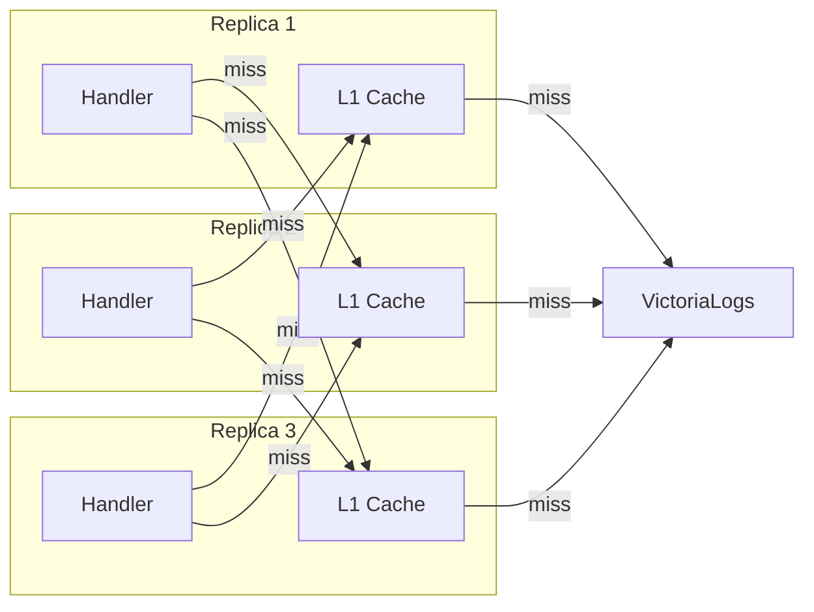

# Peer Cache Design

## Problem

When running multiple proxy replicas, each maintains an independent L1 cache. This means:
- Cache hit rate drops proportionally with replica count (N replicas = ~1/N hit rate per replica)
- VL backend receives N times more identical queries
- Cold starts after rollouts wipe all caches simultaneously

## Solution: Distributed Peer Cache (L1.5)

A lightweight peer-to-peer cache layer between L1 (in-process) and VL backend:

```
Client Request
    ↓
L1 Cache (in-process, ~2us)
    ↓ miss
L1.5 Peer Cache (HTTP to nearby replica, ~1-5ms)
    ↓ miss
VL Backend (~10-100ms)
```

## Architecture



## Peer Discovery

### Kubernetes Headless Service (Primary)

```yaml
apiVersion: v1
kind: Service
metadata:
  name: loki-vl-proxy-peers
spec:
  clusterIP: None  # headless
  selector:
    app.kubernetes.io/name: loki-vl-proxy
  ports:
    - port: 3100
      name: http
```

The proxy resolves `loki-vl-proxy-peers.namespace.svc.cluster.local` via DNS to get all pod IPs. Refreshed every 10s.

### Configuration

```yaml
# Helm values
peerCache:
  enabled: false
  # Discovery method: "dns" (headless service) or "static" (explicit list)
  discovery: "dns"
  # Headless service name for DNS discovery
  serviceName: ""  # defaults to fullname + "-peers"
  # Static peer list (if discovery=static)
  peers: []
    # - "http://proxy-0:3100"
    # - "http://proxy-1:3100"
  # Cache fetch timeout (should be much less than VL query time)
  timeout: "5ms"
  # Max peers to query on cache miss (0 = all)
  maxPeerQueries: 2
```

## Key Routing (Consistent Hashing)

Instead of querying all peers on every miss, use consistent hashing to route each cache key to a specific peer:

1. Hash the cache key (normalized query + tenant)
2. Map hash to peer via consistent hash ring (jump hash — zero allocation)
3. On L1 miss, check only the owning peer
4. If peer miss → query VL, populate both L1 and tell owning peer

This gives O(1) peer lookups instead of O(N) and ensures each key lives on exactly one peer.

## Protocol

### Internal Peer API

```
GET /internal/cache?key=<sha256-key>
→ 200 + body (cache hit)
→ 404 (cache miss)

PUT /internal/cache?key=<sha256-key>&ttl=<seconds>
body: cached response bytes
→ 204 (stored)
```

These endpoints are NOT exposed externally — only reachable within the cluster via the headless service.

## Cache Miss Flow

```
1. Client → Proxy A: GET /loki/api/v1/labels
2. Proxy A: L1 miss
3. Proxy A: hash("labels:tenant:query") → Proxy B is owner
4. Proxy A → Proxy B: GET /internal/cache?key=abc123
5a. Proxy B: L1 hit → 200 + cached bytes → Proxy A stores in L1, returns to client
5b. Proxy B: L1 miss → 404 → Proxy A queries VL
6. Proxy A: VL responds → Proxy A stores in L1 + PUT to Proxy B's L1
```

## Benefits

| Metric | Without Peer Cache | With Peer Cache |
|---|---|---|
| Effective cache size | 256MB per replica | 256MB × N replicas |
| VL query reduction | ~60% (single-replica hit rate) | ~95%+ (fleet-wide dedup) |
| Cold start recovery | Full cache rebuild | Peers serve warm data |
| Network overhead | None | ~1KB/miss to peer (internal) |

## Implementation Phases

### Phase 1: DNS Discovery + Simple Peer Fetch
- Headless service peer discovery
- On L1 miss, randomly pick one peer and try GET
- If peer hit, use it; if miss, go to VL
- No consistent hashing yet

### Phase 2: Consistent Hashing
- Jump hash for O(1) peer selection
- Each key has exactly one owner peer
- Backfill owner on VL fetch

### Phase 3: Gossip Invalidation
- When a peer's cache entry expires, notify other peers
- Prevent stale data across the fleet

## Helm Chart Addition

```yaml
# values.yaml
peerCache:
  enabled: false
  discovery: "dns"
  timeout: "5ms"
  maxPeerQueries: 2

# templates/headless-service.yaml (new)
{{- if .Values.peerCache.enabled }}
apiVersion: v1
kind: Service
metadata:
  name: {{ include "loki-vl-proxy.fullname" . }}-peers
spec:
  clusterIP: None
  selector:
    {{- include "loki-vl-proxy.selectorLabels" . | nindent 4 }}
  ports:
    - port: {{ .Values.service.port }}
      name: http
{{- end }}
```

## Security

- Peer cache endpoints (`/internal/cache`) are bound to the pod IP, not the external service
- No authentication between peers (cluster-internal trust model, same as VL connection)
- NetworkPolicy restricts peer traffic to pods with matching selector labels
