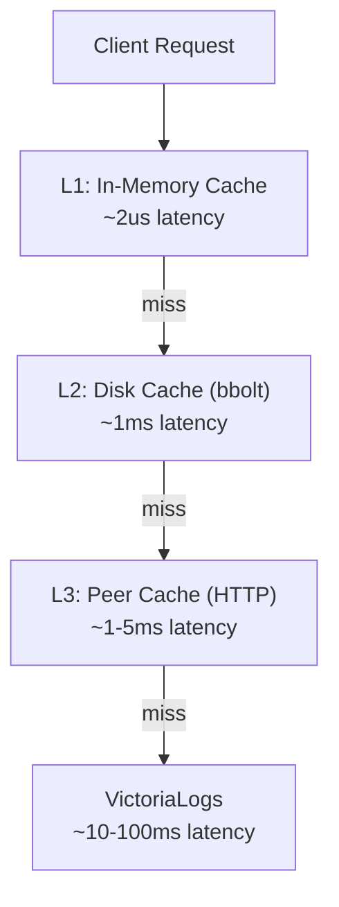
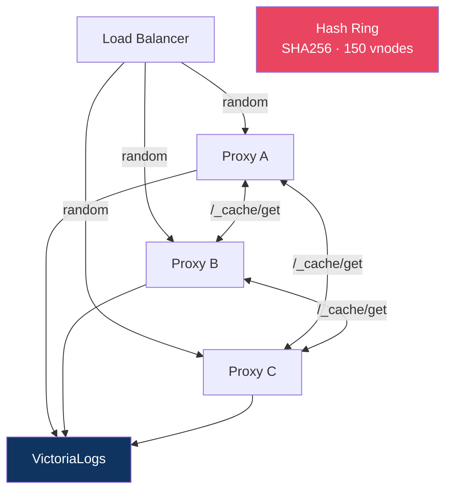

# Peer Cache Design

> **Note**: This document describes the initial design. For the current implementation, see [Fleet Cache Architecture](fleet-cache.md).

## Problem

When running multiple proxy replicas behind a load balancer, each maintains an independent cache. This means:
- Cache hit rate drops proportionally with replica count (N replicas = ~1/N hit rate per replica)
- VL backend receives N times more identical queries
- Cold starts after rollouts wipe all caches simultaneously

## Solution: Sharded Fleet Cache

A three-tier caching architecture with peer-aware consistent hashing:



## Key Design Decisions

| Decision | Rationale |
|----------|-----------|
| Consistent hashing (not gossip) | Zero background traffic, deterministic routing |
| Owner write-through + shadow copies | Non-owner long-TTL writes can warm owner shards while local shadows stay short-lived |
| TTL preservation (not extension) | Never serve stale data beyond original intent |
| MinUsableTTL = 5s | Don't transfer data that expires in transit |
| Per-peer circuit breaker | Isolate failures, auto-recover after cooldown |
| No disk encryption | Delegated to cloud provider (EBS/PD at rest) |

## Architecture



## Configuration

```bash
# Kubernetes (DNS discovery via headless service)
./loki-vl-proxy \
  -peer-self=$(hostname -i):3100 \
  -peer-discovery=dns \
  -peer-dns=proxy-headless.ns.svc.cluster.local

# Static peer list
./loki-vl-proxy \
  -peer-self=10.0.0.1:3100 \
  -peer-discovery=static \
  -peer-static=10.0.0.1:3100,10.0.0.2:3100,10.0.0.3:3100
```

For full details including request flow diagrams, TTL preservation, circuit breaker states, and performance characteristics, see [Fleet Cache Architecture](fleet-cache.md).

Current implementation notes:

- the current chart can wire peer discovery automatically through `peerCache.enabled=true`
- larger `/_cache/get` responses can be `zstd`- or `gzip`-compressed between peers
- `-peer-write-through=true` is enabled by default; non-owner writes above `-peer-write-through-min-ttl` are pushed to owners
- `-peer-auth-token` can require a shared token on peer fetch and write-through endpoints when the fleet crosses a broader network boundary