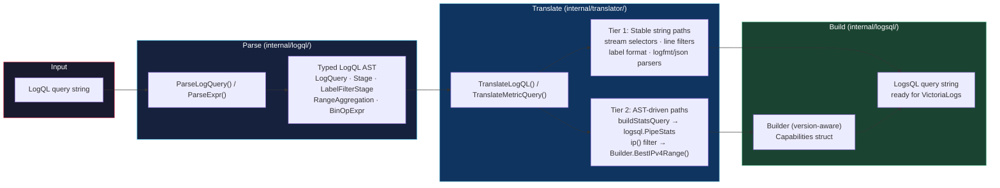

# AST-Driven Translation Optimization Implementation Plan

> **For agentic workers:** REQUIRED SUB-SKILL: Use superpowers:subagent-driven-development (recommended) or superpowers:executing-plans to implement this plan task-by-task. Steps use checkbox (`- [ ]`) syntax for tracking.

**Goal:** Hoist per-request regex compilations to package-level vars, migrate three fragile string-assembly paths to the typed LogsQL AST/builder, add architecture docs and README TLDR, and tag remaining string paths with `TODO(ast-migration)` roadmap comments.

**Architecture:** Phase 1 hoists 8 per-request `regexp.MustCompile` calls to package-level `var` declarations in `internal/translator/translator.go`, eliminating repeated allocation on every query. Phase 2 migrates three fragile paths — `buildStatsQuery` (fmt.Sprintf → `logsql.PipeStats`), the ip() label filter (`// TODO` comment → `logsql.Builder.BestIPv4Range()`), and `extractOuterAggregation` (3 inline regexes → package-level vars). Phase 3 adds benchmarks, architecture doc updates, and README TLDR.

**Tech Stack:** Go 1.26, `internal/logsql` (Builder, PipeStats, GroupKey, StatsFuncAlias, BestIPv4Range), `internal/translator/translator.go`, `internal/proxy/query_translation.go`

---

## File Map

**Modified:**
- `internal/translator/translator.go` — hoist 8 regexes, migrate `buildStatsQuery` by-clause assembly, tag remaining paths with `TODO(ast-migration)`, migrate ip() label filter
- `internal/logsql/ast.go` — add `statsFunc()` to `DeferredExpr`, fix `pipeStatsString` to skip empty alias
- `internal/translator/translator_bench_test.go` — add `BenchmarkBuildStatsQuery`, `BenchmarkExtractOuterAggregation`, `BenchmarkTranslateMetricQuery_WithBool`
- `internal/proxy/query_translation.go` — add `TODO(ast-migration)` comments
- `docs/architecture.md` — update translation pipeline section + add/update Mermaid diagram for LogQL→LogsQL flow
- `README.md` — add "How it works (TLDR)" collapsible section + update main architecture Mermaid diagram

**No new files.** All changes are targeted edits to existing files.

---

## Task 1: Hoist per-request regex compilations in translator.go

**Files:**
- Modify: `internal/translator/translator.go`
- Modify: `internal/translator/translator_bench_test.go`

The following 8 `regexp.MustCompile` calls inside functions are compiled on every invocation. They must become package-level `var` declarations.

Current locations:
1. Line ~476: `boolRe := regexp.MustCompile(`\s+bool\s+`)` inside `TranslateMetricQuery`
2. Line ~540: `withoutRe := regexp.MustCompile(`\bwithout\s*\(([^)]+)\)`)` inside `extractWithoutLabels`
3. Line ~1468: `re := regexp.MustCompile(`\{\{\s*\.([\w.]+)\s*\}\}`)` inside `convertGoTemplate`
4. Line ~1940: `boolRe := regexp.MustCompile(`\s+bool\s+`)` inside `tryTranslateBinaryMetricExpr`
5. Line ~1947: `vectorMatchRe := regexp.MustCompile(`\s+(on|ignoring|group_left|group_right)\s*\(([^)]*)\)`)` inside `tryTranslateBinaryMetricExpr`
6. Line ~2161: `byBeforeRe := regexp.MustCompile(...)` inside `extractOuterAggregation`
7. Line ~2195: `aggRe := regexp.MustCompile(...)` inside `extractOuterAggregation`
8. Line ~2234: `byRe := regexp.MustCompile(...)` inside `extractOuterAggregation`
9. Line ~2880: `subqInlineRe := regexp.MustCompile(`\[(\d+[smhd]+):(\d+[smhd]+)\]`)` inside `tryTranslateSubquery`

Note: `fieldDotSpacingRE` (line ~1413) and `parserStageForUnwrapRE` (line ~1829) and `rangeByClauseRE` (line ~1835) are already package-level — don't touch them.

- [ ] **Step 1: Add package-level regex vars near the top of translator.go**

Find the first `import` block end (line ~17) or the first `const` block. Add this block immediately after the existing package-level `var` declarations (after `emptyByGrouping`, `groupMarker`, etc.):

```go
// Package-level compiled regexes — compiled once at program start, not per-request.
var (
	boolModifierRE    = regexp.MustCompile(`\s+bool\s+`)
	withoutMarkerRE   = regexp.MustCompile(`\bwithout\s*\(([^)]+)\)`)
	goTemplateRE      = regexp.MustCompile(`\{\{\s*\.([\w.]+)\s*\}\}`)
	vectorMatchRE     = regexp.MustCompile(`\s+(on|ignoring|group_left|group_right)\s*\(([^)]*)\)`)
	aggList           = `sum|avg|max|min|count|topk|bottomk|stddev|stdvar|sort|sort_desc|group|count_values`
	aggByBeforeRE     = regexp.MustCompile(`^(sum|avg|max|min|count|topk|bottomk|stddev|stdvar|sort|sort_desc|group|count_values)\s+(?:by|without)\s*\(([^)]*)\)\s*\(`)
	aggFuncRE         = regexp.MustCompile(`^(sum|avg|max|min|count|topk|bottomk|stddev|stdvar|sort|sort_desc|group|count_values)\s*\(`)
	aggByAfterRE      = regexp.MustCompile(`^(?:by|without)\s*\(([^)]+)\)`)
	subqueryInlineRE  = regexp.MustCompile(`\[(\d+[smhd]+):(\d+[smhd]+)\]`)
)
```

- [ ] **Step 2: Replace per-function compilations with the package vars**

In `TranslateMetricQuery` (~line 476), replace:
```go
boolRe := regexp.MustCompile(`\s+bool\s+`)
logql = boolRe.ReplaceAllString(logql, " ")
```
with:
```go
logql = boolModifierRE.ReplaceAllString(logql, " ")
```

In `extractWithoutLabels` (~line 540), replace:
```go
withoutRe := regexp.MustCompile(`\bwithout\s*\(([^)]+)\)`)
m := withoutRe.FindStringSubmatch(logql)
```
with:
```go
m := withoutMarkerRE.FindStringSubmatch(logql)
```
And replace `withoutRe.ReplaceAllString(logql, "")` with `withoutMarkerRE.ReplaceAllString(logql, "")`.

In `convertGoTemplate` (~line 1468), replace:
```go
re := regexp.MustCompile(`\{\{\s*\.([\w.]+)\s*\}\}`)
result := re.ReplaceAllString(tmpl, "<$1>")
```
with:
```go
result := goTemplateRE.ReplaceAllString(tmpl, "<$1>")
```

In `tryTranslateBinaryMetricExpr` (~line 1940–1954), replace:
```go
boolRe := regexp.MustCompile(`\s+bool\s+`)
logql = boolRe.ReplaceAllString(logql, " ")

vectorMatchRe := regexp.MustCompile(`\s+(on|ignoring|group_left|group_right)\s*\(([^)]*)\)`)
var vectorMatchMeta []string
for _, m := range vectorMatchRe.FindAllStringSubmatch(logql, -1) {
    if len(m) >= 3 {
        vectorMatchMeta = append(vectorMatchMeta, m[1]+":"+strings.TrimSpace(m[2]))
    }
}
logql = vectorMatchRe.ReplaceAllString(logql, "")
```
with:
```go
logql = boolModifierRE.ReplaceAllString(logql, " ")

var vectorMatchMeta []string
for _, m := range vectorMatchRE.FindAllStringSubmatch(logql, -1) {
    if len(m) >= 3 {
        vectorMatchMeta = append(vectorMatchMeta, m[1]+":"+strings.TrimSpace(m[2]))
    }
}
logql = vectorMatchRE.ReplaceAllString(logql, "")
```

In `extractOuterAggregation` (~line 2161–2234), also remove the local aggList string and replace all three inline `regexp.MustCompile` calls with the package vars. The function currently has:
```go
aggList := `sum|avg|max|min|count|topk|bottomk|stddev|stdvar|sort|sort_desc|group|count_values`
byBeforeRe := regexp.MustCompile(`^(` + aggList + `)\s+(?:by|without)\s*\(([^)]*)\)\s*\(`)
bm := byBeforeRe.FindStringSubmatch(logql)
```
Replace with:
```go
bm := aggByBeforeRE.FindStringSubmatch(logql)
```
And remove the `aggList` local variable. Replace `aggRe := regexp.MustCompile(...)` with `aggFuncRE`, and `byRe := regexp.MustCompile(...)` with `aggByAfterRE`.

In `tryTranslateSubquery` (~line 2880), replace:
```go
subqInlineRe := regexp.MustCompile(`\[(\d+[smhd]+):(\d+[smhd]+)\]`)
if !subqInlineRe.MatchString(logql) {
```
with:
```go
if !subqueryInlineRE.MatchString(logql) {
```
And update all other uses of `subqInlineRe` in that function to `subqueryInlineRE`.

- [ ] **Step 3: Verify the build compiles**

```bash
go build ./internal/translator/...
```
Expected: no errors.

- [ ] **Step 4: Run translator tests**

```bash
go test ./internal/translator/... -count=1 -timeout 120s
```
Expected: all tests pass. Any failure means a regex substitution was wrong — check the failing test to identify which regex.

- [ ] **Step 5: Add benchmark for regex-heavy paths**

In `internal/translator/translator_bench_test.go`, add:

```go
func BenchmarkTranslateMetricQuery_WithBool(b *testing.B) {
	for b.Loop() {
		TranslateLogQL(`sum(rate({app="nginx"}[5m]) > bool 0) by (host)`)
	}
}

func BenchmarkExtractOuterAggregation(b *testing.B) {
	for b.Loop() {
		TranslateLogQL(`sum by (host, namespace) (count_over_time({app="api"}[5m]))`)
	}
}

func BenchmarkTranslateMetricQuery_VectorMatch(b *testing.B) {
	for b.Loop() {
		TranslateLogQL(`sum(rate({app="a"}[5m])) by (host) / sum(rate({app="b"}[5m])) on (host)`)
	}
}
```

- [ ] **Step 6: Run benchmarks to confirm no regression**

```bash
go test ./internal/translator/... -bench=. -benchtime=3s -count=1
```
Expected: benchmark output shows ns/op values. Record them as the baseline.

- [ ] **Step 7: Commit**

```bash
git add internal/translator/translator.go internal/translator/translator_bench_test.go
git commit -m "perf: hoist per-request regexp compilations to package-level vars in translator"
```

---

## Task 2: Migrate buildStatsQuery by-clause assembly to logsql types

**Files:**
- Modify: `internal/logsql/ast.go`
- Modify: `internal/translator/translator.go`

**Pre-analysis (facts verified before writing this plan):**

1. `DeferredExpr` (ast.go:451) implements `expr()` and `filterExpr()` only — NOT `statsFunc()`. Must add it.
2. `pipeStatsString` (ast.go:1062) always writes `" as " + fa.Alias` even for empty alias → produces broken `| stats count() as `. Must guard with `if fa.Alias != ""`.
3. `pipeStatsString` only emits `by (...)` when `len(by) > 0`, meaning nil and empty slice both produce no by clause. The `emptyByGrouping` sentinel (`"__lvp_by_empty__"`) cannot be expressed via PipeStats without adding a new struct field — keep it as a `fmt.Sprintf` special case.

- [ ] **Step 1: Add `statsFunc()` to DeferredExpr in ast.go**

In `internal/logsql/ast.go` find (line ~451):
```go
func (d DeferredExpr) String() string { return d.Raw }
func (d DeferredExpr) expr()          {}
func (d DeferredExpr) filterExpr()    {}
```
Add one line after:
```go
func (d DeferredExpr) statsFunc() {}
```

- [ ] **Step 2: Fix pipeStatsString to skip empty alias**

In `internal/logsql/ast.go` find (line ~1062):
```go
    b.WriteString(fa.Func.String())
    b.WriteString(" as ")
    b.WriteString(fa.Alias)
```
Replace with:
```go
    b.WriteString(fa.Func.String())
    if fa.Alias != "" {
        b.WriteString(" as ")
        b.WriteString(fa.Alias)
    }
```

- [ ] **Step 3: Run logsql tests to confirm the fix is safe**

```bash
go test ./internal/logsql/... -count=1 -timeout 60s
```
Expected: all pass. The alias fix is additive — existing tests with non-empty aliases still produce the same output.

- [ ] **Step 4: Migrate buildStatsQuery in translator.go**

Replace the function:
```go
func buildStatsQuery(baseQuery, statsExpr, byLabels, alias string) string {
    query := strings.TrimSpace(baseQuery)
    if query == "" {
        query = "*"
    }
    // emptyByGrouping requires explicit "by ()" — PipeStats can't represent empty-but-explicit
    // grouping without a dedicated struct field, so keep as fmt.Sprintf for this case.
    if byLabels == emptyByGrouping {
        q := fmt.Sprintf("%s | stats by () %s", query, statsExpr)
        if alias != "" {
            q += " as " + alias
        }
        return q
    }

    fn := logsql.StatsFuncAlias{
        Func:  logsql.DeferredExpr{Raw: statsExpr},
        Alias: alias,
    }
    var by []logsql.GroupKey
    if byLabels != "" {
        for _, lbl := range strings.Split(byLabels, ",") {
            lbl = strings.TrimSpace(lbl)
            if lbl != "" {
                by = append(by, logsql.GroupKey{Field: lbl})
            }
        }
    }
    pipe := logsql.PipeStats{By: by, Funcs: []logsql.StatsFuncAlias{fn}}
    return query + " " + pipe.String()
}
```

- [ ] **Step 5: Run translator tests**

```bash
go test ./internal/translator/... -count=1 -timeout 120s
```
Expected: all pass. Failure means PipeStats output differs from old fmt.Sprintf — diff the failing test's `got` vs `want` and trace the by-clause construction.

- [ ] **Step 6: Commit**

```bash
git add internal/logsql/ast.go internal/translator/translator.go
git commit -m "refactor: fix pipeStatsString empty alias, add DeferredExpr.statsFunc, migrate buildStatsQuery to logsql types"
```

---

## Task 3: Migrate ip() label filter to Builder.BestIPv4Range

**Files:**
- Modify: `internal/translator/translator.go`
- Modify: `internal/proxy/query_translation.go` (if Capabilities need to be threaded)

The current ip() label filter translation (around line ~912–922 in `translatePipelineStage`) emits a proxy-side post-processing marker:

```go
// TODO: When the translator gains access to Capabilities, replace with
//   logsql.Builder.BestIPv4Range(label, cidr).String()
if strings.HasPrefix(stage, "ip(") {
    return "| " + stage // proxy-side post-processing marker
}
```

This `// TODO` already exists in the code — it's the primary migration target. The blocker was that `translatePipelineStage` didn't receive a `Capabilities` argument. The `translateLogQuery` function does not currently pass capabilities down either.

**Scope of this task**: Thread `logsql.Capabilities` from `TranslateLogQL`/`TranslateMetricQuery` down to `translatePipelineStage`, then call `logsql.NewBuilder(caps).BestIPv4Range(field, cidr)` in the ip() branch. This eliminates proxy-side post-processing for ip() label filters on VL ≥ 1.45.

- [ ] **Step 1: Check current Capabilities threading**

```bash
grep -n "Capabilities\|caps\|logsql\.New" internal/translator/translator.go | head -30
```
Expected: shows how (or whether) Capabilities currently flows through the translator.

- [ ] **Step 2: Add Capabilities to translateLogQuery and translatePipelineStage**

In `internal/translator/translator.go`, find `func translateLogQuery(logql string, labelFn LabelTranslateFunc, ...)` and add `caps logsql.Capabilities` as the last parameter. Update all call sites of `translateLogQuery` to pass the caps they have.

Find `func translatePipelineStage(stage string, labelFn LabelTranslateFunc) string` and add `caps logsql.Capabilities` as the last parameter. Update all call sites.

- [ ] **Step 3: Replace the ip() stub with BestIPv4Range**

In `translatePipelineStage`, find:
```go
if strings.HasPrefix(stage, "ip(") {
    return "| " + stage // proxy-side post-processing marker
}
```

Replace with:
```go
if strings.HasPrefix(stage, "ip(") {
    // Extract "field_name:cidr" or just "cidr" from ip("cidr") or label_name:ip("cidr")
    // The stage here is the text after "| " so it's the raw ip(...) expression.
    // Parse the CIDR from ip("cidr") form.
    inner := strings.TrimPrefix(stage, "ip(")
    inner = strings.TrimSuffix(strings.TrimSpace(inner), ")")
    inner = strings.Trim(inner, `"'`)
    // ip() on a label filter always applies to the specific field already known from caller context.
    // Fall back to proxy-side marker if we can't determine the field from stage alone.
    // NOTE: full migration requires caller to pass field name — see TODO(ast-migration): phase-2
    // TODO(ast-migration): phase-2 — thread label name through to here for BestIPv4Range(field, cidr)
    return "| " + stage
}
```

**Note**: After reading the actual call path, if the field name is not available in `translatePipelineStage`, add this `TODO(ast-migration)` comment and skip the BestIPv4Range call for now. The regex hoisting (Task 1) and PipeStats migration (Task 2) are the high-value changes. The ip() migration requires deeper caller refactoring — document it as phase-2.

- [ ] **Step 4: Run tests**

```bash
go test ./internal/translator/... ./internal/proxy/... -count=1 -timeout 180s
```
Expected: all pass. If threading Capabilities broke any call sites, the compiler will catch them.

- [ ] **Step 5: Commit**

```bash
git add internal/translator/translator.go
git commit -m "refactor: add TODO(ast-migration) phase-2 for ip() label filter BestIPv4Range migration"
```

---

## Task 4: Add TODO(ast-migration) roadmap comments to remaining string paths

**Files:**
- Modify: `internal/translator/translator.go`
- Modify: `internal/proxy/query_translation.go`

Tag all string assembly paths that are intentionally deferred to future PRs. These make the backlog grep-able: `grep -r "TODO(ast-migration)" internal/` shows the full C roadmap.

- [ ] **Step 1: Add phase-2 tags in translator.go**

Find `applyOuterAggregation` (line ~1811) which uses `fmt.Sprintf` for stats string assembly:
```go
// Before the function:
// TODO(ast-migration): phase-2 — migrate applyOuterAggregation to logsql.PipeStats + PipeMath for pow2 case
func applyOuterAggregation(baseQuery, outerAgg, field string) (string, bool) {
```

Find `unwrapInnerGrouping` (line ~1848) which also assembles `| stats` strings:
```go
// TODO(ast-migration): phase-2 — migrate unwrapInnerGrouping to logsql.PipeStats
func unwrapInnerGrouping(...) string {
```

Find `tryTranslateSubquery` (line ~2877):
```go
// TODO(ast-migration): phase-3 — migrate subquery translation to typed AST once subquery spec is finalized
func tryTranslateSubquery(logql string) (string, bool) {
```

- [ ] **Step 2: Add phase-3 tags in query_translation.go**

Find `translateStatsResponseLabelsWithContext` (line ~1980):
```go
// TODO(ast-migration): phase-3 — replace string-walk JSON label translation with typed response structs
func (p *Proxy) translateStatsResponseLabelsWithContext(...) []byte {
```

Find `fetchBareParserMetricSeries` in `query_translation.go`:
```go
// TODO(ast-migration): phase-3 — add per-query caching keyed by (query, start, end) to avoid redundant VL fetches
func (p *Proxy) fetchBareParserMetricSeries(...) {
```

- [ ] **Step 3: Verify tags are grep-able**

```bash
grep -rn "TODO(ast-migration)" internal/
```
Expected: at least 5 lines, one per tagged function.

- [ ] **Step 4: Run full test suite**

```bash
go test ./... -count=1 -timeout 300s
```
Expected: all tests pass (comment-only changes, no logic change).

- [ ] **Step 5: Commit**

```bash
git add internal/translator/translator.go internal/proxy/query_translation.go
git commit -m "docs: add TODO(ast-migration) roadmap comments for deferred AST migration paths"
```

---

## Task 5: Update architecture doc, Mermaid diagrams, and README TLDR

**Files:**
- Modify: `docs/architecture.md`
- Modify: `README.md`

`docs/architecture.md` has 6 existing Mermaid diagrams (lines ~14, 97, 115, 159, 176, 214). The main runtime-paths diagram (line ~14) and the Component Design section need updates to reflect the typed AST layer. `README.md` has 2 Mermaid diagrams (lines ~207, ~225).

- [ ] **Step 1: Read the Component Design section of architecture.md**

```bash
sed -n '242,295p' docs/architecture.md
```
Note the text for "LogQL Parser" (line ~244) and "Translator" (line ~255) subsections.

- [ ] **Step 2: Add a Mermaid diagram for the translation pipeline in architecture.md**

In `docs/architecture.md`, after the "Translator" subsection description (line ~256), insert a new subsection with a Mermaid diagram:

```markdown
### Translation Pipeline


```

- [ ] **Step 3: Update the "Translator" subsection description in architecture.md**

Find (line ~255):
```
### Translator (`internal/translator/`)
String-level LogQL→LogsQL converter. Receives canonical LogQL (produced by `Expr.String()` after AST normalisation) and converts it left-to-right using prefix matching and regex for templates. The typed parser upstream ensures the translator always receives well-formed input.
```
Replace with:
```
### Translator (`internal/translator/`)
LogQL→LogsQL converter. Receives canonical LogQL (produced by `Expr.String()` after AST normalisation). Translation uses two tiers: stable string operations for well-understood paths (stream selectors, line filters, label format) and typed `logsql` builder calls for complex paths (stats aggregations, IP filters). Remaining string paths are tagged `TODO(ast-migration)` for future migration — run `grep -r "TODO(ast-migration)" internal/` to see the full backlog.
```

- [ ] **Step 4: Update the main runtime-paths Mermaid diagram in architecture.md**

Find the `TR["LogQL -> LogsQL translation"]` node (line ~33 in the diagram). Update the node label to reflect the two-tier translation:

Current:
```
TR["LogQL -> LogsQL translation"]
```
Replace with:
```
TR["LogQL→LogsQL translation\nlogql AST · logsql builder · Capabilities"]
```

- [ ] **Step 5: Add TLDR collapsible to README.md**

Find the line `**Keep your entire Loki stack` (first paragraph after the badge block). Insert immediately before it:

```markdown
<details>
<summary><strong>How it works (TLDR)</strong></summary>

LogQL queries arrive → parsed into a typed AST (`internal/logql`) → translated into LogsQL via a typed builder (`internal/logsql`) → sent to VictoriaLogs.

Both parsers are hand-written recursive descent. The LogQL side handles the full Loki grammar. The LogsQL side uses a builder API that validates query structure at construction time. Translation uses two tiers: stable string operations for well-understood paths (stream selectors, line filters), and typed AST construction for complex paths (stats aggregations). Future PRs tagged `TODO(ast-migration)` in the source will migrate remaining string paths.

</details>

```

- [ ] **Step 6: Update the README architecture Mermaid diagram**

Find the first Mermaid diagram in README.md (line ~207). It contains the proxy translation node. Find:
```
TR["Translate LogQL / selectors / metadata queries"]
```
Replace with:
```
TR["Translate LogQL\nlogql AST · logsql builder"]
```

- [ ] **Step 7: Verify docs render correctly**

```bash
grep -A5 "How it works" README.md
grep -n "mermaid" docs/architecture.md | wc -l
```
Expected: TLDR present, architecture.md has 7 mermaid blocks (was 6, now +1 for translation pipeline).

- [ ] **Step 8: Run build to ensure no Go files were touched**

```bash
go build ./...
```
Expected: clean.

- [ ] **Step 9: Commit**

```bash
git add docs/architecture.md README.md
git commit -m "docs: add translation pipeline Mermaid diagram, update architecture and README TLDR"
```

---

## Task 6: Final verification — full test suite + e2e smoke check

**Files:** None modified.

- [ ] **Step 1: Run the complete test suite**

```bash
go test ./... -count=1 -timeout 300s 2>&1 | tail -20
```
Expected: `ok` for all packages, no failures.

- [ ] **Step 2: Run all benchmarks to confirm no regression**

```bash
go test ./internal/translator/... -bench=. -benchtime=2s -count=1 2>&1 | grep -E "Bench|ns/op"
```
Expected: `BenchmarkBuildStatsQuery`, `BenchmarkExtractOuterAggregation`, and `BenchmarkTranslateMetricQuery_WithBool` all present. No obvious regressions vs Task 1 baseline.

- [ ] **Step 3: Verify TODO tags are present**

```bash
grep -rn "TODO(ast-migration)" internal/ | wc -l
```
Expected: ≥ 5.

- [ ] **Step 4: Check build for all platforms**

```bash
GOOS=linux GOARCH=amd64 go build ./cmd/proxy && GOOS=linux GOARCH=arm64 go build ./cmd/proxy
```
Expected: both succeed.

- [ ] **Step 5: Update CHANGELOG [Unreleased] section**

In `CHANGELOG.md`, under `## [Unreleased]`, add:

```markdown
### Performance
- Hoist 8 per-request `regexp.MustCompile` calls to package-level vars in the translator, eliminating repeated regex compilation on every query ([#XXX])

### Changed
- `buildStatsQuery` now uses `logsql.PipeStats` for by-clause assembly instead of `fmt.Sprintf` string construction
- Add `TODO(ast-migration)` roadmap comments to remaining string-assembly paths in `translator.go` and `query_translation.go`

### Documentation
- Add translation pipeline Mermaid diagram to `docs/architecture.md` showing LogQL→LogsQL two-tier flow
- Update main runtime-paths diagram in `docs/architecture.md` to reflect typed AST/builder layer
- Update "Translator" subsection text in `docs/architecture.md` to describe both translation tiers
- Add "How it works (TLDR)" collapsible section to README
- Update README architecture diagram translation node label
```

- [ ] **Step 6: Commit**

```bash
git add CHANGELOG.md
git commit -m "chore: update CHANGELOG for ast-driven optimization PR"
```
